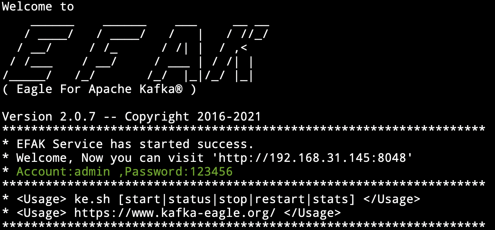
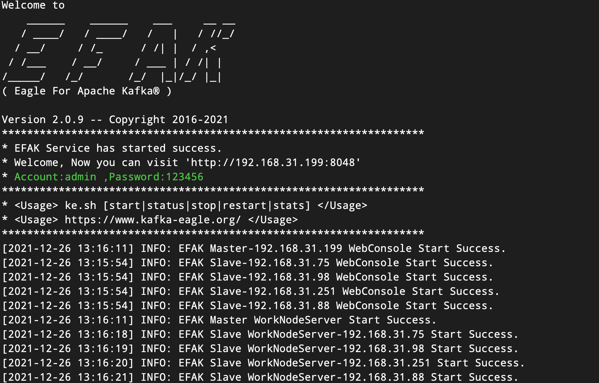

# Install on Linux/macOS

## Overview

This page explains how to install EFAK dependencies, download and install EFAK, get the service up and running on your Linux or macOS system, and the installation package details.  本页介绍如何安装 EFAK 依赖项、下载和安装 EFAK、在 Linux 或 macOS 系统上启动和运行服务，以及安装包详细信息。

> NOTE ON UPGRADING
> While the process for upgrading EFAK is very similar to installing EFAK, there are some key backup steps you should perform. Read [Upgrading EFAK](https://www.kafka-eagle.org/articles/docs/installation/upgrade.html) for tips and guidance on updating an existing installation.  虽然升级 EFAK 的过程与安装 EFAK 非常相似，但您应该执行一些关键的备份步骤。 阅读升级 EFAK 以获取有关更新现有安装的提示和指南。

## 1. Download and install

You can download the [EFAK](https://github.com/smartloli/EFAK) source code on GitHub to compile and install by yourself, or by [downloading](http://download.kafka-eagle.org/) a binary .tar.gz file.

| EFAK     | Repository                        |
| -------- | --------------------------------- |
| Github   | https://github.com/smartloli/EFAK |
| Download | http://download.kafka-eagle.org/  |

> NOTE ON INSTALL
> We recommend using the official compiled binary installation package.

## 2. Install JDK

If there is a JDK environment on the Linux server, this step can be ignored, and the installation of the next steps. If there is no JDK, first to the Oracle official website to [download JDK](http://www.oracle.com/technetwork/java/javase/downloads/index.html).

### JAVA_HOME Configure

Extract the binary installation package to the specified directory:

```bash
cd /usr/java
tar -zxvf jdk-xxxx.tar.gz
mv jdk-xxxx jdk1.8
vi /etc/profile
export JAVA_HOME=/usr/java/jdk1.8
export PATH=$PATH:$JAVA_HOME/bin
```

Then, we use the `. /etc/profile` to enable the configuration to take effect immediately.

> NOTE
> If the authority is insufficient, please use the sudo command.

Finally, we input `java -version`, according to the following information:

> NOTE
> java version "1.8.0_60"
> Java(TM) SE Runtime Environment (build 1.8.0_60-b27)
> Java HotSpot(TM) 64-Bit Server VM (build 25.60-b23, mixed mode)

## 3. Extract EFAK

Here we extract to `/data/soft/new` directory and extract:

```bash
tar -zxvf efak-xxx-bin.tar.gz
```

If you have installed the version before, delete the modified version, and rename the current version, as shown below:

```bash
rm -rf efak
mv efak-xxx efak
```

Then, configure EFAK profile

```bash
vi /etc/profile
export KE_HOME=/data/soft/new/efak
export PATH=$PATH:$KE_HOME/bin
```

Finally, we use the `. /etc/profile` to enable the configuration to take effect immediately.

## 4. Configure EFAK system file

Configure EFAK according to the actual situation of its own Kafka cluster, For example, zookeeper address, version type of Kafka cluster (zk for low version, kafka for high version), Kafka cluster with security authentication enabled etc.  根据自身Kafka集群的实际情况配置EFAK，例如zookeeper地址、Kafka集群的版本类型（zk为低版本，kafka为高版本）、开启安全认证的Kafka集群等。

```bash
cd ${KE_HOME}/conf
vi system-config.properties

# Multi zookeeper&kafka cluster list -- The client connection address of the Zookeeper cluster is set here
efak.zk.cluster.alias=cluster1,cluster2
cluster1.zk.list=tdn1:2181,tdn2:2181,tdn3:2181
cluster2.zk.list=xdn1:2181,xdn2:2181,xdn3:2181

# Add zookeeper acl
cluster1.zk.acl.enable=false
cluster1.zk.acl.schema=digest
cluster1.zk.acl.username=test
cluster1.zk.acl.password=test123

# Kafka broker nodes online list
cluster1.efak.broker.size=10
cluster2.efak.broker.size=20

# Zkcli limit -- Zookeeper cluster allows the number of clients to connect to
# If you enable distributed mode, you can set value to 4 or 8
kafka.zk.limit.size=16

# EFAK webui port -- WebConsole port access address
efak.webui.port=8048

######################################
# EFAK enable distributed
######################################
efak.distributed.enable=false
# master worknode set status to master, other node set status to slave
efak.cluster.mode.status=slave
# deploy efak server address
efak.worknode.master.host=localhost
efak.worknode.port=8085

# Kafka offset storage -- Offset stored in a Kafka cluster, if stored in the zookeeper, you can not use this option
cluster1.efak.offset.storage=kafka
cluster2.efak.offset.storage=kafka

# Whether the Kafka performance monitoring diagram is enabled
efak.metrics.charts=false

# EFAK keeps data for 30 days by default
efak.metrics.retain=30

# If offset is out of range occurs, enable this property -- Only suitable for kafka sql
efak.sql.fix.error=false
efak.sql.topic.records.max=5000

# Delete kafka topic token -- Set to delete the topic token, so that administrators can have the right to delete
efak.topic.token=keadmin

# Kafka sasl authenticate
cluster1.efak.sasl.enable=false
cluster1.efak.sasl.protocol=SASL_PLAINTEXT
cluster1.efak.sasl.mechanism=SCRAM-SHA-256
cluster1.efak.sasl.jaas.config=org.apache.kafka.common.security.scram.ScramLoginModule required username="admin" password="admin-secret";
# If not set, the value can be empty
cluster1.efak.sasl.client.id=
# Add kafka cluster cgroups
cluster1.efak.sasl.cgroup.enable=false
cluster1.efak.sasl.cgroup.topics=kafka_ads01,kafka_ads02

cluster2.efak.sasl.enable=true
cluster2.efak.sasl.protocol=SASL_PLAINTEXT
cluster2.efak.sasl.mechanism=PLAIN
cluster2.efak.sasl.jaas.config=org.apache.kafka.common.security.plain.PlainLoginModule required username="admin" password="admin-secret";
cluster2.efak.sasl.client.id=
cluster2.efak.sasl.cgroup.enable=false
cluster2.efak.sasl.cgroup.topics=kafka_ads03,kafka_ads04

# Default use sqlite to store data
efak.driver=org.sqlite.JDBC
# It is important to note that the '/hadoop/kafka-eagle/db' path must be exist.
efak.url=jdbc:sqlite:/hadoop/kafka-eagle/db/ke.db
efak.username=root
efak.password=smartloli

# (Optional) set mysql address
#efak.driver=com.mysql.jdbc.Driver
#efak.url=jdbc:mysql://127.0.0.1:3306/ke?useUnicode=true&characterEncoding=UTF-8&zeroDateTimeBehavior=convertToNull
#efak.username=root
#efak.password=smartloli
```

## 5. Start the EFAK server (Standalone)

In the `$KE_HOME/bin` directory, there is a `ke.sh` script file. Execute the start command as follows:

```bash
cd ${KE_HOME}/bin
chmod +x ke.sh 
ke.sh start
```

After that, when the EFAK server is restarted or stopped, execute the following command:

```bash
ke.sh restart
ke.sh stop
```

As shown in the following figure:



## 6. Start the EFAK server (Distributed)

In the `$KE_HOME/bin` directory, there is a `ke.sh` script file. Execute the start command as follows:

```bash
cd ${KE_HOME}/bin
# sync efak package to other worknode node  将 efak 包同步到其他工作节点节点
# if $KE_HOME is /data/soft/new/efak
for i in `cat $KE_HOME/conf/works`;do scp -r $KE_HOME $i:/data/soft/new;done

# sync efak server .bash_profile environment
for i in `cat $KE_HOME/conf/works`;do scp -r ~/.bash_profile $i:~/;done

chmod +x ke.sh 
ke.sh cluster start
```

After that, when the EFAK server is restarted or stopped, execute the following command:

```bash
ke.sh cluster restart
ke.sh cluster stop
```

As shown in the following figure:



