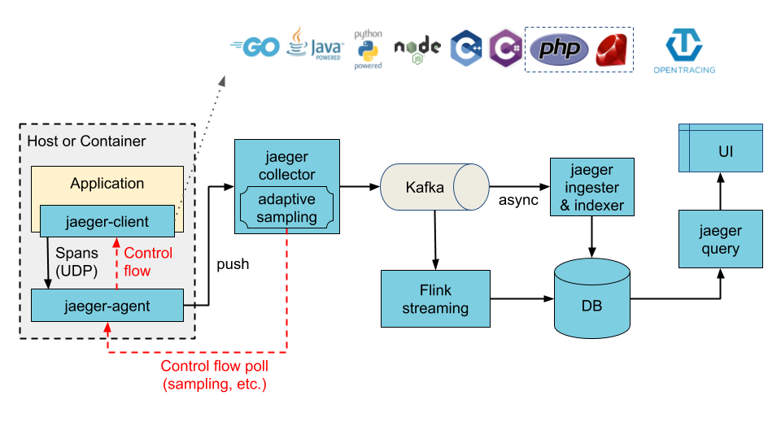

# Architecture

Version **1.32**Latest

------

See also:

- [APIs](https://www.jaegertracing.io/docs/1.32/apis/)

- [Sampling](https://www.jaegertracing.io/docs/1.32/sampling/)

------

Jaeger’s clients adhere to the data model described in the OpenTracing standard. Reading the [specification](https://github.com/opentracing/specification/blob/master/specification.md) will help you understand this section better.  Jaeger 的客户遵守 OpenTracing 标准中描述的数据模型。 阅读规范将帮助您更好地理解本节。

## Terminology  术语

Let’s start with a quick refresher on the terminology defined by the [OpenTracing Specification](https://github.com/opentracing/specification/blob/master/specification.md).  让我们先快速回顾一下 OpenTracing 规范定义的术语。

### Span  跨度

A **span** represents a logical unit of work in Jaeger that has an operation name, the start time of the operation, and the duration. Spans may be nested and ordered to model causal relationships.  跨度表示 Jaeger 中的逻辑工作单元，它具有操作名称、操作的开始时间和持续时间。 跨度可以嵌套和排序以模拟因果关系。

### Trace  痕迹

A **trace** is a data/execution path through the system, and can be thought of as a directed acyclic graph of [spans](https://www.jaegertracing.io/docs/1.32/architecture#span).  跟踪是通过系统的数据/执行路径，可以被认为是跨度的有向无环图。

## Components  成分

Jaeger can be deployed either as all-in-one binary, where all Jaeger backend components run in a single process, or as a scalable distributed system, discussed below. There are two main deployment options:  Jaeger 可以部署为一体式二进制文件，其中所有 Jaeger 后端组件在单个进程中运行，也可以部署为可扩展的分布式系统，如下所述。 有两个主要的部署选项：

1. Collectors are writing directly to storage.  收集器直接写入存储。

2. Collectors are writing to Kafka as a preliminary buffer.  收集器正在写入 Kafka 作为初步缓冲区。

**Illustration of direct-to-storage architecture**

**Illustration of architecture with Kafka as intermediate buffer**

This section details the constituent parts of Jaeger and how they relate to each other. It is arranged by the order in which spans from your application interact with them.  本节详细介绍 Jaeger 的组成部分以及它们之间的关系。它是按照您的应用程序与它们交互的顺序排列的。

### Jaeger client libraries  Jaeger 客户端库

Jaeger clients are language specific implementations of the [OpenTracing API](https://opentracing.io/). They can be used to instrument applications for distributed tracing either manually or with a variety of existing open source frameworks, such as Flask, Dropwizard, gRPC, and many more, that are already integrated with OpenTracing.  Jaeger 客户端是 OpenTracing API 的特定语言实现。它们可用于手动或与各种现有开源框架（例如 Flask、Dropwizard、gRPC 等）一起为分布式跟踪检测应用程序，这些框架已经与 OpenTracing 集成。

An instrumented service creates spans when receiving new requests and attaches context information (trace id, span id, and baggage) to outgoing requests. Only the ids and baggage are propagated with requests; all other profiling data, like operation name, timing, tags and logs, is not propagated. Instead, it is transmitted out of process to the Jaeger backend asynchronously, in the background.  检测服务在接收新请求时创建跨度并将上下文信息（跟踪 ID、跨度 ID 和行李）附加到传出请求。只有 id 和 bag 会随请求传播；所有其他分析数据，如操作名称、时间、标签和日志，都不会传播。相反，它在后台异步传输到 Jaeger 后端。

The instrumentation is designed to be always on in production. To minimize the overhead, Jaeger clients employ various sampling strategies. When a trace is sampled, the profiling span data is captured and transmitted to the Jaeger backend. When a trace is not sampled, no profiling data is collected at all, and the calls to the OpenTracing APIs are short-circuited to incur the minimal amount of overhead. By default, Jaeger clients sample 0.1% of traces (1 in 1000), and have the ability to retrieve sampling strategies from the Jaeger backend. For more information, please refer to [Sampling](https://www.jaegertracing.io/docs/1.32/sampling/).  仪器设计为始终在生产中运行。为了最大限度地减少开销，Jaeger 客户端采用了各种采样策略。对跟踪进行采样时，会捕获分析跨度数据并将其传输到 Jaeger 后端。如果没有对跟踪进行采样，则根本不会收集任何分析数据，并且对 OpenTracing API 的调用会短路以产生最小的开销。默认情况下，Jaeger 客户端对 0.1% 的跟踪进行采样（千分之一），并且能够从 Jaeger 后端检索采样策略。有关详细信息，请参阅采样。

**Illustration of context propagation**

### Agent

The Jaeger **agent** is a network daemon that listens for spans sent over UDP, which it batches and sends to the collector. It is designed to be deployed to all hosts as an infrastructure component. The agent abstracts the routing and discovery of the collectors away from the client.  Jaeger 代理是一个网络守护程序，它侦听通过 UDP 发送的跨度，并将其批处理并发送给收集器。 它旨在作为基础架构组件部署到所有主机。 代理将收集器的路由和发现从客户端抽象出来。

### Collector

The Jaeger **collector** receives traces from Jaeger [agents](https://www.jaegertracing.io/docs/1.32/architecture#agent) and runs them through a processing pipeline. Currently our pipeline validates traces, indexes them, performs any transformations, and finally stores them.  Jaeger 收集器从 Jaeger 代理接收跟踪并通过处理管道运行它们。 目前，我们的管道验证跟踪、索引它们、执行任何转换并最终存储它们。

Jaeger’s storage is a pluggable component which currently supports [Cassandra](https://www.jaegertracing.io/docs/1.32/deployment#cassandra), [Elasticsearch](https://www.jaegertracing.io/docs/1.32/deployment#elasticsearch) and [Kafka](https://www.jaegertracing.io/docs/1.32/deployment#kafka).  Jaeger 的存储是一个可插拔组件，目前支持 Cassandra、Elasticsearch 和 Kafka。

### Query

**Query** is a service that retrieves traces from storage and hosts a UI to display them.  Query 是一项服务，它从存储中检索跟踪并托管 UI 以显示它们。

### Ingester

**Ingester** is a service that reads from Kafka topic and writes to another storage backend (Cassandra, Elasticsearch).  Ingester 是一项从 Kafka 主题读取数据并写入另一个存储后端（Cassandra、Elasticsearch）的服务。
