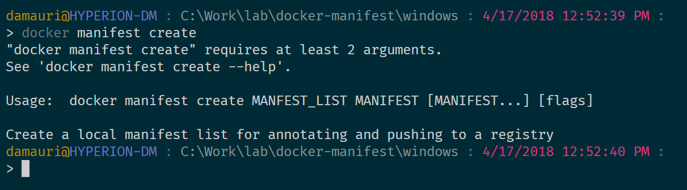
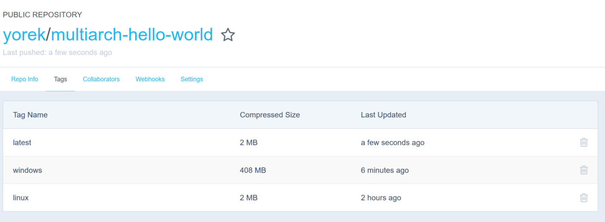
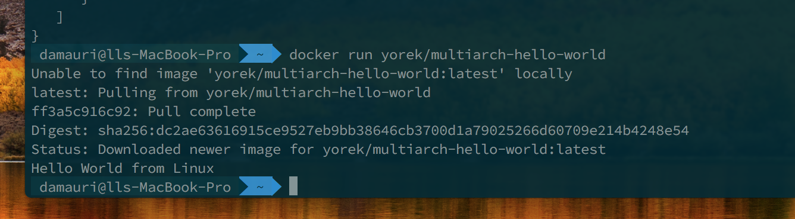
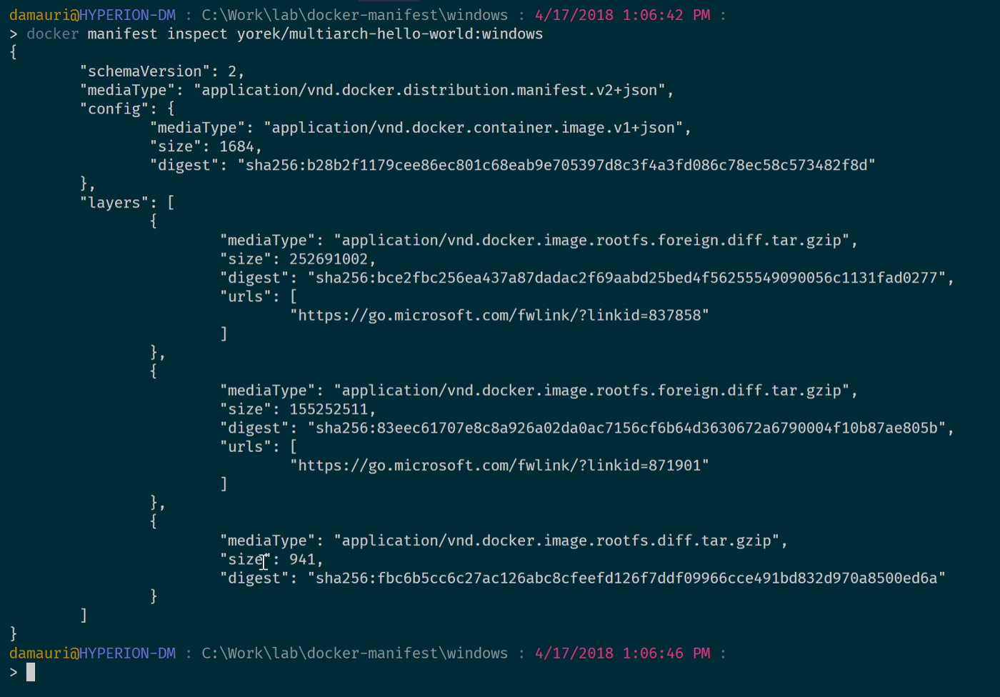
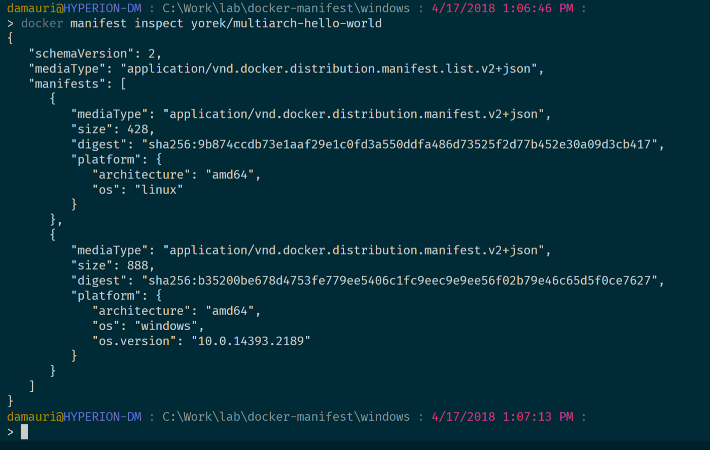

# Docker Multi-Architecture Images

## Let docker figure the correct image to pull for you

In one of the projects I’m working on, we’re targeting both Linux and Windows system. Of course we’re using Docker to containerize the whole application and make it easy to work on both systems: we created two docker images one for each supported system, and after that what we needed was to make sure that if someone would be pulling the `my-cool-image:latest` from a Unix-based machine, the Linux image would be returned, while if doing the pull from a Windows machine (using Windows containers), then the windows-based image would be used.  在我正在从事的项目之一中，我们同时针对Linux和Windows系统。 当然，我们使用Docker来容器化整个应用程序，并使其易于在两个系统上工作：我们为每个受支持的系统创建了两个docker映像，然后我们需要确保是否有人将 my-cool-image：最新的基于Unix的计算机，将返回Linux映像，而如果从Windows的计算机（使用Windows容器）进行提取，则将使用基于Windows的映像。

Both for developers and user, being able to abstract the image from the architecture it will be running on is a great thing. You reach the level of abstraction where you don’t really care where the solution will be executed. It will just run. Say that you want to execute the  对于开发人员和用户而言，能够从将要运行的体系结构中提取图像是一件很棒的事情。 您到达了抽象级别，而您实际上并不关心在哪里执行解决方案。 它将运行。 假设您要执行

```
yorek/multiarch-hello-world
```

beautiful containerized application on your system. You should expect to just run the usual `docker run` commands and that’s it, it will work. No matter if you’re on Ubuntu, Mac OSX or Windows (Containers), right?  系统上漂亮的容器化应用程序。 您应该期望只运行常规的docker run命令，这样就可以了。 不管您使用的是Ubuntu，Mac OSX还是Windows（容器），对不对？

Right! Good news is that it is totally possible, and, as developers, to do this we need to leverage a nice feature of Docker called [*Manifest List*](https://docs.docker.com/registry/spec/manifest-v2-2/), also known as Multi-Architecture, shortened to multi-arch for friends.  对！ 好消息是，这是完全可能的，作为开发人员，我们需要利用Docker的一项出色功能，即清单清单（Manifest List），也称为多架构（Multi-Architecture），为朋友们简化为多架构。

# Create two images

Let’s first of all create two very simple images that will serve two different architectures. Here’s the “Hello World” for Windows:

```
FROM microsoft/nanoserver:latest
CMD echo "Hello World from Windows"
```

and here’s the dockerfile for “Hello World” using Linux:

```
FROM alpine:latest
CMD echo "Hello World from Linux"
```

let’s build the two images and let’s call them `multiarch-hello-world:windows `and `multiarch-hello-world:linux` respectively, and push them to your Docker repository.

# Enable manifest command

Docker now [support the ability to work with image manifest natively](https://docs.docker.com/edge/engine/reference/commandline/manifest/). The feature is still in development and thus if you just try to run it  Docker现在支持本地处理映像清单的功能。 该功能仍在开发中，因此，如果您尝试运行它

```
docker manifest
```

you’ll get the following message:

```
docker manifest is only supported when experimental cli features are enabled
```

To enable the manifest feature, the *experimental CLI* options needs to be set in the config file in `.docker` home folder. Here’s how your `config.json` file should look like

```
{
   "experimental": "enabled",
   "credsStore": "wincred",
   "auths": {
       "https://index.docker.io/v1/": {}
    }
}
```

once this is done, you can run the `docker manifest` command without problems.

# Create a manifest list

The first step to create a multi-architecture image is to create a [*manifest list*](http://(https//docs.docker.com/registry/spec/manifest-v2-2/#manifest-list)). The manifest list will be seen as a “virtual image” but it will actually contain an index of available images with their relative supported architecture. With that information the docker client will now be able to actually pull the image for the correct architecture.  创建多体系结构映像的第一步是创建清单清单。 清单清单将被视为“虚拟映像”，但实际上将包含可用映像的索引及其相对受支持的体系结构。 有了这些信息，泊坞窗客户端现在将能够实际为正确的架构拉取映像。

Since the manifest list is seen as a virtual image, the usual naming convention should be used too. For example in my repository on Docker Hub, I have created a repository called `multiarch-hello-world`, and I want make sure that everyone who will pull the *latest* tag will automatically get the correct image for the architecture being used. So my manifest list needs to be named as  由于清单清单被视为虚拟映像，因此也应使用通常的命名约定。 例如，在我的Docker Hub上的存储库中，我创建了一个名为multiarch-hello-world的存储库，并且我希望确保将使用最新标签的每个人都将自动获取所使用架构的正确映像。 所以我的清单清单需要命名为

```
yorek/multiarch-hello-world:latest
```

and it needs to index the

- `yorek/multiarch-hello-world:linux`
- `yorek/multiarch-hello-world:windows`

images. The docker manifest command uses the following syntax



so here’s the command for the mentioned sample:

```
docker manifest create 
    yorek/multiarch-hello-world:latest 
    yorek/multiarch-hello-world:linux 
    yorek/multiarch-hello-world:windows
```

once the manifest list is created, it can be pushed like an image:

```
docker manifest push yorek/multiarch-hello-world:latest
```

and it will be available in your repository, just like (again) a standard image:



and, just like a standard image it can be used:



Et voila’, multi-architecture support: done.

# Inspect a manifest list

Well, you can actually inspect manifest list *and* manifests for single images. For example if you run

```
docker manifest inspect yorek/multiarch-hello-world:windows
```

you’ll get the details about that image:



while if you do it on a manifest list, you’ll get the manifest list you created before (look at the `mediaType` property):



as you can see in the manifest list there are references to the images (well, their manifests), via their digest value, along with the information on the supported architecture. A list of supported operating systems and architectures is available here, in the “`$GOOS` and `$GOARCH`” section:  如清单清单中所示，通过摘要值对图像（以及其清单）进行了引用，并提供了有关受支持体系结构的信息。 可在此处的“ $ GOOS和$ GOARCH”部分中找到受支持的操作系统和体系结构的列表：

[Installing Go from source - The Go Programming LanguageTo build a bootstrap toolchain from source, use either the git branch release-branch.go1.4 or…golang.org](https://golang.org/doc/install/source#environment)

Yes, the link points to a Go Language help page, and that’s correct (I think it is related to the fact that the original tool that supported manifest list was written in Go…check next section for this).

# Want to know more?

If you’re interested in the topic and want to know more, you can start learning from the historical background behind the multi-architecture feature here (thanks [@druttka](https://twitter.com/druttka?lang=en) for the link ):

[Multi-arch All The Things - Docker BlogThis post was written by Phil Estes and Michael Friis.\] True multi-platform workload portability has long been the holy…blog.docker.com](https://blog.docker.com/2017/11/multi-arch-all-the-things/)

and also take a look at the original support for manifest lists via the manifest-tool:

[estesp/manifest-toolmanifest-tool - Manifest tool for manifest list object creation/querygithub.com](https://github.com/estesp/manifest-tool)

and finally, you may want to take a look at the manifest API:

[HTTP API V2Docker Registry HTTP API V2 Introduction The Docker Registry HTTP API is the protocol to facilitate distribution of…docs.docker.com](https://docs.docker.com/registry/spec/api/#manifest)

and the manifest specs:

[Image Manifest V 2, Schema 2Image Manifest Version 2, Schema 2 This document outlines the format of of the V2 image manifest, schema version 2. The…docs.docker.com](https://docs.docker.com/registry/spec/manifest-v2-2/)

