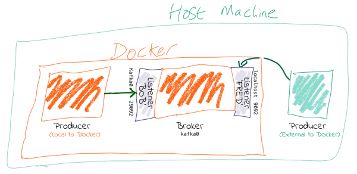

https://www.confluent.io/blog/kafka-listeners-explained/

# Kafka Listeners – Explained

This question comes up on Stack Overflow and such places a *lot*, so here’s something to try and help.  这个问题经常出现在Stack Overflow等地方，因此这里有一些可以尝试和帮助的地方。

You need to set `advertised.listeners` (or `KAFKA_ADVERTISED_LISTENERS` if you’re using Docker images) to the external address (host/IP) so that clients can correctly connect to it. Otherwise, they’ll try to connect to the internal host address—and if that’s not reachable, then problems ensue.  您需要将advertised.listeners（如果使用Docker映像，则设置为KAFKA_ADVERTISED_LISTENERS）为外部地址（主机/ IP），以便客户端可以正确连接。 否则，他们将尝试连接到内部主机地址-如果无法访问，则会出现问题。

Put another way, courtesy of Spencer Ruport:  换句话说，由Spencer Ruport提供：

> `LISTENERS` are what interfaces Kafka binds to. `ADVERTISED_LISTENERS` are how clients can connect.  LISTENERS是Kafka绑定的接口。 ADVERTISED_LISTENERS是客户端可以如何连接的方式。



In this post, I’ll talk about *why* this is necessary and then show *how* to do it based on a couple of scenarios—Docker and AWS.  在这篇文章中，我将讨论为什么这样做是必要的，然后展示如何基于Docker和AWS这两个场景来做到这一点。

## Is anyone listening?

Apache Kafka® is a distributed system. Data is read from and written to the *leader* for a given partition, which could be on any of the brokers in a cluster. When a client (producer/consumer) starts, it will request metadata about which broker is the leader for a partition—and it can do this from *any* broker. The metadata returned will include the endpoints available for the Leader broker for that partition, and the client will then use those endpoints to connect to the broker to read/write data as required.  ApacheKafka®是一个分布式系统。 可以从给定分区的领导者读取数据并将数据写入领导者，该分区可以位于集群中的任何代理上。 当客户端（生产者/消费者）启动时，它将请求有关哪个代理是分区领导者的元数据，并且它可以从任何代理执行此操作。 返回的元数据将包括该分区的领导者代理可用的端点，然后客户端将使用这些端点连接到代理以根据需要读取/写入数据。

It’s these endpoints that cause people trouble. On a *single* machine, running *bare metal* (no VMs, no Docker), everything might be the hostname (or just `localhost`), and it’s easy. But once you move into more complex networking setups and multiple nodes, you have to pay more attention to it.  这些端点引起了人们的麻烦。 在裸机（无VM，无Docker）上运行的单台计算机上，所有内容都可能是主机名（或只是localhost），这很容易。 但是一旦进入更复杂的网络设置和多个节点，就必须更加注意它。

Let’s assume you have more than one network. This could be things like:  假设您有多个网络。 可能是这样的：

- Docker internal network(s) plus host machine
- Brokers in the cloud (e.g., AWS EC2) and on-premises machines locally (or even in another cloud)

You need to tell Kafka how the brokers can reach each other but also make sure that external clients (producers/consumers) can reach the broker they need to reach.  您需要告诉Kafka经纪人如何相互联系，还要确保外部客户（生产者/消费者）可以联络到他们需要联系的经纪人。

The key thing is that when you run a client, **the broker you pass to it is just where it’s going to go and get the metadata about brokers in the cluster from.** The actual host and IP that it will connect to for reading/writing data is based on **the data that the broker passes back in that initial connection**—even if it’s just a single node and the broker returned is the same as the one it’s connected to.  关键是，当您运行客户端时，传递给它的代理就可以从中获取有关集群中代理的元数据。 它将连接用于读取/写入数据的实际主机和IP是基于代理在该初始连接中传递回的数据的，即使它只是单个节点并且返回的代理与它所连接的主机和IP也相同。

For configuring this correctly, you need to understand that Kafka brokers can have multiple *listeners*. A listener is a combination of:  为了正确配置此配置，您需要了解Kafka代理可以具有多个侦听器。 侦听器是以下各项的组合：

1. Host/IP
2. Port
3. Protocol

Let’s check out some config. Often the protocol is used for the listener name too, but here let’s make it nice and clear by using abstract names for the listeners:  让我们检查一些配置。 协议通常也用于侦听器名称，但是在这里，通过为侦听器使用抽象名称让它变得清晰明了：

```
KAFKA_LISTENERS: LISTENER_BOB://kafka0:29092,LISTENER_FRED://localhost:9092
KAFKA_ADVERTISED_LISTENERS: LISTENER_BOB://kafka0:29092,LISTENER_FRED://localhost:9092
KAFKA_LISTENER_SECURITY_PROTOCOL_MAP: LISTENER_BOB:PLAINTEXT,LISTENER_FRED:PLAINTEXT
KAFKA_INTER_BROKER_LISTENER_NAME: LISTENER_BOB
```

I’m using the Docker config names—the equivalents if you’re configuring `server.properties` directly (e.g., on AWS, etc.) are shown indented in the following list:

- **KAFKA_LISTENERS(listeners)** is a comma-separated list of listeners and the host/IP and port to which Kafka binds to for listening. For more complex networking, this might be an IP address associated with a given network interface on a machine. The default is 0.0.0.0, which means listening on all interfaces.  KAFKA_LISTENERS是逗号分隔的侦听器列表，以及Kafka绑定用于侦听的主机/ IP和端口。 对于更复杂的网络，这可能是与计算机上给定网络接口关联的IP地址。 默认值为0.0.0.0，表示在所有接口上侦听。

- **KAFKA_ADVERTISED_LISTENERS(advertised.listeners)** is a comma-separated list of listeners with their host/IP and port. This is the metadata that’s passed back to clients.  KAFKA_ADVERTISED_LISTENERS是用逗号分隔的侦听器列表，包括其主机/ IP和端口。 这是传回给客户的元数据。

- **KAFKA_LISTENER_SECURITY_PROTOCOL_MAP(listener.security.protocol.map)** defines key/value pairs for the security protocol to use per listener name.

Kafka brokers communicate between themselves, usually on the internal network (e.g., Docker network, AWS VPC, etc.). To define which listener to use, specify `KAFKA_INTER_BROKER_LISTENER_NAME(inter.broker.listener.name)`. The host/IP used must be accessible from the broker machine to others.  Kafka经纪人之间通常在内部网络（例如Docker网络，AWS VPC等）之间进行通信。 要定义要使用的侦听器，请指定KAFKA_INTER_BROKER_LISTENER_NAME（inter.broker.listener.name）。 所使用的主机/ IP必须可以从代理计算机访问其他主机。

Kafka `clients` may well not be local to the broker’s network, and this is where the additional listeners come in.  Kafka客户很可能不是经纪人网络的本地用户，这是其他侦听器进入的地方。

Each listener will, when connected to, report back the address at which it can be reached. The address at which you reach a broker depends on the network used. If you’re connecting to the broker from an internal network, it’s going to be a different host/IP than when connecting externally.  每个侦听器在连接后都会向其报告可以到达的地址。 您到达经纪人的地址取决于所使用的网络。 如果您要从内部网络连接到代理，则它将是与外部连接不同的主机/ IP。

When connecting to a broker, the listener that will be returned to the client will be the listener to which you connected (based on the port).  连接到代理时，将返回到客户端的侦听器将是您连接到的侦听器（基于端口）。

`kafkacat` is a useful tool for exploring this. Using `-L`, you can see the metadata for the listener to which you connected. Based on the same listener config as above (`LISTENER_BOB/LISTENER_FRED`), check out the respective entries for broker `0 at: -`:

- Connecting on port 9092 (which we map as LISTENER_FRED), the broker’s address is given back as localhost

```bash
$ kafkacat -b kafka0:9092 -L
Metadata for all topics (from broker -1: kafka0:9092/bootstrap):
1 brokers:
  broker 0 at localhost:9092

```

- Connecting on port 29092 (which we map as LISTENER_BOB), the broker’s address is given back as kafka0

```bash
$ kafkacat -b kafka0:29092 -L
Metadata for all topics (from broker 0: kafka0:29092/0):
1 brokers:
  broker 0 at kafka0:29092

```

You can also use `tcpdump` to examine the traffic from a client connecting to the broker and spot the hostname that’s returned from the broker.

## Why can I connect to the broker, but the client still fails?

Even if you can make the initial connection to the broker, the address returned in the metadata may still be for a hostname that is not accessible from your client.  即使您可以与代理建立初始连接，元数据中返回的地址仍可能是无法从客户端访问的主机名。

Let’s walk this through step by step.  让我们逐步介绍一下。

1. We’ve got a broker on AWS. We want to send a message to it from our laptop. We know the external hostname for the EC2 instance (**ec2-54-191-84-122.us-west-2.compute.amazonaws.com**). We’ve created the necessary entry in the security group to open the broker’s port to our inbound traffic. We do smart things like checking that our local machine can connect to the port on the AWS instance:  我们有一个AWS经纪人。 我们希望通过笔记本电脑向其发送消息。 我们知道EC2实例的外部主机名（ec2-54-191-84-122.us-west-2.compute.amazonaws.com）。 我们已经在安全组中创建了必要的条目，以打开代理端口进入我们的入站流量。 我们做一些聪明的事情，例如检查本地计算机是否可以连接到AWS实例上的端口：

```bash
$ nc -vz ec2-54-191-84-122.us-west-2.compute.amazonaws.com 9092
found 0 associations
found 1 connections:
    1:  flags=82<CONNECTED,PREFERRED>
  outif utun5
  src 172.27.230.23 port 53352
  dst 54.191.84.122 port 9092
  rank info not available
  TCP aux info available

Connection to ec2-54-191-84-122.us-west-2.compute.amazonaws.com port 9092 [tcp/XmlIpcRegSvc] succeeded!

```

Things are looking good! We run:

```bash
echo "test"|kafka-console-producer --broker-list ec2-54-191-84-122.us-west-2.compute.amazonaws.com:9092 --topic test

```

Now…what happens next?

2. Our laptop resolves **ec2-54-191-84-122.us-west-2.compute.amazonaws.com** successfully (to the IP address 54.191.84.122) and connects to the AWS machine on port 9092.

3. The broker receives the inbound connection on port 9092. It returns the metadata to the client, with the hostname **ip-172-31-18-160.us-west-2.compute.internal**, because this is the host name of the broker and the default value for listeners.  代理在端口9092上接收入站连接。它将元数据返回给客户端，主机名为ip-172-31-18-160.us-west-2.compute.internal，因为这是代理的主机名以及侦听器的默认值。

4. The client then tries to send data to the broker using the metadata it was given. Since **ip-172-31-18-160.us-west-2.compute.internal** is not resolvable from the internet, it fails.

```bash
$ echo "test"|kafka-console-producer --broker-list ec2-54-191-84-122.us-west-2.compute.amazonaws.com:9092 --topic test
>>[2018-07-30 15:08:41,932] ERROR Error when sending message to topic test with key: null, value: 4 bytes with error: (org.apache.kafka.clients.producer.internals.ErrorLoggingCallback)
org.apache.kafka.common.errors.TimeoutException: Expiring 1 record(s) for test-0: 1547 ms has passed since batch creation plus linger time

```

5. Puzzled, we try the same thing from the broker machine itself:  感到困惑的是，我们尝试使用代理计算机本身进行相同的操作：

```bash
$ echo "foo"|kafka-console-producer --broker-list ec2-54-191-84-122.us-west-2.compute.amazonaws.com:9092 --topic test
>>
$ kafka-console-consumer --bootstrap-server ec2-54-191-84-122.us-west-2.compute.amazonaws.com:9092 --topic test --from-beginning
foo

```

It works fine! That’s because we are connecting to port 9092, which is configured as the internal listener and thus reports back its hostname as **ip-172-31-18-160.us-west-2.compute.internal**, which is resolvable from the broker machine (since it’s its own hostname!).  工作正常！ 这是因为我们正在连接到端口9092，该端口被配置为内部侦听器，因此将其主机名报告回为ip-172-31-18-160.us-west-2.compute.internal，可从代理计算机上解析该主机名。 （因为这是它自己的主机名！）。

6. We can make life even easier by using [`kafkacat`](https://docs.confluent.io/current/app-development/kafkacat-usage.html). Using the `-L` flag, we can see the metadata returned by the broker:

```bash
$ kafkacat -b ec2-54-191-84-122.us-west-2.compute.amazonaws.com:9092 -L
Metadata for all topics (from broker -1: ec2-54-191-84-122.us-west-2.compute.amazonaws.com:9092/bootstrap):
1 brokers:
  broker 0 at ip-172-31-18-160.us-west-2.compute.internal:9092

```

Clear as day, the internal hostname is returned. This also makes this seemingly confusing error make a lot more sense—connecting to one hostname, getting a lookup error on another:  清除为天，将返回内部主机名。 这也使这个看似令人困惑的错误更加有意义-连接到一个主机名，在另一个主机名上出现查找错误：

```bash
$ kafkacat -b ec2-54-191-84-122.us-west-2.compute.amazonaws.com:9092 -C -t test
% ERROR: Local: Host resolution failure: ip-172-31-18-160.us-west-2.compute.internal:9092/0: Failed to resolve 'ip-172-31-18-160.us-west-2.compute.internal:9092': nodename nor servname provided, or not known

```

Here, we’re using `kafkacat` in consumer mode (`-C`) from our local machine to try and read from the topic. As before, because we’re getting the internal listener hostname back from the broker in the metadata, the client cannot resolve that hostname to read/write from.

## I saw a Stack Overflow answer suggesting to just update my hosts file…isn’t that easier?

This is nothing more than a hack to work around a misconfiguration instead of actually fixing it.  这仅是解决配置错误而不是实际解决问题的技巧。

If the broker is reporting back a hostname to which the client cannot connect, then hardcoding the hostname/IP combo into the local `/etc/hosts` may seem like a nice fix. But this is a very brittle and manual solution. What happens when the IP changes, when you move hosts and forget to take the little hack with you, and when other people want to do the same?  如果代理正在报告客户端无法连接的主机名，则将 hostname/IP 组合硬编码到本地 /etc/hosts 中似乎是一个不错的解决方案。 但这是一个非常脆弱且手动的解决方案。 当IP发生变化时，当您移动主机而忘记随身携带小东西，而其他人也想这样做时，会发生什么呢？

It’s much better to understand and actually fix the `advertised.listeners` setting for your network.  了解并实际修复您网络的advertised.listeners设置要好得多。

## HOW TO: Connecting to Kafka on Docker


To run within Docker, you will need to configure two listeners for Kafka:

1. **Communication within the Docker network:** This could be inter-broker communication (i.e., between brokers) and between other components running in Docker, such as Kafka Connect or third-party clients or producers.For these comms, we need to use the *hostname of the Docker container(s)*. Each Docker container on the same Docker network will use the hostname of the Kafka broker container to reach it.  Docker网络内部的通信：这可能是经纪人之间的通信（即，代理之间）以及Docker中运行的其他组件之间的通信，例如Kafka Connect或第三方客户端或生产者。对于这些通信，我们需要使用主机名 Docker容器。 同一Docker网络上的每个Docker容器都将使用Kafka代理容器的主机名来访问它。

2. **Non-Docker network traffic:** This could be clients running locally on the Docker host machine, for example. The assumption is that they will connect on `localhost` to a port exposed from the Docker container.  非Docker网络流量：例如，这可能是在Docker主机上本地运行的客户端。 假设它们将在localhost上连接到Docker容器公开的端口。

Here’s the Docker Compose snippet:  以下是Docker Compose片段：

```yaml
---
version: '2'
services:
  zookeeper:
    image: "confluentinc/cp-zookeeper:5.2.1"
    environment:
      ZOOKEEPER_CLIENT_PORT: 2181
      ZOOKEEPER_TICK_TIME: 2000

# This has three listeners you can experiment with. 
# BOB for internal traffic on the Docker network
# FRED for traffic from the Docker-host machine (`localhost`)
# ALICE for traffic from outside, reaching the Docker host on the DNS name `never-gonna-give-you-up`
# Use 
  kafka0:
    image: "confluentinc/cp-enterprise-kafka:5.2.1"
    ports:
      - '9092:9092'
      - '29094:29094'
    depends_on:
      - zookeeper
    environment:
      KAFKA_BROKER_ID: 0
      KAFKA_ZOOKEEPER_CONNECT: zookeeper:2181
      KAFKA_LISTENERS: LISTENER_BOB://kafka0:29092,LISTENER_FRED://kafka0:9092,LISTENER_ALICE://kafka0:29094
      KAFKA_ADVERTISED_LISTENERS: LISTENER_BOB://kafka0:29092,LISTENER_FRED://localhost:9092,LISTENER_ALICE://never-gonna-give-you-up:29094
      KAFKA_LISTENER_SECURITY_PROTOCOL_MAP: LISTENER_BOB:PLAINTEXT,LISTENER_FRED:PLAINTEXT,LISTENER_ALICE:PLAINTEXT
      KAFKA_INTER_BROKER_LISTENER_NAME: LISTENER_BOB
      KAFKA_AUTO_CREATE_TOPICS_ENABLE: "false"
      KAFKA_OFFSETS_TOPIC_REPLICATION_FACTOR: 1
      KAFKA_GROUP_INITIAL_REBALANCE_DELAY_MS: 100

  kafkacat:
    image: confluentinc/cp-kafkacat
    command: sleep infinity

```

- Clients within the Docker network connect using listener `BOB`, with port 29092 and hostname `kafka0`. In doing so, they get back the hostname `kafka0` to which to connect. Each Docker container will resolve `kafka0` using Docker’s internal network and be able to reach the broker.

- Clients external to the Docker network connect using listener `FRED`, with port 9092 and hostname `localhost`. Port 9092 is exposed by the Docker container and therefore becomes available to connect to. When clients connect, they are given the hostname `localhost` for the broker’s metadata, and so connect to this when reading/writing data.

- The above configuration would not handle the scenario in which a client external to Docker and external to the host machine wants to connect. This is because neither `kafka0` (the internal Docker hostname) or `localhost` (the loopback address for the Docker host machine) would be resolvable.  上面的配置无法处理Docker外部客户端和主机外部客户端想要连接的场景。 这是因为kafka0（内部Docker主机名）或localhost（Docker主机的环回地址）都不可解析。

## Exploring listeners with Docker

Take a look at [GitHub](https://github.com/rmoff/kafka-listeners). This includes a Docker Compose to bring up a ZooKeeper instance, along with a Kafka broker configured with several listeners.  看看GitHub。 这包括一个用于启动ZooKeeper实例的Docker Compose，以及一个配置有多个侦听器的Kafka代理。

- Listener BOB (port 29092) for internal traffic on the Docker network

```bash
$ docker-compose exec kafkacat kafkacat -b kafka0:29092 -L
Metadata for all topics (from broker 0: kafka0:29092/0):
1 brokers:
  broker 0 at kafka0:29092

```

- Listener FRED (port 9092) for traffic from the Docker host machine (localhost)

```bash
$ docker-compose exec kafkacat kafkacat -b kafka0:9092 -L
Metadata for all topics (from broker -1: kafka0:9092/bootstrap):
1 brokers:
  broker 0 at localhost:9092

```

- Listener ALICE (port 29094) for traffic from outside, reaching the Docker host on the DNS name never-gonna-give-you-up

```bash
$ docker run -t --network kafka-listeners_default confluentinc/cp-kafkacat kafkacat -b kafka0:29094 -L
Metadata for all topics (from broker -1: kafka0:29094/bootstrap):
1 brokers:
  broker 0 at never-gonna-give-you-up:29094

```

