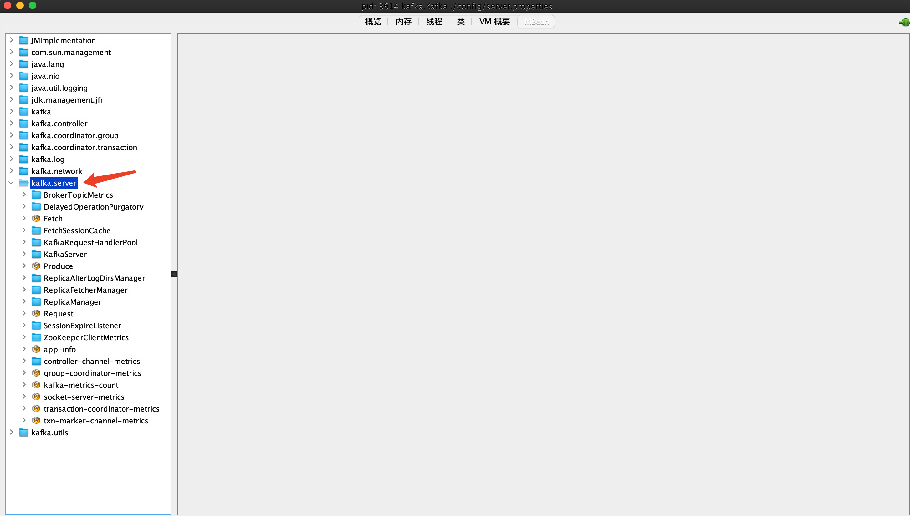
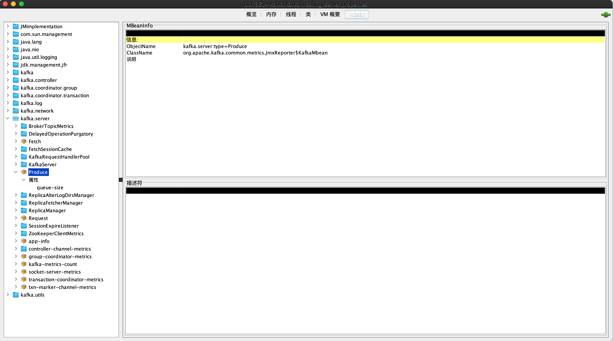
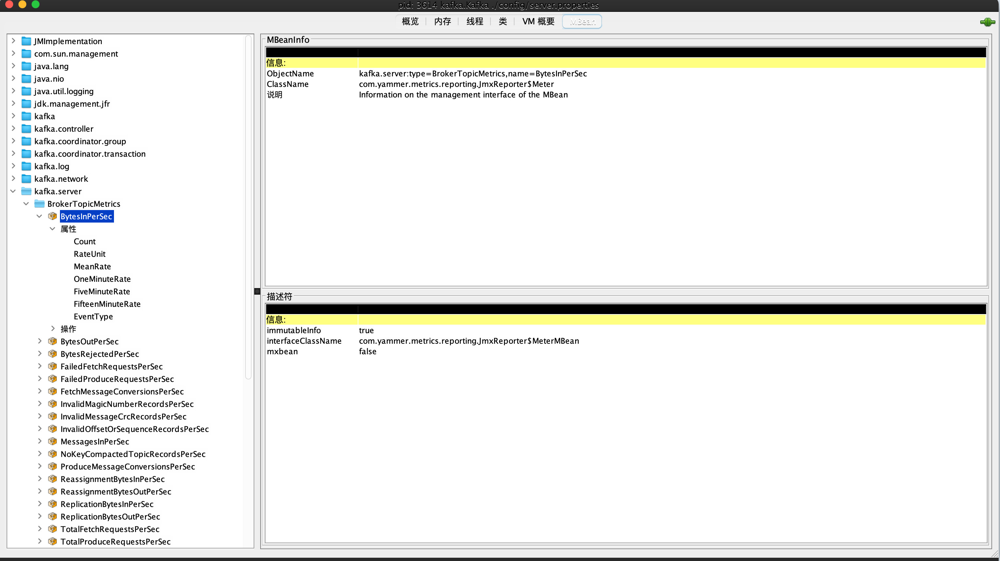
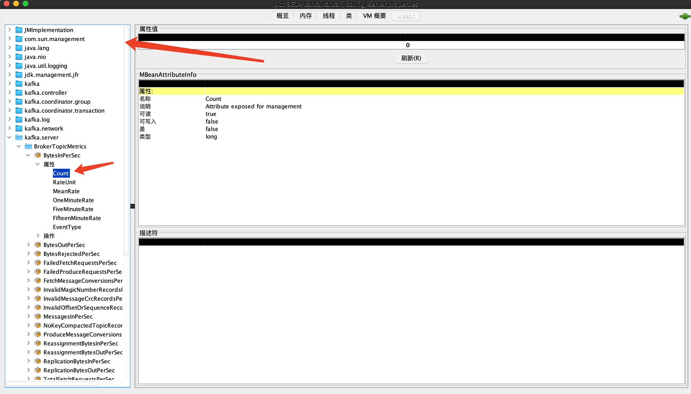

# MBean 监控

如官网所述，Kafka 使用基于 yammer metrics 的监控指标体系来统计 broker 端和 clients 端的各种监控指标(metric)。说到 yammer metrics，其官网给出了这样的一句话:

yammer metrics 是一个 Java 库，它使得你能够对生产环境代码所做之事具有无与伦比的洞察力。

当前，虽然该项目已经进化到 3.x 版本，但即使是最新版本的 Kafka 依然在使用 2.2 版本的 yammer metrics。不过这并不会妨碍我们对其使用方法的讨论。

## 监控指标

目前，Kafka 默认提供了超多的监控指标。无一例外，用户皆使用 JMX 接口访问这些指标。JMX，即 Java Management Extension，Java 管理扩展，是一套为各种应用程序、设备或系统等植入管理功能的框架。JMX 本身是跨平台的，因此具有高度的灵活性，可以无缝集成进各种系统中。

虽然有一小部分功能是以 Shell 脚本或直接运行 Java 类来提供的，但是 Kafka 集群大部分的运行表现都可由 JMX 指标来表征，因此搭建一套能够访问 JMX 的监控框架或系统对于监控 Kafka 集群而言至关重要。

Kafka 的每个监控指标都是以 JMX MBean 的形式定义的。虽然 JMX 规范不在本书的讨论范围内，但这里依然简单介绍一些 MBean 的概念。MBean 代表一个被管理的资源实例，它表示管理资源的 Java 对象。每个 MBean 的管理接口如下。

* 属性值
* 能够执行的操作
* 能发出的通知事件
* 构建器

对于 Kafka 而言，我们只关心上述列表中的第一项，即 MBean 的属性值，它包含了 Kafka 各种监控指标的真实值。MBean 需要注册之后才能使用，在注册时必须指定 MBean 的名称。










```java
Mbean Name: kafka.server:type=BrokerTopicMetrics,name=MessagesInPerSec
Attribute:

Mbean Name: kafka.network:type=RequestMetrics,name=RequestsPerSec,request={Produce|FetchConsumer|FetchFollower}
Attribute: 

Mbean Name: kafka.network:type=RequestMetrics,name=ErrorsPerSec,request=([-.\w]+),error=([-.\w]+)
Attribute: 

Mbean Name: kafka.server:type=BrokerTopicMetrics,name={Produce|Fetch}MessageConversionsPerSec,topic=([-.\w]+)
Attribute: 

Mbean Name: kafka.consumer:type=consumer-fetch-manager-metrics,client-id={client-id}
Attribute: records-lag-max

Mbean Name: kafka.[producer|consumer|connect]:type=[producer|consumer|connect]-metrics,client-id=([-.\w]+)
Attribute: connection-close-rate 

```

