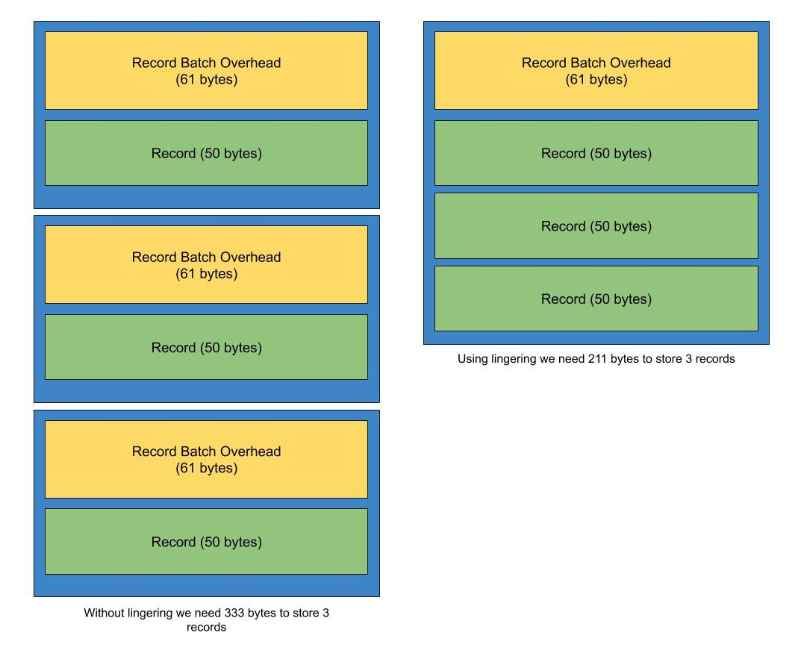

# Exploit Apache Kafka’s Message Format to Save Storage and Bandwidth  利用Apache Kafka的消息格式来节省存储空间和带宽

One of the main problems we are encountering these days are the amount of disk space used by Apache Kafka topics. Our messages are serialized as JSON. As you know in JSON, each field of the data model is stored in the JSON string, which causes a lot of duplicated field names to be stored in the Kafka topic. To reduce disk space usage, we have several options and I want to share some of them here.  这些天我们遇到的主要问题之一是Apache Kafka主题使用的磁盘空间量。 我们的消息被序列化为JSON。 如您所知，JSON中的数据模型的每个字段都存储在JSON字符串中，这导致很多重复的字段名称存储在Kafka主题中。 为了减少磁盘空间使用，我们有几种选择，我想在这里分享其中一些。

# TL;DR

In this article, I will show you how we can reduce the disk space usage by Kafka. At first, I describe why reducing disk space is necessary. Then, I describe Kafka’s message format and how it helps us to save disk storage and bandwidth. After that, using benchmarks we show how lingering, compression and using Avro can help us to save disk space. And finally, In the end, you can view a table that can help you decide which approach is better for your use case.  在本文中，我将向您展示如何减少Kafka的磁盘空间使用量。 首先，我描述了为什么需要减少磁盘空间。 然后，我将介绍Kafka的消息格式，以及它如何帮助我们节省磁盘存储空间和带宽。 之后，使用基准测试，我们将展示挥之不去，压缩并使用Avro可以如何帮助我们节省磁盘空间。 最后，您可以查看一个表，该表可以帮助您确定哪种方法更适合您的用例。

# Why do I need to reduce message size?

Although you may argue that storage is cheap today, there are several situations that you want to reduce disk space and bandwidth:  尽管您可能会争辩说今天的存储价格便宜，但是您还是需要减少磁盘空间和带宽的几种情况：

- It is [not strange to store all of your data inside the Kafka](https://www.confluent.io/blog/okay-store-data-apache-kafka/). New York Times, for example, [uses Kafka as a source of truth](https://www.confluent.io/blog/publishing-apache-kafka-new-york-times/)! It is possible to keep the entire topic records forever by disabling retention in Kafka. With correct compression, you can reduce the amount of disk space usage significantly. If you don’t reduce message size, you might run out of disk space several times faster than you think!  将所有数据存储在Kafka中并不奇怪。 例如，《纽约时报》使用卡夫卡作为真理之源！ 通过禁用对Kafka的保留，可以永久保留整个主题记录。 使用正确的压缩，可以大大减少磁盘空间使用量。 如果不减小消息大小，则磁盘空间用完的速度可能会比您想象的快几倍！

- If you can reduce the size of messages when you send them to the broker, you use smaller bandwidth and therefore you can increase total numbers of messages that can be sent to the brokers.  如果可以在将消息发送给代理时减小消息的大小，则可以使用较小的带宽，因此可以增加可以发送给代理的消息总数。

- [Cloud platforms offer pricing](https://www.confluent.io/confluent-cloud/#view-pricing) that is calculated by the amount of data that is written to or read from the Kafka cluster and the amount of data that is stored in the cluster! So reducing these factors can significantly reduce your application costs.  云平台提供的价格由写入或从Kafka集群读取的数据量以及存储在集群中的数据量计算得出！ 因此，减少这些因素可以大大降低您的应用程序成本。

Before going to show you how we can reduce the message size, I want to describe Kafka’s message format.

# Message format

The message format of Kafka is already described in its [documentation](https://kafka.apache.org/documentation/#messageformat), so I discuss it briefly.  Kafka的消息格式已经在其文档中进行了描述，因此我将对其进行简要讨论。


For this article it is enough to define record, record batch and record batch overhead:  对于本文而言，定义记录，记录批处理和记录批处理开销就足够了：

- Record: each record is our familiar key and value pair (and some small additional data).  记录：每条记录都是我们熟悉的键和值对（以及一些小的附加数据）。

- Record batch: each produce request (for a topic partition) that is sent to a Kafka broker is wrapped in a batch. Each batch contains one to several records and it contains a record batch overhead section.  记录批处理：发送到Kafka代理的每个生产请求（用于主题分区）都打包为一个批处理。 每个批处理包含一个到几个记录，并且包含一个记录批处理开销部分。

- Record batch overhead: each produced batch contains metadata about the records such as message version (magic byte), records count, compression algorithm, transaction and so on. This metadata is stored in the overhead section of the batch. Record batch overhead is **61 bytes**.  记录批处理开销：每个生产的批处理都包含有关记录的元数据，例如消息版本（魔术字节），记录计数，压缩算法，事务处理等。 此元数据存储在批处理的开销部分中。 记录批处理开销为61个字节。

Record batch overhead is constant and we cannot reduce the size of it. But we can optimize the size of the record batch in 3 ways: lingering, compression and using schemas for our records values and keys.  记录批处理的开销是恒定的，我们不能减小它的大小。 但是我们可以通过3种方式来优化记录批处理的大小：徘徊，压缩和使用架构作为记录值和键。

# Lingering

How public transportation helps us to reduce traffic?  公共交通如何帮助我们减少交通量？

if each person uses his/her car to travel in the city, we might face heavy traffic. But on the other hand, using buses to transfer passengers to their destination can decrease traffic significantly. This will be achieved because we move the same people by using a smaller space (buses).  如果每个人都使用自己的汽车去城市旅行，我们可能会遇到交通拥堵的情况。 但另一方面，使用公交车将乘客转移到目的地可以大大减少交通量。 之所以能够实现，是因为我们通过使用较小的空间（公共汽车）来移动同一个人。

Lingering in Kafka helps us to do the same. Instead of sending a batch with a single record, we can wait a bit more and gather more records in produce time, and send them as a batch:  留在卡夫卡可以帮助我们做到这一点。 除了发送带有单个记录的批处理，我们还可以再等一会儿并在生产时间内收集更多的记录，然后将它们作为批处理发送：



In the above image, the left producer sends each record immediately, and the right producer waits a bit longer to gather more records and send them as a batch to Kafka broker. This way, the right producer has only one record batch overhead and saved 122 bytes.  在上图中，左生产者立即发送每条记录，右生产者等待更长的时间来收集更多记录，然后将它们作为批次发送给Kafka经纪人。 这样，正确的生产者只有一个记录批处理开销并节省了122个字节。

Let’s see this by running a benchmark. I produced 100 record batches to topic `json-simple`. Each record batch has exactly one record inside it. Now we can view the total size of these 100 record batches using `kafka-log-dirs.sh` command:  让我们通过运行基准测试来了解这一点。 我为json-simple主题制作了100条记录。 每个记录批中都只有一个记录。 现在，我们可以使用kafka-log-dirs.sh命令查看这100个记录批的总大小：

```bash
$ kafka-log-dirs.sh --bootstrap-server localhost:9092 --describe --topic-list json-simple

Querying brokers for log directories information
Received log directory information from brokers 1
{
    "version": 1,
    "brokers": [
        {
            "broker": 1,
            "logDirs": [
                {
                    "logDir": "/var/lib/kafka/data",
                    "error": null,
                    "partitions": [
                        {
                            "partition": "json-simple-0",
                            "size": 18034,
                            "offsetLag": 0,
                            "isFuture": false
                        }
                    ]
                }
            ]
        }
    ]
}
```

As you can see these 100 batches use 18,034 bytes of our storage.  如您所见，这100个批次使用了18,034字节的存储空间。

Now let's use a lingering and produce the same 100 records, but inside exactly one record batch. You can enable it by setting `linger.ms` config to the number of milliseconds that your producer must wait for gathering our 100 records. I produce this record batch inside `json-lingering` topic:  现在，让我们挥之不去，并产生相同的100条记录，但只记录一批记录。 您可以通过将linger.ms config设置为生产者必须等待收集100条记录的毫秒数来启用它。 我在json-lingering主题内生成了此记录批处理：

```bash
$ kafka-log-dirs.sh --bootstrap-server localhost:9092 --describe --topic-list json-lingering

Querying brokers for log directories information
Received log directory information from brokers 1
{
    "version": 1,
    "brokers": [
        {
            "broker": 1,
            "logDirs": [
                {
                    "logDir": "/var/lib/kafka/data",
                    "error": null,
                    "partitions": [
                        {
                            "partition": "json-lingering-0",
                            "size": 12031,
                            "offsetLag": 0,
                            "isFuture": false
                        }
                    ]
                }
            ]
        }
    ]
}
```

As you see above, we need 12,031 to store the same data and saved 0.33 percent of disk space usage. Also, we need smaller network bandwidth, because the amount of byte that is sent to the broker is smaller.  如上所示，我们需要12031个存储相同的数据，并节省了0.33％的磁盘空间使用量。 另外，我们需要较小的网络带宽，因为发送到代理的字节数较小。

# Compression

Compression helps us to reduce the amount of data we want to store on the disk or send over the network at the cost of more CPU usage. This is a trade-off between more IO or more CPU usage. Most web applications today spend their time waiting for IO (network, database query and ..) and CPU usage might be small. Hence it makes sense to use CPU to reduce IO in this situation.  压缩可以帮助我们减少要存储在磁盘上或通过网络发送的数据量，但需要更多的CPU使用率。 这是在更多IO或更多CPU使用率之间进行权衡的结果。 如今，大多数Web应用程序都花时间等待IO（网络，数据库查询和..），而CPU使用率可能很小。 因此，在这种情况下使用CPU减少IO是有意义的。


In Kafka producer, before sending the record batch to the broker, we can use compression to reduce the size of the batch. The producer compresses only the records inside the batch and does not compress the batch overhead section. When compression enabled, a flag bit is set for compression type in the batch overhead. This flag will be used during decompression in the consumer.  在Kafka生产者中，在将记录批发送给代理之前，我们可以使用压缩来减小批的大小。 生产者仅压缩批处理中的记录，而不压缩批处理开销部分。 启用压缩后，将在批处理开销中为压缩类型设置一个标志位。 此标记将在使用者解压缩期间使用。

Compression algorithms work well when there is more duplication in the data. The more records you have in the batch, the higher the compression ratio you can expect. That is why the producer compresses all the records in the batch together (instead of compressing each record separately). For example, in JSON it is more likely to have the same field names in the adjacent records.  当数据中有更多重复项时，压缩算法会很好地工作。 批次中的记录越多，压缩率就越高。 这就是为什么生产者将批处理中的所有记录一起压缩（而不是分别压缩每个记录）的原因。 例如，在JSON中，相邻记录中更可能具有相同的字段名称。

Kafka supports various compression algorithms. If you want to have a higher compression ratio you can use gzip in the cost of more CPU usage. But if you want less CPU usage and faster algorithm, you can choose Snappy. You can set the compression algorithm using `compression.type` config in the producer.  Kafka支持各种压缩算法。 如果您希望获得更高的压缩率，则可以使用gzip来增加CPU使用率。 但是，如果您想要更少的CPU使用率和更快的算法，则可以选择Snappy。 您可以使用生产者中的compression.type config设置压缩算法。

Let’s produce the same 100 records using lingering and gzip compression inside the topic `json-gzip`:

```bash
$ kafka-log-dirs.sh --bootstrap-server localhost:9092 --describe --topic-list json-gzip

Querying brokers for log directories information
Received log directory information from brokers 1
{
    "version": 1,
    "brokers": [
        {
            "broker": 1,
            "logDirs": [
                {
                    "logDir": "/var/lib/kafka/data",
                    "error": null,
                    "partitions": [
                        {
                            "partition": "json-gzip-0",
                            "size": 3602,
                            "offsetLag": 0,
                            "isFuture": false
                        }
                    ]
                }
            ]
        }
    ]
}
```

As you can see above, we need only 3,602 bytes to store our original data. We can choose Snappy algorithm for compression:

```bash
$ kafka-log-dirs.sh --bootstrap-server localhost:9092 --describe --topic-list json-snappy

Querying brokers for log directories information
Received log directory information from brokers 1
{
    "version": 1,
    "brokers": [
        {
            "broker": 1,
            "logDirs": [
                {
                    "logDir": "/var/lib/kafka/data",
                    "error": null,
                    "partitions": [
                        {
                            "partition": "json-snappy-0",
                            "size": 5661,
                            "offsetLag": 0,
                            "isFuture": false
                        }
                    ]
                }
            ]
        }
    ]
}
```

As expected using Snappy algorithm we need more bytes (5,661 bytes) to store our 100 records.

# Schema

Using schema to store Kafka records, has several benefits and one of them is the reduction of record size. Because in JSON you have to store the name of each field with your data in the record, the total size of the record increases significantly. But if you choose to store your data in Avro format, you can store schema once and produce records based on that schema many times. This way you reduce the size of the record by removing the schema from the record. You just need to store the schema of the record value (or key) in [Confluent Schema Registry](https://docs.confluent.io/current/schema-registry/index.html) and keep the schema id in the record.  使用架构存储Kafka记录有很多好处，其中之一就是减少记录大小。 因为在JSON中，您必须将每个字段的名称与数据一起存储在记录中，所以记录的总大小会大大增加。 但是，如果您选择以Avro格式存储数据，则可以存储一次架构，并根据该架构多次生成记录。 这样，您可以通过从记录中删除模式来减小记录的大小。 您只需要将记录值（或键）的架构存储在Confluent Schema Registry中，并将架构ID保留在记录中。


Storing schema in a separate place makes sense because the schema is the same for most of the records and if you have a newer version of schema you can store the new one in Confluent Schema Registry.  将模式存储在一个单独的位置很有意义，因为大多数记录的模式都是相同的，如果您具有较新的模式版本，则可以将新版本存储在Confluent Schema Registry中。

Using lingering and Avro schema we produced the same 100 records to `avro-lingering` topic:

```bash
$ kafka-log-dirs.sh --bootstrap-server localhost:9092 --describe --topic-list avro-lingering

Querying brokers for log directories information
Received log directory information from brokers 1
{
    "version": 1,
    "brokers": [
        {
            "broker": 1,
            "logDirs": [
                {
                    "logDir": "/var/lib/kafka/data",
                    "error": null,
                    "partitions": [
                        {
                            "partition": "avro-lingering-0",
                            "size": 5559,
                            "offsetLag": 0,
                            "isFuture": false
                        }
                    ]
                }
            ]
        }
    ]
}
```

Without compression, we need 5,559 bytes to store our 100 records. If I enable compression for the same batch we can reduce the size even further:

```bash
$ kafka-log-dirs.sh --bootstrap-server localhost:9092 --describe --topic-list avro-gzip

Querying brokers for log directories information
Received log directory information from brokers 1
{
    "version": 1,
    "brokers": [
        {
            "broker": 1,
            "logDirs": [
                {
                    "logDir": "/var/lib/kafka/data",
                    "error": null,
                    "partitions": [
                        {
                            "partition": "avro-gzip-0",
                            "size": 3305,
                            "offsetLag": 0,
                            "isFuture": false
                        }
                    ]
                }
            ]
        }
    ]
}
```

Using gzip we only need 3,305 bytes to store 100 records while for the same records (in the simplest case) we needed 18,034 bytes. Using this approach we can save **81 percent** of our storage space. Notice that our sample records didn’t contain duplicated values (except a status field) and if you have duplication in your data (which is not rare), the size reduction would be very huge!  使用gzip，我们仅需要3,305字节来存储100条记录，而对于相同的记录（在最简单的情况下），我们需要18,034字节。 使用这种方法，我们可以节省81％的存储空间。 请注意，我们的示例记录中没有重复的值（状态字段除外），并且如果您的数据中有重复项（这并不罕见），那么大小会减少很多！

An interesting point about storing value by Avro format is that if you disable lingering, your record is typically smaller than a record stored with JSON. We can examine this by viewing the size of each record value using `DumpLogSegments` tool. Let’s first view the size of a record value with JSON format that we already published to `json-lingering`:  关于通过Avro格式存储值的有趣之处在于，如果禁用延迟，则记录通常小于使用JSON存储的记录。 我们可以使用DumpLogSegments工具查看每个记录值的大小来进行检查。 首先，让我们查看已经发布到json的JSON格式的记录值的大小：

```bash
$ kafka-run-class.sh kafka.tools.DumpLogSegments --deep-iteration --files /var/lib/kafka/data/json-lingering-0/00000000000000000000.log

Dumping /var/lib/kafka/data/json-lingering-0/00000000000000000000.log
Starting offset: 0
baseOffset: 0
lastOffset: 99
count: 100
baseSequence: -1
lastSequence: -1
producerId: -1
producerEpoch: -1
partitionLeaderEpoch: 0
isTransactional: false
isControl: false
position: 0
CreateTime: 1570112629952
size: 12031
magic: 2
compresscodec: NONE
crc: 2574281250
isvalid: true

| offset: 0
CreateTime: 1570112629952
keysize: -1
valuesize: 107
sequence: -1
headerKeys: []

| offset: 1
CreateTime: 1570112629952
keysize: -1
valuesize: 107
sequence: -1
headerKeys: []

.
. 98 other records goes here!
.
```

In the above command, we can view the batch of 100 records using this `DumpLogSegments`. As you see, the batch contains 100 records and I omitted 98 records for brevity. The important point (as bolded) is that the size of each record value is 107 bytes. If we run the same command for `avro-lingering`:  在上面的命令中，我们可以使用此DumpLogSegments查看100条记录的批次。 如您所见，该批次包含100条记录，为简洁起见，我省略了98条记录。 要点（以粗体显示）是每个记录值的大小为107个字节。 如果我们对avro-lingering运行相同的命令：

```bash
$ kafka-run-class.sh kafka.tools.DumpLogSegments --deep-iteration --files /var/lib/kafka/data/avro-lingering-0/00000000000000000000.log

Dumping /var/lib/kafka/data/avro-lingering-0/00000000000000000000.log
Starting offset: 0
baseOffset: 0
lastOffset: 99
count: 100
baseSequence: -1
lastSequence: -1
producerId: -1
producerEpoch: -1
partitionLeaderEpoch: 0
isTransactional: false
isControl: false
position: 0
CreateTime: 1570088225966
size: 5559
magic: 2
compresscodec: NONE
crc: 82210245
isvalid: true

| offset: 0
CreateTime: 1570088225966
keysize: -1
valuesize: 46
sequence: -1
headerKeys: []

| offset: 1
CreateTime: 1570088225966
keysize: -1
valuesize: 46
sequence: -1
headerKeys: []

.
. 98 other records goes here!
.
```

We can see using Avro we need only 46 bytes to store the value of each record. If the number of records inside the batch is small, using Avro format can reduce the size of the message significantly.  我们可以看到使用Avro只需46个字节即可存储每个记录的值。 如果批处理中的记录数很少，则使用Avro格式可以大大减少邮件的大小。

# Comparison

I summarize the comparison using a table:


As you can see using gzip and Avro format has the best result.

# Conclusion

We compared several approaches that can be used in Apache Kafka to reduce disk space usage. As you see each one has its trade-off:

- Lingering needs you wait a bit more to gather more records.
- Compression uses more CPU usage but will reduce the amount of IO.
- Using Avro impose a dependency on clients (consumer and producer) to have another datastore (Confluent Schema Registery) to keep the schema of the records.

In some cases, these trade-offs should be acceptable and reduce resource usage.

If you want to run the benchmarks, the source code is available on [GitHub](https://github.com/Mousavi310/kafka-save-storage).

# References

[Exploit Apache Kafka’s Message Format to Save Storage and Bandwidth](https://medium.com/swlh/exploit-apache-kafkas-message-format-to-save-storage-and-bandwidth-7e0c533edf26)