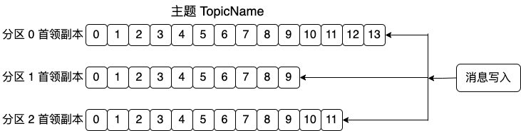

# Kafka

## kafka 使用场景

1. 活动跟踪
2. 传递消息
3. 度量指标和日志记录
4. 提交日志
5. 流处理

## kafka 总览

##### kafka 集群 1


1. kafka broker
2. zookeeper
3. 生产者
4. 消费者


##### kafka 集群 2


1. 主题
2. 分区
3. 副本和首领副本


##### 生产者




1. 消息组成
2. 序列化
3. 分区器
4. 批次


从创建一个 `ProducerRecord` 对象开始，ProducerRecord 对象需要包含`目标主题`和要`发送的内容`。还可以指定`键`或`分区`。在发送 ProducerRecord 对象时，生产者要先把键和值对象`序列化`成字节数组，这样它们才能够在网络上传输。

接下来，数据被传给`分区器`。如果之前在 ProducerRecord 对象里指定了分区，那么分区器就不会再做任何事情，直接把指定的分区返回。如果没有指定分区，那么分区器会根据 ProducerRecord 对象的键来选择一个分区。选好分区以后，生产者就知道该往哪个主题和分区发送这条记录了。

紧接着，这条记录被添加到一个`记录批次`里，这个批次里的所有消息会被发送到相同的主题和分区上。有一个独立的线程负责把这些记录批次发送到相应的 broker 上。

服务器在收到这些消息时会返回一个响应。如果消息成功写入 Kafka，就返回一个 `RecordMetaData` 对象，它包含了主题和分区信息，以及记录在分区里的偏移量。如果写入 失败，则会返回一个错误。生产者在收到错误之后会尝试重新发送消息，几次之后如果还是失败，就返回错误信息。


```java
Properties kafkaProps = new Properties();
kafkaProps.put("bootstrap.servers", "");
kafkaProps.put("key.serializer", "");
kafkaProps.put("value.serializer", "");

KafkaProducer producer = new KafkaProducer(kafkaProps);

ProducerRecord record = new ProducerRecord("topic", "key", "value");
try {
    producer.send(record);
} catch (Exception e) {
    e.printStackTrace();
}

```

同步发送：

```java
ProducerRecord record = new ProducerRecord("topic", "key", "value");
try {
    producer.send(record).get();
} catch (Exception e) {
    e.printStackTrace();
}

```

异步发送：

```java
private class DemoProducerCallback implements callback {
    public void onCompletion(RecordMetadata recordMetadata, Exception e){
        //
    }
}

ProducerRecord record = new ProducerRecord("topic", "key", "value");
try {
    producer.send(record, new DemoProducerCallback());
} catch (Exception e) {
    e.printStackTrace();
}

```


生产者配置：

1. acks

acks 参数指定了必须要有多少个分区副本收到消息，生产者才会认为消息写入是成功的。这个参数对消息丢失的可能性有重要影响。该参数有如下选项。

* 如果 acks=0，生产者在成功写入消息之前不会等待任何来自服务器的响应。也就是说， 如果当中出现了问题，导致服务器没有收到消息，那么生产者就无从得知，消息也就丢失了。不过，因为生产者不需要等待服务器的响应，所以它可以以网络能够支持的最大速度发送消息，从而达到很高的吞吐量。

* 如果 acks=1，只要集群的首领节点收到消息，生产者就会收到一个来自服务器的成功响应。如果消息无法到达首领节点（比如首领节点崩溃，新的首领还没有被选举出来），生产者会收到一个错误响应，为了避免数据丢失，生产者会重发消息。不过，如果一个没有收到消息的节点成为新首领，消息还是会丢失。这个时候的吞吐量取决于使用的是同步发送还是异步发送。如果让发送客户端等待服务器的响应（通过调用 Future 对象的 get() 方法），显然会增加延迟（在网络上传输一个来回的延迟)。如果客户端使用回调，延迟问题就可以得到缓解，不过吞吐量还是会受发送中消息数量的限制（比如，生产者在收到服务器响应之前可以发送多少个消息)。

* 如果 acks=all，只有当所有参与复制的节点全部收到消息时，生产者才会收到一个来自服务器的成功响应。这种模式是最安全的，它可以保证不止一个服务器收到消息，就算有服务器发生崩溃，整个集群仍然可以运行。不过，它的延迟比 acks=1 时更高，因为我们要等待不只一个服务器节点接收消息。

2. buffer.memory

该参数用来设置生产者内存缓冲区的大小，生产者用它缓冲要发送到服务器的消息。如果应用程序发送消息的速度超过发送到服务器的速度，会导致生产者空间不足。这个时候， send() 方法调用要么被阻塞，要么抛出异常，取决于如何设置 `block.on.buffer.full` 参数 (在 0.9.0.0 版本里被替换成了 `max.block.ms`，表示在抛出异常之前可以阻塞一段时间）。

3. compression.type

默认情况下，消息发送时不会被压缩。该参数可以设置为 `snappy`、`gzip`或 `lz4`，它指定了消息被发送给 broker 之前使用哪一种压缩算法进行压缩。使用压缩可以降低网络传输开销和存储开销，而这往往是向 Kafka 发送消息的瓶颈所在。

4. retries

生产者从服务器收到的错误有可能是临时性的错误（比如分区找不到首领）。在这种情况 下，retries 参数的值决定了生产者可以重发消息的次数，如果达到这个次数，生产者会放弃重试并返回错误。默认情况下，生产者会在每次重试之间等待 100ms，不过可以通过 `retry.backoff.ms` 参数来改变这个时间间隔。建议在设置重试次数和重试时间间隔之前， 先测试一下恢复一个崩溃节点需要多少时间（比如所有分区选举出首领需要多长时间），让总的重试时间比 Kafka 集群从崩溃中恢复的时间长，否则生产者会过早地放弃重试。不过有些错误不是临时性错误，没办法通过重试来解决（比如“消息太大”错误）。一般情况下，因为生产者会自动进行重试，所以就没必要在代码逻辑里处理那些可重试的错误。 你只需要处理那些不可重试的错误或重试次数超出上限的情况。

5. batch.size

当有多个消息需要被发送到同一个分区时，生产者会把它们放在同一个批次里。该参数指定了一个批次可以使用的内存大小，按照字节数计算（而不是消息个数)。当批次被填满，批次里的所有消息会被发送出去。不过生产者并不一定都会等到批次被填满才发送，半满的批次，甚至只包含一个消息的批次也有可能被发送。所以就算把批次大小设置得很大， 也不会造成延迟，只是会占用更多的内存而已。但如果设置得太小，因为生产者需要更频繁地发送消息，会增加一些额外的开销。

6. linger.ms

该参数指定了生产者在发送批次之前等待更多消息加入批次的时间。KafkaProducer 会在批次填满或 linger.ms 达到上限时把批次发送出去。默认情况下，只要有可用的线程，生产者就会把消息发送出去，就算批次里只有一个消息。把 linger.ms 设置成比 0 大的数， 让生产者在发送批次之前等待一会儿，使更多的消息加入到这个批次。虽然这样会增加延 迟，但也会提升吞吐量（因为一次性发送更多的消息，每个消息的开销就变小了）。

7. client.id

该参数可以是任意的字符串，服务器会用它来识别消息的来源，还可以用在日志和配额指标里。

8. max.in.flight.requests.per.connection

该参数指定了生产者在收到服务器响应之前可以发送多少个消息。它的值越高，就会占用越多的内存，不过也会提升吞吐量。把它设为 1 可以保证消息是按照发送的顺序写入服务器的，即使发生了重试。

9. timeout.ms、request.timeout.ms 和 metadata.fetch.timeout.ms

`request.timeout.ms` 指定了生产者在发送数据时等待服务器返回响应的时间，`metadata.fetch.timeout.ms` 指定了生产者在获取元数据（比如目标分区的首领是谁）时等待服务器返回响应的时间。如果等待响应超时，那么生产者要么重试发送数据，要么返回一个错误 (抛出异常或执行回调）。`timeout.ms` 指定了 broker 等待同步副本返回消息确认的时间，与 acks 的配置相匹配——如果在指定时间内没有收到同步副本的确认，那么 broker 就会返回一个错误。

10. max.block.ms

该参数指定了在调用 `send()`方法或使用 `partitionFor()` 方法获取元数据时生产者的阻塞 时间。当生产者的发送缓冲区已满，或者没有可用的元数据时，这些方法就会阻塞。在阻塞时间达到 max.block.ms 时，生产者会抛出超时异常。

11. max.request.size

该参数用于控制生产者发送的请求大小。它可以指能发送的单个消息的最大值，也可以指单个请求里所有消息总的大小。例如，假设这个值为 1MB，那么可以发送的单个最大消息为 1MB，或者生产者可以在单个请求里发送一个批次，该批次包含了 1000 个消息，每个消息大小为 1KB。另外，broker 对可接收的消息最大值也有自己的限制（`message.max.bytes`)，所以两边的配置最好可以匹配，避免生产者发送的消息被 broker 拒绝。

12. receive.buffer.bytes 和 send.buffer.bytes

这两个参数分别指定了 TCP Socket 接收和发送数据包的缓冲区大小。如果它们被设为 -1，就使用操作系统的默认值。如果生产者或消费者与 broker 处于不同的数据中心，那么可以适当增大这些值，因为跨数据中心的网络一般都有比较高的延迟和比较低的带宽。


总结：

1. kafka 集群
2. 创建 Topic，配置分区数和副本数
3. kafka 集群进行`分区分配`、`分区首领选举`，然后将这些元数据信息写入 Zookeeper
4. 生产者配置相关参数
5. 生产者获取元数据
6. 生产者发送数据
7. 生产者接收相应或者接收异常


分区首领选举 -> 控制器（本质上是一个 broker）

副本分为`首领副本`和`跟随者副本`

跟随者副本的状态又分为`同步`和`不同步`

Rebalance 工具也产生了作用

消息在集群中的存储位置和存储格式


##### 消费者


1. 消费者组
2. 群组协调器


```java
private Properties kafkaProps = new Properties();
kafkaProps.put("bootstrap.servers", "");
kafkaProps.put("group.id", "");  // 消费者群组
kafkaProps.put("key.deserializer", "");
kafkaProps.put("value.deserializer", "");

KafkaConsumer consumer = new KafkaConsumer(kafkaProps);

// 订阅主题，可以订阅多个主题
consumer.subscribe(Collections.SingletonList(""));

try {
    while(true) {
        // 超时时间，如果该参数设置为 0，poll() 会立即返回，否则它会在指定的毫秒数内一直等待 broker 返回数据
        ConsumerRecords records = consumer.poll(100);
        for(ConsumerRecords record : records){
            // 业务逻辑
            record.topic();
            record.partition();
            record.offset();
            record.key();
            record.value();
        }
        // 提交偏移量

    }

} finally {
    consumer.close();
}


```


1. fetch.min.bytes

该属性指定了消费者从服务器获取记录的最小字节数。broker 在收到消费者的数据请求时，如果可用的数据量小于 fetch.min.bytes 指定的大小，那么它会等到有足够的可用数据时才把它返回给消费者。这样可以降低消费者和 broker 的工作负载，因为它们在主题不是很活跃的时候（或者一天里的低谷时段）就不需要来来回回地处理消息。如果没有很多可用数据，但消费者的 CPU 使用率却很高，那么就需要把该属性的值设得比默认值大。如果消费者的数量比较多，把该属性的值设置得大一点可以降低 broker 的工作负载。

2. fetch.max.wait.ms

我们通过 fetch.min.bytes 告诉 Kafka，等到有足够的数据时才把它返回给消费者。而 fetch.max.wait.ms 则用于指定 broker 的等待时间， 默认是 500ms。如果没有足够的数据流入 Kafka， 消费者获取最小数据量的要求就得不到满足，最终导致 500ms 的延迟。如果要降低潜在的延迟， 可以把该参数值设置得小一些。如果 fetch.max.wait.ms 被设为 100ms， 并且 fetch.min.bytes 被设为 1MB， 那么 Kafka 在收到消费者的请求后， 要么返回 1MB 数据，要么在 100ms 后返回所有可用的数据，就看哪个条件先得到满足。

3. max.partition.fetch.bytes

该属性指定了服务器从每个分区里返回给消费者的最大字节数。它的默认值是 1MB，也就是说， KafkaConsumer.poll() 方法从每个分区里返回的记录最多不超过 max.partition.fetch.bytes 指定的字节。如果一个主题有 20 个分区和 5 个消费者，那么每个消费者需要至少 4MB 的可用内存来接收记录。在为消费者分配内存时，可以给它们多分配一些，因为如果群组里有消费者发生崩溃，剩下的消费者需要处理更多的分区。max.partition.fetch.bytes 的值必须比 broker 能够接收的最大消息的字节数（通过 `message.max.bytes` 属性配置）大，否则消费者可能无法读取这些消息，导致消费者一直挂起重试。在设置该属性时，另一个需要考虑的因素是消费者处理数据的时间。消费者需要频繁调用 poll() 方法来避免会话过期和发生分区再均衡，如果单次调用 poll() 返回的数据太多，消费者需要更多的时间来处理，可能无法及时进行下一个轮询来避免会话过期。如果出现这种情况，可以把 max.partition.fetch.bytes 值改小，或者延长会话过期时间。

4. session.timeout.ms

该属性指定了消费者在被认为死亡之前可以与服务器断开连接的时间，默认是 3s。如果消费者没有在 session.timeout.ms 指定的时间内发送心跳给群组协调器，就被认为已经死亡，协调器就会触发再均衡，把它的分区分配给群组里的其他消费者。该属性与 `heartbeat.interval.ms` 紧密相关。heartbeat.interval.ms 指定了 poll() 方法向协调器发送心跳的频率，session.timeout.ms 则指定了消费者可以多久不发送心跳。所以，一般需要同时修改这两个属性，heartbeat.interval.ms 必须比 session.timeout.ms 小。一般是 session.timeout.ms 的三分之一。如果 session.timeout.ms 是 3s，那么 heartbeat.interval.ms 应该是 1s。把 session.timeout.ms 值设得比默认值小，可以更快地检测和恢复崩溃的节点，不过长时间的轮询或垃圾收集可能导致非预期的再均衡。把该属性的值设置得大一些，可以减少意外的再均衡，不过检测节点崩溃需要更长的时间。

5. auto.offset.reset

该属性指定了消费者在读取一个没有偏移量的分区或者偏移量无效的情况下（因消费者长时间失效，包含偏移量的记录已经过时并被删除）该作何处理。它的默认值是 latest，意思是说，在偏移量无效的情况下，消费者将从最新的记录开始读取数据（在消费者启动之后生成的记录）。另一个值是 earliest，意思是说，在偏移量无效的情况下，消费者将从起始位置读取分区的记录。

6. enable.auto.commit

该属性指定了消费者是否自动提交偏移量，默认值是 true。为了尽量避免出现重复数据和数据丢失，可以把它设为 false，由自己控制何时提交偏移量。如果把它设为 true，还可以通过配置 `auto.commit.interval.ms` 属性来控制提交的频率。

7. partition.assignment.strategy

分区会被分配给群组里的消费者。PartitionAssignor 根据给定的消费者和主题，决定哪些分区应该被分配给哪个消费者。Kafka 有两个默认的分配策略。

* Range

该策略会把主题的若干个连续的分区分配给消费者。假设消费者 C1 和消费者 C2 同时订阅了主题 T1 和主题 T2，并且每个主题有 3 个分区。那么消费者 C1 有可能分配到这两个主题的分区 0 和分区 1，而消费者 C2 分配到这两个主题的分区 2。因为每个主题拥有奇数个分区，而分配是在主题内独立完成的，第一个消费者最后分配到比第二个消费者更多的分区。只要使用了 Range 策略，而且分区数量无法被消费者数量整除，就会出现这种情况。

* RoundRobin

该策略把主题的所有分区逐个分配给消费者。如果使用 RoundRobin 策略来给消费者 C1 和消费者 C2 分配分区，那么消费者 C1 将分到主题 T1 的分区 0 和分区 2 以及主题 T2 的分区 1，消费者 C2 将分配到主题 T1 的分区 1 以及主题 T2 的分区 0 和分区 2。一般来说，如果所有消费者都订阅相同的主题（这种情况很常见），RoundRobin 策略会给所有消费者分配相同数量的分区（或最多就差一个分区）。

可以通过设置 partition.assignment.strategy 来选择分区策略。 默认使用的是 
org. apache.kafka.clients.consumer.RangeAssignor， 这个类实现了 Range 策略，不过也可以把它改成 org.apache.kafka.clients.consumer.RoundRobinAssignor。我们还可以使用自定义策略，在这种情况下，partition.assignment.strategy 属性的值就是自定义类的名字。

8. client.id

该属性可以是任意字符串，broker 用它来标识从客户端发送过来的消息，通常被用在日志、度量指标和配额里。

9. max.poll.records

该属性用于控制单次调用 poll() 方法能够返回的记录数量，可以帮你控制在轮询里需要处理的数据量。

10. receive.buffer.bytes 和 send.buffer.bytes

socket 在读写数据时用到的 TCP 缓冲区也可以设置大小。如果它们被设为 -1，就使用操作系统的默认值。如果生产者或消费者与 broker 处于不同的数据中心内，可以适当增大这些值，因为跨数据中心的网络一般都有比较高的延迟和比较低的带宽。


总结：

1. 群组协调
2. 分区在均衡
3. 发送心跳
4. 获取数据
5. 提交偏移量


提交偏移量

1. 自动提交
2. 同步提交
3. 异步提交


同步提交


```java
try {
    while(true) {
        // 超时时间，如果该参数设置为 0，poll() 会立即返回，否则它会在指定的毫秒数内一直等待 broker 返回数据
        ConsumerRecords records = consumer.poll(100);
        for(ConsumerRecords record : records){
            // 业务逻辑
            record.topic();
            record.partition();
            record.offset();
            record.key();
            record.value();
        }
        // 同步提交偏移量
        try {
            consumer.commitSync();
        } catch () {
            //
        }

    }

} finally {
    consumer.close();
}


```


异步提交

```java
try {
    while(true) {
        // 超时时间，如果该参数设置为 0，poll() 会立即返回，否则它会在指定的毫秒数内一直等待 broker 返回数据
        ConsumerRecords records = consumer.poll(100);
        for(ConsumerRecords record : records){
            // 业务逻辑
            record.topic();
            record.partition();
            record.offset();
            record.key();
            record.value();
        }
        // 异步提交偏移量
        consumer.commitAsync();

    }

} finally {
    consumer.close();
}

```


```java
private class OffsetCommitCallback(){
    public void onComplete(Map<TopicPartition, OffsetAndMetadata> offsets, Exception e){
        //
    }
}

try {
    while(true) {
        // 超时时间，如果该参数设置为 0，poll() 会立即返回，否则它会在指定的毫秒数内一直等待 broker 返回数据
        ConsumerRecords records = consumer.poll(100);
        for(ConsumerRecords record : records){
            // 业务逻辑
            record.topic();
            record.partition();
            record.offset();
            record.key();
            record.value();
        }
        // 异步提交偏移量
        consumer.commitAsync(new OffsetCommitCallback());

    }

} finally {
    consumer.close();
}

```

同步提交与异步提交相结合

```java
private class OffsetCommitCallback(){
    public void onComplete(Map<TopicPartition, OffsetAndMetadata> offsets, Exception e){
        //
    }
}

try {
    while(true) {
        // 超时时间，如果该参数设置为 0，poll() 会立即返回，否则它会在指定的毫秒数内一直等待 broker 返回数据
        ConsumerRecords records = consumer.poll(100);
        for(ConsumerRecords record : records){
            // 业务逻辑
            record.topic();
            record.partition();
            record.offset();
            record.key();
            record.value();
        }
        // 异步提交偏移量
        consumer.commitAsync(new OffsetCommitCallback());

    }
} catch (Exception e) {
    //
} finally {
    try {
        consumer.commitSync();
    } finally {
        consumer.close();
    }
}


```


提交特定偏移量

```java
Map<TopicPartition, OffsetAndMetadata> currentOffsets = new HashMap()
int count = 0;
try {
    while(true) {
        // 超时时间，如果该参数设置为 0，poll() 会立即返回，否则它会在指定的毫秒数内一直等待 broker 返回数据
        ConsumerRecords records = consumer.poll(100);
        for(ConsumerRecords record : records){
            // 业务逻辑
            record.topic();
            record.partition();
            record.offset();
            record.key();
            record.value();

            currentOffsets.put(
                new TopicPartition(record.topic(), record.partition()),
                new OffsetAndMetadata(record.offset() + 1, "no metadata")
            );
            if (count % 1000 == 0) {
                consumer.commitAsync(currentOffsets, null)
                // consumer.commitSync(currentOffsets, null)
            }
            count++;

        }

    }
} catch (Exception e) {
    //
} finally {
    try {
        consumer.commitSync();
    } finally {
        consumer.close();
    }
}


```

在均衡监听器

```java
Map<TopicPartition, OffsetAndMetadata> currentOffsets = new HashMap()
int count = 0;

private class HandleRebalance implements ConsumerRebalanceListener {
    //消费者停止读取消息之后和再均衡开始之前调用
    public void onPartitionsAssigned(Collections<TopicPartition> partitions) {
        //
    }

    // 重新分配分区之后和消费者开始读取消息之前调用
    publoc void onPartitionsRevoked(Collections<TopicPartition> partitions) {
        //
    }
}


KafkaConsumer consumer = new KafkaConsumer(kafkaProps);

// 订阅主题，可以订阅多个主题
consumer.subscribe(Collections.SingletonList(""), new HandleRebalance());

try {
    while(true) {
        // 超时时间，如果该参数设置为 0，poll() 会立即返回，否则它会在指定的毫秒数内一直等待 broker 返回数据
        ConsumerRecords records = consumer.poll(100);
        for(ConsumerRecords record : records){
            // 业务逻辑
            record.topic();
            record.partition();
            record.offset();
            record.key();
            record.value();

            currentOffsets.put(
                new TopicPartition(record.topic(), record.partition()),
                new OffsetAndMetadata(record.offset() + 1, "no metadata")
            );
            if (count % 1000 == 0) {
                consumer.commitAsync(currentOffsets, null)
                // consumer.commitSync(currentOffsets, null)
            }
            count++;

        }

    }
} catch (Exception e) {
    //
} finally {
    try {
        consumer.commitSync();
    } finally {
        consumer.close();
    }
}

```


从特定的偏移量开始读取数据

```java
seekToBeginning(Collection<TopicPartition> tp)
seekToEndllection<TopicPartition> tp)
seek(partition, offset)

```


https://www.wdku.net

KHW.6Wa.KmBidBn


## 创建生产者


