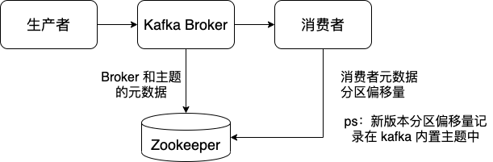

# kafka

## kafka broker



kafka broker 的作用：

Kafka 的 broker 负责持久化 producer 端发送的消息，同时还为 consumer 端提供消息。

## 消息的设计和存储方式


### Java 版本

使用 Java 消息类实现消息结构，如下面的代码所示：

```java
public class Message implements Serializable {
    // 消息元数据
    // CRC 校验码
    private CRC32 crc;
    // 版本号
    private byte magic;
    // 消息体，业务数据
    private String payload;
}
```

优点：简单，熟悉，容易理解

缺点：

1. 浪费空间
2. Java GC

16(16字节对象头部) + 1 + 4 + 4 + 7(7字节补齐) = 32 bytes

```java
// JVM 重排
public class Message implements Serializable {
    private byte magic;  // 1 bytes
    private CRC32 crc;  // 4 bytes
    private String body;  // 4 bytes, 引用类型
}
```

### V0 版本

#### V0 版本消息格式

[Kafka 0.9.0 messageformat](https://kafka.apache.org/090/documentation.html#messageformat)

```
/**
 * A message. The format of an N byte message is the following:
 *
 * If magic byte is 0
 *
 * 1. 1 byte "magic" identifier to allow format changes
 *
 * 2. 4 byte CRC32 of the payload
 *
 * 3. N - 5 byte payload
 *
 * If magic byte is 1
 *
 * 1. 1 byte "magic" identifier to allow format changes
 *
 * 2. 1 byte "attributes" identifier to allow annotations on the message independent of the version (e.g. compression enabled, type of codec used)
 *
 * 3. 4 byte CRC32 of the payload
 *
 * 4. N - 6 byte payload
 *
 */
```


各字段说明如下：

1. magic：单字节的版本号。用于不同版本之间的格式转换。

2. CRC 校验码：4 字节的 CRC 校验码，用于确保消息在传输过程中不会被恶意篡改。

3. payload：消息体

#### V0 版本日志文件格式

```
On-disk format of a message

message length : 4 bytes (value: 1+4+n)
"magic" value  : 1 byte
crc            : 4 bytes
payload        : n bytes
```


优点：

1. 节约磁盘空间和带宽

1 + 4 = 5 bytes

缺点：

1. 由于没有消息的时间信息，Kafka 定期删除过期日志只能依靠日志段文件的”最近修改时间“，但这个时间极易受到外部操作的干扰。 若不小心对日志段文件执行了 UNIX 的 touch 命令，该日志文件的最近修改时间就被更新了。一旦这个时间被”破坏“或者更改，Kafka将无法对哪些消息过期做出正确判断。

2. 很多流式处理框架都需要消息保存时间信息以便对消息执行时间窗口等聚合操作。


### V1 版本

#### V1 版本消息格式

[Kafka 0.10.2 messageformat](https://kafka.apache.org/0102/documentation.html#messageformat)

```
/**
 * 1. 4 byte CRC32 of the message
 * 2. 1 byte "magic" identifier to allow format changes, value is 0 or 1
 * 3. 1 byte "attributes" identifier to allow annotations on the message independent of the version
 *    bit 0 ~ 2 : Compression codec.
 *      0 : no compression
 *      1 : gzip
 *      2 : snappy
 *      3 : lz4
 *    bit 3 : Timestamp type
 *      0 : create time
 *      1 : log append time
 *    bit 4 ~ 7 : reserved
 * 4. (Optional) 8 byte timestamp only if "magic" identifier is greater than 0
 * 5. 4 byte key length, containing length K
 * 6. K byte key
 * 7. 4 byte payload length, containing length V
 * 8. V byte payload
 */
```


字段说明：

1. CRC 校验码：4 字节的 CRC 校验码，用于确保消息在传输过程中不会被恶意篡改。
2. magic：单字节的版本号。
3. attribute：单字节属性字段。
4. 时间戳：消息在生产者端的创建时间或者消息追加到日志文件中的时间
5. key 长度：4 字节的消息 key 长度信息。若未指定 key，则给该字段赋值为 -1。
6. key 值：消息 key，长度由上面的 key 长度字段值指定。如果 key 长度字段值是 -1，则消息没有该字段。
7. payload 长度：4 字节的消息长度。若未指定 payload，则给该字段赋值 -1。
8. payload 值：消息 payload，长度由上面的 payload 长度字段值指定。如果 payload 长度字段值是 -1，则消息没有该字段。

#### V1 版本日志文件格式

```
On-disk format of a message

offset         : 8 bytes
message length : 4 bytes (value: 4 + 1 + 1 + 8(if magic value > 0) + 4 + K + 4 + V)
crc            : 4 bytes
magic value    : 1 byte
attributes     : 1 byte
timestamp      : 8 bytes (Only exists when magic value is greater than zero)
key length     : 4 bytes
key            : K bytes
value length   : 4 bytes
value          : V bytes
```


缺点：

1. 空间利用率不高：不论 key 和 payload 长度是多少，它总是使用 4 字节固定长度来保存这部分信息。例如保存 100 或是 1000 都是使用 4 字节，但其实只需要 7 位就足以保存 100 这个数字了，也就是说，只用 1 字节就足够，另外 3 字节纯属浪费。

2. 压缩率不高。

3. 冗余的消息级 CRC 校验：为每条消息都执行 CRC 校验有些多余。即使在网络传输过程中没有出现恶意篡改，也不能认为在 producer 端发送的消息到 consumer 端时其 CRC 值是不变的。若用户指定时间戳类型是 LOG APPEND TIME，broker 将使用当前时间戳覆盖掉消息已有时间戳，那么当 broker 端对消息进行时间戳更新后，CRC 就需要重新计算从而发生变化；再如，broker 端进行消息格式转换（broker 端和 clients 端版本不一致时会发生消息格式转换，不过这对用户而言是完全透明的）也会带来 CRC 值的变化。鉴于这些情况，对每条消息都执行 CRC 校验实际上没有必要，不仅浪费空间，还占用了宝贵的 CPU 时间片。

4. 未保存消息长度：每次需要单条消息的总字节数信息时都需要计算得出，没有使用单独字段来保存。

### V2 版本

#### V1 版本消息格式

[Kafka 2.5.0 messageformat](https://kafka.apache.org/25/documentation.html#messageformat)

```
length: varint
attributes: int8
	bit 0~7: unused
timestampDelta: varint
offsetDelta: varint
keyLength: varint
key: byte[]
valueLen: varint
value: byte[]
Headers => [Header]
```


* length：消息长度
* attributes：属性值，未使用
* timestampDelta：与 RecordBatch 中的 firstTimestamp 时间增量
* offsetDelta：与 RecordBatch 中的 baseOffset 增量
* keyLength
* key
* valueLen
* value
* Headers

#### V2 版本日志文件格式

```
baseOffset: int64
batchLength: int32
partitionLeaderEpoch: int32
magic: int8 (current magic value is 2)
crc: int32
attributes: int16
	bit 0~2:
		0: no compression
		1: gzip
		2: snappy
		3: lz4
		4: zstd
	bit 3: timestampType
	bit 4: isTransactional (0 means not transactional)
	bit 5: isControlBatch (0 means not a control batch)
	bit 6~15: unused
lastOffsetDelta: int32
firstTimestamp: int64
maxTimestamp: int64
producerId: int64
producerEpoch: int16
baseSequence: int32
records: [Record]
```


说明：

1. baseOffset 与 lastOffsetDelta 结合实现二分法查找

2. firstTimestamp 与 maxTimestamp 结合实现二分法查找

## 日志存储设计

创建 topic 时，Kafka 为该 topic 的每个分区在文件系统中创建了一个对应的子目录，名字就是 `<topicname>-<分区号>`。如下所示：有一个 topic 是 alauda-log-topic，拥有 3 个分区，所以在文件系统中 Kafka 会创建 3 个子目录：alauda-log-topic-0、alauda-log-topic-1、alauda-log-topic-2。

每个日志子目录的文件构成也如下所示，即包括**日志段文件**和**索引文件**。

```bash
$ tree -a kafka-log1/
kafka-log1/
├── alauda-log-topic-0
│   ├── 00000000000000058813.index
│   ├── 00000000000000058813.log
│   ├── 00000000000000058813.timeindex

│   ├── 00000000000000085639.index
│   ├── 00000000000000085639.log
│   ├── 00000000000000085639.timeindex

│   ├── 00000000000000107770.index
│   ├── 00000000000000107770.log
│   ├── 00000000000000107770.timeindex

├── alauda-log-topic-1
├── alauda-log-topic-2
```

### 日志段文件

日志段文件，即后缀名是 `.log` 的文件，保存着真实的 Kafka 记录。每个 .log 文件都包含了一段位移范围内的 Kafka 记录。Kafka 使用该文件第一条记录对应的 offset 来命名此 log 文件。因此，每个新创建的 topic 分区一定有 offset 是 0 的 .log 文件，即 `00000000000000000.log`。

### 索引文件

索引文件包括位移索引文件 `00000000000000058813.index` 和时间戳索引文件 `00000000000000058813.timeindex`。位移索引文件帮助 broker 更快地定位记录所在的物理文件位置，而时间戳索引文件则是根据给定的时间戳查找对应的位移信息。

无论是位移索引文件还是时间戳索引文件，它们中的索引项都按照某种规律进行升序排列。对于位移索引文件而言，它是按照位移顺序保存的。而时间戳索引文件则严格按照时间戳顺序保存。由于有了这种升序规律，Kafka 可以利用**二分查找( binary search)算法**来搜寻目标索引项，从而降低整体时间复杂度到 O(logN)。 若没有索引文件，Kafka搜寻记录的方式只能是从每个日志段文件的头部顺序扫描，因此，这种方案的时间复杂度是O(N)。显然，引入索引文件可以极大地减少查找时间，减少 broker 端的 CPU 开销。

#### 位移移索引文件


#### 时间戳索引文件


## 副本和ISR

### HW 和 LEO


* LEO：日志末端位移，**记录了该副本对象底层日志文件中下一条消息的位移值**。比如 LEO=0，说明日志文件中没有数据，下次生产者发送过来的数据写在位移为 0 的位置上，若 LEO=10，那么表示在该副本日志上已经保存了 10 条消息，位移范围是[0, 9]，下次生产者发送过来的数据写在位移为 10 的位置上。

* HW：水印值。小于或等于 HW 值的所有消息被认为是“已提交的”或“已备份的”，可以被消费者消费的数据。任何一个副本对象的 HW 值一定不大于其 LEO 值。

### 消息写入机制


**leader 接收到生产消息的请求后，主要做如下两件事情。**

1. 写入消息到底层日志，同时更新 leader 副本的 LEO 属性。

2. 尝试更新 leader 副本的 HW 值。此时 follower 尚未发送 FETCH 请求，那么 leader 端保存的 remote LEO 依然是 0，因此 leader 会比较它自己的 LEO 值和 remote LEO 值，发现最小值是 0，更新 HW 值为 -1。

**此时 follower 发送 FETCH 请求，leader 端的处理逻辑依次如下。**

1. 读取底层 log 数据。

2. 更新 remote LEO = 0。为什么是 0？因为这是通过 follower 发来的 FETCH 请求中的 fetch offset 来确定的。

3. 尝试更新 leader 副本的 HW 值。此时 leader LEO = 1，remote LEO = 0，故 Leader HW = min(leader LEO，follower remote LEO) -1 = -1。

4. 把数据和 leader 副本的 HW 值发送给 follower 副本。

**follower 副本接收到 FETCH response 后依次执行下列操作。**

1. 写入本地 log，同时更新 followerLEO。

2. 更新 follower HW，比较本地 LEO 和当前 leader HW 后取较小值，故 follower HW=-1。

**follower 发来了第二轮 FETCH 请求，leader 端接收到后仍然会依次执行下列操作。**

1. 读取底层 log 数据。

2. 更新 remote LEO=1，因为这轮 FETCH RPC 携带的 fetch offset 是 1。

3. 尝试更新 Leader HW，此时 leader LEO = 1，remote LEO = 1，故 Leader HW = 
min(leader LEO，fllower remote LEO) -1 = 0

4. 把数据（实际上没有数据）和 Leader HW 发送给 follower 副本。

**follower 副本接收到 FETCH response 后依次执行下列操作。**

1. 写入本地 log，因为没有数据，故 follower LEO 也不会变化。
2. 更新 follower HW。比较本地 LEO 和 Leader HW 后取较小值。故更新 follower HW = 0。

## 生产者

生产者面临的问题：数据重复写入


使用**消息序列号幂等性**解决数据重复写入的问题


生产者面临的问题：不允许多个 producer 同时向同一个 topic 的同一个分区中写入数据


使用 **PID(生产者 ID) **解决不允许多个 producer 同时向同一个 topic 的同一个分区中写入数据


生产者面临的问题：生产者在一次请求中将同一条消息发送给两个 topic，或者向两个 topic 发送不同的消息时不能确保全部发送成功


使用事务处理


## 消费者

消费者处理过程：


如上图所示：

1. Consumer 不断向 Broker 请求数据，假设上一次消费者提交的位置是 1，也就是消费者已经消费消息 0 和消息 1

2. 当消费者再次请求数据时，Broker 会返回位置为 2 之后的若干条数据，假设 Broker 返回位置为 [2, 7] 的 6 条数据

```bash
# 向主题中生产 55 条数据并消费

$ kafka-consumer-groups.sh --bootstrap-server 10.0.128.237:30300 --describe --group my-group
GROUP           TOPIC           PARTITION  CURRENT-OFFSET  LOG-END-OFFSET  LAG
my-group        my-topic        0          19              19              0
my-group        my-topic        1          18              18              0
my-group        my-topic        2          18              18              0


$ echo "exclude.internal.topics=false" > ./consumer.config
$ kafka-console-consumer.sh --consumer.config ./consumer.config --formatter "kafka.coordinator.group.GroupMetadataManager\$OffsetsMessageFormatter" --bootstrap-server 10.0.128.237:30300 --topic __consumer_offsets --from-beginning
[my-group,my-topic,0]::OffsetAndMetadata(offset=1)
[my-group,my-topic,1]::OffsetAndMetadata(offset=2)
[my-group,my-topic,2]::OffsetAndMetadata(offset=2)

[my-group,my-topic,0]::OffsetAndMetadata(offset=19)
[my-group,my-topic,1]::OffsetAndMetadata(offset=18)
[my-group,my-topic,2]::OffsetAndMetadata(offset=18)

```


### log compacted


### 问题

1. Consumer 不断向 Broker 请求数据，假设上一次消费者提交的位置是 1，也就是消费者已经消费消息 0 和消息 1

2. 当消费者再次请求数据时，Broker 会返回位置为 2 之后的若干条数据，假设 Broker 返回位置为 [2, 7] 的 6 条数据

3. 如果消费者在拿到位置为 [2, 7] 的 6 条数据后立刻提交位移，也就是提交位移 7，提交成功后准备开始处理数据逻辑，比如写入数据库，但此时消费者程序挂掉了，也就是没有将 [2, 7] 这 6 条数据写入数据库，等消费者程序恢复后再次请求数据时，Broker 会返回从位置 8 开始的若干条数据。也就是**位置 [2, 7] 这 6 条数据没有被处理**。

```java
while(true) {
    ConsumerRecords records = consumer.poll(100);  // 获取数据
    consumer.commitSync();  // 提交偏移量
    // 程序挂掉
    for(ConsumerRecords record : records) {  // 业务逻辑
        record.topic();
        record.partition();
        record.offset();
        record.key();
        record.value();
    }
}
```

4. 如果消费者在拿到位置为 [2, 7] 的 6 条数据后开始处理业务逻辑，比如写入数据库，将数据写入数据库后再提交位移，但在成功写入数据库提交位移 7 之前消费者程序挂掉了，也就是没有提交位移 7，Broker 记录的上次提交的位移还是 2。等消费者程序恢复后再次请求数据时，Broker 会返回从位置 2 开始的若干条数据。比如返回位置为 [2, 7] 的 6 条数据，对于 kafka 来说**位置 [2, 7] 的这 6 条数据被重复处理了**。

```java
while(true) {
    ConsumerRecords records = consumer.poll(100);  // 获取数据
    for(ConsumerRecords record : records) {  // 业务逻辑
        record.topic();
        record.partition();
        record.offset();
        record.key();
        record.value();
    }
    // 程序挂掉
    consumer.commitSync();  // 提交偏移量
}
```

