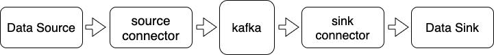

# KAFKA CONNECT

https://kafka.apache.org/documentation/#connect

Kafka Connect 是一个高伸缩性、高可靠性的数据集成工具，用于在 Apache Kafka 与其他系统间进行数据搬运以及执行 ETL 操作，比如 Kafka Connect 能够将文件系统中某些文件的内容全部灌入Kafka topic 中或者是把 Kafka topic 中的消息导出到外部的数据库系统。

Kafka Connect 原理如下图所示：



如图所示，Kafka Connect 主要由 source connector 和 sink connector 组成。source connector 负责把输入数据从外部系统中导入到 Kafka 中，而 sink connector 则负责把输出数据导出到其他外部系统。

KafkaConnect 有两种运行模式，分别是 standalone 和 distributed。在 standalone 模式下所有的操作都是在一个进程中完成的。这种模式非常适合运行在测试或功能验证环境，抑或是必须是单线程才能完成的场景（比如收集日志文件）。由于是单进程，standalone 模式无法充分利用 Kafka 提供的负载均衡和高容错等特性。

和 standalone 模式不同，distributed Connect 结合了 Kafka 提供的负载均衡和故障转移功能，能够自动地在多节点机器上平衡负载。用户可以增减机器来实现整体系统的高伸缩性。

## standalone 模式

为了演示 standalone 模式的使用方法，在一个单节点的 Kafka 集群上运行 standalone 模式的 Kafka Connect，把输入文件 foo.txt 中的数据通过 Kafka 传输到输出文件 bar.txt 中。

Kafka Connect standalone 模式通常有 3 类配置文件: connect 配置文件，若干 source connector 配置文件和若干 sink connector 配置文件。本例分别启动一个 source connector 读取 foo.txt 和一个 sink connector 写入 bar.txt，因此配置文件如下：

* config/connect-standalone.properties  connect 配置文件
* connect-file-source.properties  ource connector 配置文件
* connect-file-sink.properties  sink connector 配置文件

配置文件内容和相关配置选项说明如下：

**config/connect-standalone.properties**

```
bootstrap.servers=localhost:9092
key.converter=org.apache.kafka.connect.json.JsonConverter
value.converter=org.apache.kafka.connect.json.JsonConverter
key.converter.schemas.enable=false
value.converter.schemas.enable=false
offset.storage.file.filename=/tmp/connect.offsets
```

* bootstrap.servers： 指定 Connect 要连接的 Kafka 集群主机名和端口号。本例使用 localhost:9092。
* key/value.converter：设置 Kafka 消息 key/value 的格式转化类，本例使用 JsonConverter，即把每条 Kafka 消息转化成一个 JSON 格式。
* key/value.converter.schemas.enable：设置是否需要把数据看成纯 JSON 字符串或者 JSON 格式的对象。本例设置为 true，即把数据转换成 JSON 对象。
* offset.storage.file.filename：connector 会定期地将状态写入底层存储中。该参数设定了状态要被写入的底层存储文件的路径。本例使用 /tmp/connect.offsets 保存 connector 的状态。

**connect-file-source.properties**

```
name=test-file-source
connector.class=FileStreamSource
tasks.max=1
file=foo.txt
topic=connect-file-test

# transforms=MakeMap, InsertHost
# transforms.WrapMap.type=org.apache.kafka.connect.transforms.HoistField$Value
# transforms.WrapMap.field=line
# transforms.InsertHost.type=org.apache.kafka.connect.transforms.InsertField$Value
# transforms.InsertHost.static.field=ip
# transforms.InsertHost.static.value=com.connector.machine
```

* name：设置该 file source connector的名称。
* connector.class：设置 source connector 类的全限定名。有时候设置为类名也是可以的，KafkaConnect 可以在 classpath 中自动搜寻该类并加载。
* tasks.max：每个 connector 下会创建若干个任务(task)执行 connector 逻辑以期望增加并行度，但对于从单个文件读/写数据这样的操作，任意时刻只能有一个 task 访问文件，故这里设置最大任务数为 1。
* file：输入文件全路径名。本例为 foo.txt，即表示该文件位于 Kafka 目录下。实际使用时最好使用绝对路径。
* topic：设置 source conector 把数据导入到 Kafka 的哪个 topic，若该 topic 之前不存在，则source connector 会自动创建。最好提前手工创建出该 topic。本例使用 connect-file-test。

**connect-file-sink.properties**

```
name=test-file-sink
connector.class=FileStreamSink
tasks.max=1
file=bar.txt
topic=connect-file-test
```

* name：设置该 sink connector 名称。
* connector.class：设置 sink connector 类的全限定名。有时候设置为类名也是可以的，KafkaConnect 可以在 classpath 中自动搜寻该类并加载。
* tasks.max：依然设置为 1，原理与 source connector 中配置设置相同。
* file：输出文件全路径名。本例为 bar.txt，即表示该文件位于 Kafka 目录下。实际使用时最好使用绝对路径。
* topic：设置 sink connector 导出 Kafka 中的哪个 topic 的数据。

standalone 模式的 Kafka Connect 运行指令：

```bash
$ cd /opt/kafka_2.12-0.11.0.0
$ bin/zookeeper-server-start.sh config/zookeeper.properties &
$ bin/kafka-server-start.sh -daemon config/server.properties

$ bin/connect-standalone.sh config/connect-standalone.properties connect-file-source.properties connect-file-sink.properties

```

## distributed 模式

为了演示 distributed 模式的使用方法，也在一个单节点的 Kafka 集群上运行 standalone 模式的 Kafka Connect，把输入文件 foo.txt 中的数据通过 Kafka 传输到输出文件 bar.txt 中。

和 standalone 模式不同的是，在 distributed 模式中我们不需要指定 source 和 sink 的配置文件。distributed 模式中的 connector 只能通过 REST API 来创建和管理。

我们使用系统默认的配置文件启动 distributed 模式的 Kafka Connect，指令如下：

```bash
$ cd /opt/kafka_2.12-0.11.0.0
$ bin/zookeeper-server-start.sh config/zookeeper.properties &
$ bin/kafka-server-start.sh -daemon config/server.properties

$ bin/connect-distributed.sh config/connect-distributed.properties

```

使用 REST API 创建 source 和 sink 两个 connector，指令如下：

```bash
$ curl -i -X POST -H "Content-type: application/json" -H "Accept: application/json" -d '{"name": "test-file-source", "config": {"connector.class": "FileStreamSource", "tasks.max": 1, "file": "foo.txt", "topic": "connect-file-test"}}' http://localhost:8083/connectors

$ curl -i -X POST -H "Content-type: application/json" -H "Accept: application/json" -d '{"name": "test-file-sink", "config": {"connector.class": "FileStreamSink", "tasks.max": 1, "file": "bar.txt", "topic": "connect-file-test"}}' http://localhost:8083/connectors

```

