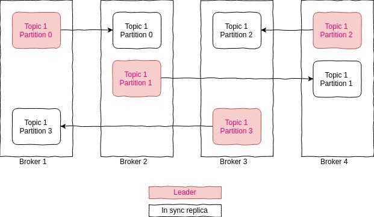

# Preferred leader election in Kafka

https://medium.com/@mandeep309/preferred-leader-election-in-kafka-4ec09682a7c4

In the Kafka cluster, we have observed that some leader partitions are not on the broker where they are preferred. This post will explain how leader election work, what event can make partition leave it’s preferred broker and what steps can be taken to bring it back. Most of the references in this doc are from the book “Kafka the definitive guide “ written by the founders of Kafka and official Kafka documentation.  在 Kafka 集群中，我们观察到一些领导分区不在他们首选的代理上。 这篇文章将解释领导者选举是如何工作的，什么事件可以使分区离开它的首选代理，以及可以采取哪些步骤将其恢复。 本文档中的大部分参考资料来自 Kafka 创始人撰写的“Kafka 权威指南”一书和 Kafka 官方文档。

## How the leader gets selected  领导者如何被选中

To start with let’s understand how the leader election works.  首先让我们了解领导者选举是如何运作的。

Whenever a new topic is created, Kafka runs it’s leader election algorithm to figure out the preferred leader of a partition. The first replica will be the one that will be elected as a leader from the list of replicas.  每当创建一个新主题时，Kafka 都会运行它的领导者选举算法来找出分区的首选领导者。 第一个副本将是从副本列表中被选为领导者的副本。

Reference from Kafka definitive guide  来自 Kafka 权威指南的参考

The first replica in the list is always the preferred leader. This is true no matter who is the current leader and even if the replicas were reassigned to different brokers using the replica reassignment tool. In fact, if you manually reassign replicas, it is important to remember that the replica you specify first will be the preferred replica.  列表中的第一个副本始终是首选的领导者。 无论谁是当前的领导者，即使使用副本重新分配工具将副本重新分配给不同的代理，这都是正确的。 事实上，如果您手动重新分配副本，请务必记住您首先指定的副本将是首选副本。

Let's understand this by example

* Consider we have 4 node cluster

* topic with 4 partition

* replication factor 2



As seen in the diagram above, all leaders replicas are distributed across brokers and replicas for the same exist on another broker. In Kafka, all read and write happens through a leader. So it’s important that leaders are spread evenly across brokers.  如上图所示，所有领导副本都分布在代理之间，并且相同的副本存在于另一个代理上。 在 Kafka 中，所有的读写都是通过一个领导者进行的。 因此，领导者在经纪人之间均匀分布很重要。

So far we understood that during the topic creation time leader election algorithm of Kafka will take care of distributing the partition leader evenly.  至此我们了解到Kafka在topic创建时leader选举算法会负责分区leader的平均分配。

Now since affinity is assigned for a leader partition during creation time, but over the period of time because of certain events like broker shutdown or crashes or brokers are not able to register heartbeat, leadership gets changed and one of the followers replicas will become the leader.  现在，由于在创建期间为领导分区分配了亲缘关系，但在一段时间内，由于某些事件（例如代理关闭或崩溃或代理无法注册心跳），领导被更改并且其中一个追随者副本将成为领导 .

For example in the above diagram if broker 4 is dead then broker 3 will become the leader for partition 2 of the topic.

In that case leadership is skewed. As we can see distribution of leaders is not even.  在这种情况下，领导力是有偏差的。 正如我们所看到的，领导者的分布是不均匀的。

At this point in time, we have established that if the leader replica is not there on the preferred broker. It leads to an uneven distribution of leaders.  此时，我们已经确定，如果首选代理上没有领导副本。 这导致领导者分布不均。

Now arises certain question in mind, few of them are listed below  现在想到了一些问题，下面列出了其中的几个

1. **what if the broker that was preferred for this partition comes back.**  如果这个分区首选的代理回来了怎么办。

2. **If leaders are not equally distributed, how to overcome this state.**  如果领导者分布不均，如何克服这种状态。

We will work on this one by one  我们将一一致力于此

## what if the broker that was preferred for this partition comes back

Once the broker is up again, it will try to get the load that was originally assigned to it.  一旦代理再次启动，它将尝试获取最初分配给它的负载。

But it can only do that if all the replicas are in sync at that moment of time when it’s trying to get leadership back. In case replicas are out of sync leader partition will be left with current broker, reason will be to avoid inconsistency and data loss. After that, it will trigger rebalance only if **auto.leader.rebalance.enable**(will discuss in this detail in the next topic) is set to true. Then periodically it will check whether the partition leader is preferred or not. An important point to notice here is that even auto leader rebalance is set to true, it’s an asynchronous operation. It does not guarantee that the leader will be moved immediately(the reason for the same is out of sync replicas). But eventually, it will.  但只有在它试图重新获得领导权的那一刻所有副本都同步时，它才能做到这一点。 如果副本不同步，领导分区将留给当前代理，原因是为了避免不一致和数据丢失。 之后，只有当 auto.leader.rebalance.enable（将在下一个主题中详细讨论）设置为 true 时，它才会触发重新平衡。 然后它会定期检查分区领导者是否是首选的。 这里需要注意的重要一点是，即使自动领导者重新平衡设置为 true，它也是一个异步操作。 它不保证会立即移动领导者（原因是不同步的副本）。 但最终，它会。

One workaround can be to stop producing messages to that particular topic or to be more precise partition.  一种解决方法是停止向该特定主题生成消息或更精确的分区。

Few lines from Kafka definitive guide for the same  来自 Kafka 权威指南的几行内容

Kafka brokers do not automatically take partition leadership back (**unless auto leader rebalance is enabled, but this configuration is not recommended**) after they have released leadership (e.g., **when the broker has failed or been shut down).**  Kafka 代理在释放领导权后（例如，当代理失败或被关闭时）不会自动收回分区领导权（除非启用了自动领导者重新平衡，但不建议使用此配置）。

Answer to next question

## If leaders are not equally distributed, how to overcome this state.

Now we are aware that events can be triggered periodically to rebalance leadership and property controlling the same is **auto.leader.rebalance.enable**. But this config is not recommended. Kafka definitive guide is not recommending this but it’s not clear why.  现在我们知道可以定期触发事件以重新平衡领导力和控制相同的属性是 auto.leader.rebalance.enable。 但是不推荐这个配置。 Kafka 权威指南不推荐这样做，但不清楚为什么。

To answer this to a certain extent, I found this bug on Kafka. [link](https://issues.apache.org/jira/browse/KAFKA-4084)  为了在一定程度上回答这个问题，我在 Kafka 上发现了这个 bug。

In a nutshell, we can say that it has performance implications on clusters. Details can be read from the above link. The fix is there in version 1.1.  简而言之，我们可以说它对集群有性能影响。 详情可以从上面的链接阅读。 修复程序在 1.1 版中。

So, now the question arises, we can’t set the property as it’s not recommended how to get out of this state.  所以，现在问题来了，我们不能设置属性，因为不建议如何摆脱这种状态。

Below are the steps for the same:  以下是相同的步骤：

1. Do a rolling restart, or if there are few brokers holding the leaders of other brokers just restart them and check if leadership is balanced.  进行滚动重启，或者如果几乎没有经纪人持有其他经纪人的领导者，只需重启他们并检查领导权是否平衡。

2. If you are using the version containing fix then-leader rebalance property can be used. Definition for the same can be found here:https://kafka.apache.org/documentation/

3. Third tool can be used, to reassign the leader, this utility is provided by Kafka, and it works asynchronously. [source](https://cwiki.apache.org/confluence/display/KAFKA/Replication+tools#Replicationtools-1.PreferredReplicaLeaderElectionTool)

I hope this gives a fair insight into how leadership works in Kafka.


```bash
$ kafka-preferred-replica-election.sh

$ kafka-leader-election.sh
This tool attempts to elect a new leader for a set of topic partitions. The type of elections supported are preferred replicas and unclean replicas.  该工具尝试为一组主题分区选举一个新的领导者。 支持的选举类型是首选副本和不干净的副本。

--admin.config <String: config file>
Configuration properties files to pass to the admin client

--all-topic-partitions
Perform election on all of the eligible topic partitions based on the type of election (see the --election-type flag). Not allowed if --topic or --path-to-json-file is specified.  根据选举类型对所有符合条件的主题分区进行选举

--bootstrap-server <String: host:port>
A hostname and port for the broker to connect to, in the form host:port. Multiple comma separated URLs can be given. REQUIRED.

--election-type <[PREFERRED,UNCLEAN]: election type>
Type of election to attempt. Possible values are "preferred" for preferred leader election or "unclean" for unclean leader election. If preferred election is selection, the election is only performed if the current leader is not the preferred leader for the topic partition. If unclean election is selected, the election is only performed if there are no leader for the topic partition. REQUIRED.

--help
Print usage information.

--partition <Integer: partition id>
Partition id for which to perform an election. REQUIRED if --topic is specified.

--path-to-json-file <String: Path to JSON file>
The JSON file with the list of partition for which leader elections should be performed. This is an example format.
{
    "partitions":[
        {
            "topic":"foo",
            "partition":1
        },
        {
            "topic":"foobar",
            "partition":2
        }
    ]
}
Not allowed if --all-topic-partitions or --topic flags are specified.

--topic <String: topic name>
Name of topic for which to perform an election. Not allowed if --path-to-json-file or --all-topic-partitions is specified.

--version
Display Kafka version.

[root@dataservice-master ~]#

```


# preferred replicas


```bash
apiVersion: kafka.strimzi.io/v1beta1
kind: Kafka
metadata:
  name: my-cluster
  namespace: hz-kafka
spec:
  entityOperator:
    topicOperator: {}
    userOperator: {}
  kafka:
    config:
      log.message.format.version: '2.5'
      offsets.topic.replication.factor: '3'
      transaction.state.log.min.isr: '2'
      transaction.state.log.replication.factor: '3'
    jvmOptions:
      '-Xms': 8192m
      '-Xmx': 8192m
    listeners:
      external:
        tls: false
        type: nodeport
      plain: {}
      tls: {}
    replicas: 5
    resources:
      limits:
        cpu: '1'
        memory: 1Gi
      requests:
        cpu: 500m
        memory: 500Mi
    storage:
      type: ephemeral
    version: 2.5.0
  zookeeper:
    jvmOptions:
      '-Xms': 4096m
      '-Xmx': 4096m
    replicas: 3
    resources:
      limits:
        cpu: '1'
        memory: 1000Mi
      requests:
        cpu: 500m
        memory: 500Mi
    storage:
      type: ephemeral


apiVersion: kafka.strimzi.io/v1beta1
kind: KafkaTopic
metadata:
  labels:
    strimzi.io/cluster: my-cluster
  name: my-topic
  namespace: hz-kafka
spec:
  config:
    retention.ms: 604800000
    segment.bytes: 1073741824
  replicas: 3
  partitions: 3


[root@dataservice-master ~]# kafka-topics.sh --bootstrap-server 10.0.128.239:32730 --list
my-topic
[root@dataservice-master ~]#
[root@dataservice-master ~]# kafka-topics.sh --bootstrap-server 10.0.128.239:32730 --topic my-topic --describe
Topic: my-topic	PartitionCount: 3	ReplicationFactor: 3	Configs: segment.bytes=1073741824,retention.ms=604800000,message.format.version=2.5-IV0
	Topic: my-topic	Partition: 0	Leader: 1	Replicas: 1,2,3	Isr: 1,2,3
	Topic: my-topic	Partition: 1	Leader: 2	Replicas: 2,3,0	Isr: 2,3,0
	Topic: my-topic	Partition: 2	Leader: 3	Replicas: 3,0,4	Isr: 3,0,4
[root@dataservice-master ~]#

kafka-leader-election.sh --bootstrap-server 10.0.128.239:32730 --election-type preferred --topic my-topic --partition 0

# 减少 broker 数量有可能出现 Leader 和 preferred replicas 不一致的情况

[root@dataservice-master ~]# kafka-topics.sh --bootstrap-server 10.0.128.239:32730 --topic my-topic --describe
Topic: my-topic	PartitionCount: 3	ReplicationFactor: 3	Configs: segment.bytes=1073741824,retention.ms=604800000,message.format.version=2.5-IV0
	Topic: my-topic	Partition: 0	Leader: 1	Replicas: 1,2,3	Isr: 1,2
	Topic: my-topic	Partition: 1	Leader: 2	Replicas: 2,3,0	Isr: 0,2
	Topic: my-topic	Partition: 2	Leader: 0	Replicas: 3,0,4	Isr: 0
[root@dataservice-master ~]#

# 此时直接执行 preferred replicas election 会失败，需要确保 topic 副本都在存活的 broker 上

[root@dataservice-master ~]# kafka-leader-election.sh --bootstrap-server 10.0.128.239:32730 --election-type preferred --topic my-topic --partition 2
Error completing leader election (PREFERRED) for partition: my-topic-2: org.apache.kafka.common.errors.PreferredLeaderNotAvailableException: Failed to elect leader for partition my-topic-2 under strategy PreferredReplicaPartitionLeaderElectionStrategy
Exception in thread "main" kafka.common.AdminCommandFailedException: 1 replica(s) could not be elected
	at kafka.admin.LeaderElectionCommand$.electLeaders(LeaderElectionCommand.scala:173)
	at kafka.admin.LeaderElectionCommand$.run(LeaderElectionCommand.scala:89)
	at kafka.admin.LeaderElectionCommand$.main(LeaderElectionCommand.scala:41)
	at kafka.admin.LeaderElectionCommand.main(LeaderElectionCommand.scala)
	Suppressed: org.apache.kafka.common.errors.PreferredLeaderNotAvailableException: Failed to elect leader for partition my-topic-2 under strategy PreferredReplicaPartitionLeaderElectionStrategy
[root@dataservice-master ~]#


$ cat topics-to-move-json-file.json
{
    "topics": [
        {
            "topic": "my-topic"
        }
    ],
    "version": 1
}

$ kafka-reassign-partitions.sh --zookeeper 10.0.132.0:32316 --topics-to-move-json-file topics-to-move-json-file.json --broker-list "0,1,2" --generate
Current partition replica assignment
{"version":1,"partitions":[{"topic":"my-topic","partition":2,"replicas":[3,0,4],"log_dirs":["any","any","any"]},{"topic":"my-topic","partition":1,"replicas":[2,3,0],"log_dirs":["any","any","any"]},{"topic":"my-topic","partition":0,"replicas":[1,2,3],"log_dirs":["any","any","any"]}]}

Proposed partition reassignment configuration
{"version":1,"partitions":[{"topic":"my-topic","partition":2,"replicas":[1,2,0],"log_dirs":["any","any","any"]},{"topic":"my-topic","partition":1,"replicas":[0,1,2],"log_dirs":["any","any","any"]},{"topic":"my-topic","partition":0,"replicas":[2,0,1],"log_dirs":["any","any","any"]}]}

$ cat expand-cluster-reassignment.json
{"version":1,"partitions":[{"topic":"my-topic","partition":2,"replicas":[1,2,0],"log_dirs":["any","any","any"]},{"topic":"my-topic","partition":1,"replicas":[0,1,2],"log_dirs":["any","any","any"]},{"topic":"my-topic","partition":0,"replicas":[2,0,1],"log_dirs":["any","any","any"]}]}


$ kafka-reassign-partitions.sh --zookeeper 10.0.132.0:32316 --reassignment-json-file expand-cluster-reassignment.json --execute


$ kafka-topics.sh --bootstrap-server 10.0.128.239:32730 --topic my-topic --describe
Topic: my-topic	PartitionCount: 3	ReplicationFactor: 3	Configs: segment.bytes=1073741824,retention.ms=604800000,message.format.version=2.5-IV0
	Topic: my-topic	Partition: 0	Leader: 1	Replicas: 2,0,1	Isr: 1,2,0
	Topic: my-topic	Partition: 1	Leader: 2	Replicas: 0,1,2	Isr: 0,2,1
	Topic: my-topic	Partition: 2	Leader: 0	Replicas: 1,2,0	Isr: 0,2,1


$ kafka-leader-election.sh --bootstrap-server 10.0.128.239:32730 --election-type preferred --topic my-topic --partition 2
Successfully completed leader election (PREFERRED) for partitions my-topic-2

$ kafka-leader-election.sh --bootstrap-server 10.0.128.239:32730 --election-type preferred --topic my-topic --partition 0
Successfully completed leader election (PREFERRED) for partitions my-topic-0

$ kafka-leader-election.sh --bootstrap-server 10.0.128.239:32730 --election-type preferred --topic my-topic --partition 1
Successfully completed leader election (PREFERRED) for partitions my-topic-1

$ kafka-topics.sh --bootstrap-server 10.0.128.239:32730 --topic my-topic --describe
Topic: my-topic	PartitionCount: 3	ReplicationFactor: 3	Configs: segment.bytes=1073741824,retention.ms=604800000,message.format.version=2.5-IV0
	Topic: my-topic	Partition: 0	Leader: 2	Replicas: 2,0,1	Isr: 1,2,0
	Topic: my-topic	Partition: 1	Leader: 0	Replicas: 0,1,2	Isr: 0,2,1
	Topic: my-topic	Partition: 2	Leader: 1	Replicas: 1,2,0	Isr: 0,2,1

$ kafka-leader-election.sh --bootstrap-server 10.0.128.239:32730 --election-type preferred --topic my-topic --partition 2
Valid replica already elected for partitions

$ kafka-leader-election.sh --bootstrap-server 10.0.128.239:32730 --election-type preferred --topic my-topic --partition 0
Valid replica already elected for partitions

$ kafka-leader-election.sh --bootstrap-server 10.0.128.239:32730 --election-type preferred --topic my-topic --partition 1
Valid replica already elected for partitions


# 直接修改 Replicas 顺序也可能导致 Leader 和 preferred replicas 不一致的情况

[root@dataservice-master ~]# kafka-topics.sh --bootstrap-server 10.0.128.239:32730 --topic my-topic --describe
Topic: my-topic	PartitionCount: 3	ReplicationFactor: 3	Configs: segment.bytes=1073741824,retention.ms=604800000,message.format.version=2.5-IV0
	Topic: my-topic	Partition: 0	Leader: 2	Replicas: 2,0,1	Isr: 1,2,0
	Topic: my-topic	Partition: 1	Leader: 0	Replicas: 0,1,2	Isr: 2,1,0
	Topic: my-topic	Partition: 2	Leader: 1	Replicas: 1,2,0	Isr: 2,1,0
[root@dataservice-master ~]#

$ cat expand-cluster-reassignment.json
{"version":1,"partitions":[{"topic":"my-topic","partition":2,"replicas":[2,1,0],"log_dirs":["any","any","any"]},{"topic":"my-topic","partition":1,"replicas":[1,2,0],"log_dirs":["any","any","any"]},{"topic":"my-topic","partition":0,"replicas":[1,0,2],"log_dirs":["any","any","any"]}]}


$ kafka-reassign-partitions.sh --zookeeper 10.0.132.0:32316 --reassignment-json-file expand-cluster-reassignment.json --execute

$ kafka-topics.sh --bootstrap-server 10.0.128.239:32730 --topic my-topic --describe
Topic: my-topic	PartitionCount: 3	ReplicationFactor: 3	Configs: segment.bytes=1073741824,retention.ms=604800000,message.format.version=2.5-IV0
	Topic: my-topic	Partition: 0	Leader: 2	Replicas: 1,0,2	Isr: 1,2,0
	Topic: my-topic	Partition: 1	Leader: 0	Replicas: 1,2,0	Isr: 2,1,0
	Topic: my-topic	Partition: 2	Leader: 1	Replicas: 2,1,0	Isr: 2,1,0

$ kafka-leader-election.sh --bootstrap-server 10.0.128.239:32730 --election-type preferred --topic my-topic --partition 2
Successfully completed leader election (PREFERRED) for partitions my-topic-2

$ kafka-leader-election.sh --bootstrap-server 10.0.128.239:32730 --election-type preferred --topic my-topic --partition 0
Successfully completed leader election (PREFERRED) for partitions my-topic-0

$ kafka-leader-election.sh --bootstrap-server 10.0.128.239:32730 --election-type preferred --topic my-topic --partition 1
Successfully completed leader election (PREFERRED) for partitions my-topic-1

$ kafka-topics.sh --bootstrap-server 10.0.128.239:32730 --topic my-topic --describe
Topic: my-topic	PartitionCount: 3	ReplicationFactor: 3	Configs: segment.bytes=1073741824,retention.ms=604800000,message.format.version=2.5-IV0
	Topic: my-topic	Partition: 0	Leader: 1	Replicas: 1,0,2	Isr: 1,2,0
	Topic: my-topic	Partition: 1	Leader: 1	Replicas: 1,2,0	Isr: 2,1,0
	Topic: my-topic	Partition: 2	Leader: 2	Replicas: 2,1,0	Isr: 2,1,0


```


# unclean election


```bash


[root@dataservice-master huzhi]# kafka-topics.sh --bootstrap-server 192.168.131.210:32730 --describe --topic my-topic2
[2021-10-27 17:19:09,241] WARN [AdminClient clientId=adminclient-1] Connection to node 0 (/192.168.131.213:30299) could not be established. Broker may not be available. (org.apache.kafka.clients.NetworkClient)
[2021-10-27 17:19:10,287] WARN [AdminClient clientId=adminclient-1] Connection to node 0 (/192.168.131.213:30299) could not be established. Broker may not be available. (org.apache.kafka.clients.NetworkClient)
Topic: my-topic2	PartitionCount: 10	ReplicationFactor: 3	Configs: message.format.version=2.5-IV0
	Topic: my-topic2	Partition: 0	Leader: 1	Replicas: 1,0,2	Isr: 1,2
	Topic: my-topic2	Partition: 1	Leader: 2	Replicas: 2,1,3	Isr: 2,1
	Topic: my-topic2	Partition: 2	Leader: 1	Replicas: 0,1,2	Isr: 1,2
	Topic: my-topic2	Partition: 3	Leader: none	Replicas: 3,4,0	Isr: 0
	Topic: my-topic2	Partition: 4	Leader: 1	Replicas: 4,0,1	Isr: 1
	Topic: my-topic2	Partition: 5	Leader: 2	Replicas: 0,2,3	Isr: 2
	Topic: my-topic2	Partition: 6	Leader: 1	Replicas: 1,3,4	Isr: 1
	Topic: my-topic2	Partition: 7	Leader: 2	Replicas: 2,4,0	Isr: 2
	Topic: my-topic2	Partition: 8	Leader: 1	Replicas: 3,0,1	Isr: 1
	Topic: my-topic2	Partition: 9	Leader: 1	Replicas: 4,1,2	Isr: 1,2
[root@dataservice-master huzhi]# kafka-topics.sh --bootstrap-server 192.168.131.210:32730 --describe --topic my-topic2
[2021-10-27 17:19:49,883] WARN [AdminClient clientId=adminclient-1] Connection to node 0 (/192.168.131.213:30299) could not be established. Broker may not be available. (org.apache.kafka.clients.NetworkClient)
Topic: my-topic2	PartitionCount: 10	ReplicationFactor: 3	Configs: message.format.version=2.5-IV0
	Topic: my-topic2	Partition: 0	Leader: 1	Replicas: 1,0,2	Isr: 1,2,0
	Topic: my-topic2	Partition: 1	Leader: 2	Replicas: 2,1,3	Isr: 2,1
	Topic: my-topic2	Partition: 2	Leader: 1	Replicas: 0,1,2	Isr: 1,2,0
	Topic: my-topic2	Partition: 3	Leader: 0	Replicas: 3,4,0	Isr: 0
	Topic: my-topic2	Partition: 4	Leader: 1	Replicas: 4,0,1	Isr: 1,0
	Topic: my-topic2	Partition: 5	Leader: 2	Replicas: 0,2,3	Isr: 2,0
	Topic: my-topic2	Partition: 6	Leader: 1	Replicas: 1,3,4	Isr: 1
	Topic: my-topic2	Partition: 7	Leader: 2	Replicas: 2,4,0	Isr: 2,0
	Topic: my-topic2	Partition: 8	Leader: 1	Replicas: 3,0,1	Isr: 1,0
	Topic: my-topic2	Partition: 9	Leader: 1	Replicas: 4,1,2	Isr: 1,2
[root@dataservice-master huzhi]# client_loop: send disconnect: Broken pipe
client_loop: send disconnect: Broken pipe
╭─huzhi@localhost  ~ ‹node-›  ‹›
╰─$


```


