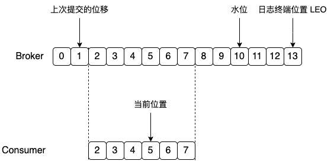

# Kafka 基础篇

## Kafka 的用途有哪些？使用场景如何？

消息系统：Kafka 和传统的消息系统(也称作消息中间件)都具备系统解耦、冗余存储、 流量削峰、缓冲、异步通信、扩展性、可恢复性等功能。与此同时，Kafka 还提供了大多数消息系统难以实现的消息顺序性保障及回溯消费的功能。

存储系统：Kafka 把消息持久化到磁盘，相比于其他基于内存存储的系统而言，有效地降低了数据丢失的风险。也正是得益于 Kafka 的消息持久化功能和多副本机制，我们可以把 Kafka 作为长期的数据存储系统来使用，只需要把对应的数据保留策略设置为“永久”或启用主题的日志压缩功能即可。

流式处理平台：Kafka 不仅为每个流行的流式处理框架提供了可靠的数据来源，还提供了一个完整的流式处理类库，比如窗口、连接、变换和聚合等各类操作。

## Kafka 中的 ISR、AR 代表什么？ISR 的伸缩又指什么？

分区中的所有副本统称为 **AR(Assigned Replicas)**。所有与 leader 副本保持一定程度同步的副本(包括 leader 副本在内)组成 **ISR(In-Sync Replicas)**，ISR 集合是 AR 集合中的一个子集。

**ISR 的伸缩**

leader 副本负责维护和跟踪 ISR 集合中所有 follower 副本的滞后状态，当 follower 副本落后太多或失效时，leader 副本会把它从 ISR 集合中剔除。如果 **OSR 集合**中有 follower 副本“追上”了 leader 副本，那么 leader 副本会把它从 OSR 集合转移至 ISR 集合。

默认情况下，当 leader 副本发生故障时，只有在 ISR 集合中的副本才有资格被选举为新的 leader，而在 OSR 集合中的副本则没有任何机会(不过这个原则也可以通过修改相应的参数配置来改变)。

**replica.lag.time.max.ms**：这个参数的含义是 Follower 副本能够落后 Leader 副本的最长时间间隔，当前默认值是 10 秒。

**unclean.leader.election.enable**：是否允许 Unclean 领导者选举。开启 Unclean 领导者选举可能会造成数据丢失，但好处是，它使得分区 Leader 副本一直存在，不至于停止对外提供服务，因此提升了高可用性。

## Kafka 中的 HW、LEO、LSO、LW 等分别代表什么？

* LEO：日志末端位移，**记录了该副本对象底层日志文件中下一条消息的位移值**。比如 LEO=0，说明日志文件中没有数据，下次生产者发送过来的数据写在位移为 0 的位置上，若 LEO=10，那么表示在该副本日志上已经保存了 10 条消息，位移范围是[0, 9]，下次生产者发送过来的数据写在位移为 10 的位置上。

* HW：水印值。小于或等于 HW 值的所有消息被认为是“已提交的”或“已备份的”，可以被消费者消费的数据。任何一个副本对象的 HW 值一定不大于其 LEO 值。

消费者处理过程：

如上图所示：

1. Consumer 不断向 Broker 请求数据，假设上一次消费者提交的位置是 1，也就是消费者已经消费消息 0 和消息 1

2. 当消费者再次请求数据时，Broker 会返回位置为 2 之后的若干条数据，假设 Broker 返回位置为 [2, 7] 的 6 条数据

**HW 是 High Watermark** 的缩写，俗称高水位，它标识了一个特定的消息偏移量(offset)，消费者只能拉取到这个 offset 之前的消息。

**LEO 是 Log End Offset** 的缩写，它标识当前日志文件中下一条待写入消息的 offset，上图中 offset 为 9 的位置即为当前日志文件的 LEO，LEO 的大小相当于当前日志分区中最后一条消息的 offset 值加 1。**分区 ISR 集合中的每个副本都会维护自身的 LEO，而 ISR 集合中最小的 LEO 即为分区的 HW，对消费者而言只能消费 HW 之前的消息**。

**LSO 是 LogStartOffset**，一般情况下，日志文件的起始偏移量 logStartOffset 等于第一个日志分段的 baseOffset，但这并不是绝对的，logStartOffset 的值可以通过 `DeleteRecordsRequest` 请求或者使用 `kafka-delete-records.sh` 脚本进行修改。

如上图所示，它代表一个日志文件，这个日志文件中有 9 条消息，第一条消息的 offset (LogStartOffset)为 0，最后一条消息的 offset 为 8，offset 为 9 的消息用虚线框表示， 代表下一条待写入的消息。日志文件的 HW 为 6，表示消费者只能拉取到 offset 在 0 至 5 之间的消息，而 offset 为 6 的消息对消费者而言是不可见的。

**LW 是 Low Watermark** 的缩写，俗称“低水位”，代表 AR 集合中最小的 logStartOffset 值。 副本的拉取请求 `FetchRequest` 和删除消息请求 `DeleteRecordRequest` 都有可能促使 LW 的增长。

副本的拉取请求`FetchRequest` 有可能触发新建日志分段而旧的被清理，进而导致 logStartOffset 的增加

## Kafka 中是怎么体现消息顺序性的？ 

可以通过分区策略体现消息顺序性。

分区策略有**轮询策略、随机策略、按消息键保序策略**。

按消息键保序策略：一旦消息被定义了 Key，那么你就可以保证同一个 Key 的所有消息都进入到相同的分区里面，由于每个分区下的消息处理都是有顺序的，故这个策略被称为按消息键保序策略

