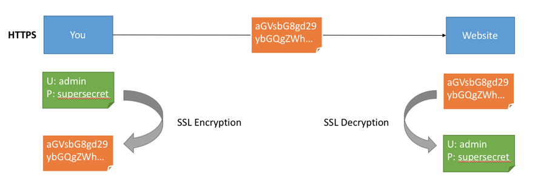
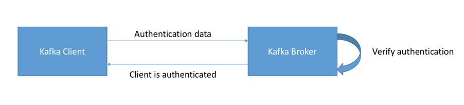
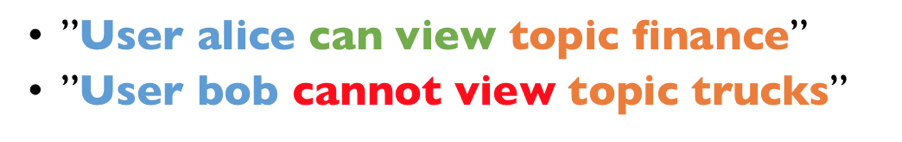

# Introduction to Apache Kafka Security

In this blog, I will try my best to explain Kafka Security in terms everyone can understand. We will go over SSL, SASL and ACL.

## Apache Kafka and the need for security

Apache Kafka is an internal middle layer enabling your back-end systems to share real-time data feeds with each other through Kafka topics. **With a standard Kafka setup, any user or application can write any messages to any topic, as well as read data from any topics**. As your company moves towards a shared tenancy model where multiple teams and applications use the same Kafka Cluster, or your Kafka Cluster starts on boarding some critical and confidential information, you need to implement security.  Apache Kafka是内部中间层，使您的后端系统可以通过Kafka主题彼此共享实时数据源。 使用标准的Kafka设置，任何用户或应用程序都可以将任何消息写入任何主题，以及从任何主题读取数据。 当您的公司向共享租户模式过渡时，多个团队和应用程序使用相同的Kafka群集，或者您的Kafka群集开始接收一些关键和机密信息，因此，您需要实现安全性。

## Problems Security is solving

Kafka Security has three components:

- **Encryption of data in-flight using SSL/TLS:** This allows your data to be encrypted between your producers and Kafka and your consumers and Kafka. This is a very common pattern everyone has used when going on the web. That’s the “S” of HTTPS (that beautiful green lock you see everywhere on the web).
- **Authentication using SSL or SASL:** This allows your producers and your consumers to authenticate to your Kafka cluster, which verifies their identity. It’s also a secure way to enable your clients to endorse an identity. Why would you want that? Well, for authorization!
- **Authorization using ACLs:** Once your clients are authenticated, your Kafka brokers can run them against access control lists (ACL) to determine whether or not a particular client would be authorised to write or read to some topic.

## Encryption (SSL)

Encryption solves the problem of the man in the middle (MITM) attack. That’s because your packets, while being routed to your Kafka cluster, travel your network and hop from machines to machines. If your data is PLAINTEXT (by default in Kafka), any of these routers could read the content of the data you’re sending:  加密解决了中间人攻击的问题。 这是因为您的数据包在路由到Kafka群集时，会传播网络并在计算机之间跳转。 如果您的数据是PLAINTEXT（默认是在Kafka中），则这些路由器中的任何一个都可以读取您要发送的数据的内容：



Now with Encryption enabled and carefully setup SSL certificates, your data is now encrypted and securely transmitted over the network. With SSL, only the first and the final machine possess the ability to decrypt the packet being sent.  现在启用了加密并仔细设置了SSL证书，您的数据现在已加密并通过网络安全传输。 使用SSL，只有第一台机器和最后一台机器才能解密正在发送的数据包。

This encryption comes at a cost: CPU is now leveraged for both the Kafka Clients and the Kafka Brokers in order to encrypt and decrypt packets. SSL Security comes at the cost of performance, but it’s low to negligible. Using Java 9 vs Java 8 with Kafka 1.0 or greater, the performance cost is decreased further by a substantial amount!  这种加密需要付出一定的代价：Kafka客户端和Kafka代理现在都利用CPU来加密和解密数据包。 SSL安全性是以性能为代价的，但是它低到可以忽略不计。 使用Java 9 vs Java 8和Kafka 1.0或更高版本，性能成本将进一步降低！

Please note the encryption is only in-flight and the data still sits un-encrypted on your broker’s disk.  请注意，加密仅在传输中，数据仍未加密，位于经纪人的磁盘上。

## Authentication (SSL & SASL)



There are two ways to authenticate your Kafka clients to your brokers: SSL and SASL. Let’s go over both  有两种方法可以向您的代理验证您的Kafka客户端：SSL和SASL。 让我们一起看一下

### SSL Authentication

SSL Auth is basically leveraging a capability from SSL called two ways authentication. The idea is to also issue certificates to your clients, signed by a certificate authority, which will allow your Kafka brokers to verify the identity of the clients.  SSL Auth基本上利用了SSL的一种称为“两种身份验证”的功能。 这个想法也是要向由证书颁发机构签名的客户颁发证书，这将使您的Kafka经纪人可以验证客户的身份。

### SASL Authentication

SASL stands for Simple Authorization Service Layer and trust me, the name is deceptive, things are not simple. Basically, the idea is that the authentication mechanism is separated from the Kafka protocol (which is a nice idea). It’s very popular with Big Data systems and most likely your Hadoop setup already leverages that.  SASL代表简单授权服务层，请相信我，这个名称具有欺骗性，事情并不简单。 基本上，这个想法是将身份验证机制与Kafka协议分开（这是一个好主意）。 它在大数据系统中非常流行，很可能您的Hadoop设置已经利用了它。

SASL takes many shapes and forms and the following are supported by Kafka:  SASL具有多种形状和形式，Kafka支持以下形式：

- **SASL PLAINTEXT:** This is a classic username/password combination. These usernames and passwords have to be stored on the Kafka brokers in advance and each change needs to trigger a rolling restart. It’s very annoying and not the recommended kind of security. If you use SASL/PLAINTEXT, make sure to enable SSL encryption so that credentials aren’t sent as PLAINTEXT on the network  这是经典的用户名/密码组合。 这些用户名和密码必须事先存储在Kafka代理中，每次更改都需要触发滚动重启。 这很烦人，而不是建议的安全性。 如果您使用SASL/PLAINTEXT，请确保启用SSL加密，以免凭据在网络上以PLAINTEXT的形式发送

- **SASL SCRAM:** This is a username/password combination alongside a challenge (salt), which makes it more secure. On top of this, username and password hashes are stored in Zookeeper, which allows you to scale security without rebooting brokers. If you use SASL/SCRAM, make sure to enable SSL encryption so that credentials aren’t sent as PLAINTEXT on the network  这是一个用户名/密码组合以及一个挑战（盐），这使其更安全。 最重要的是，用户名和密码哈希存储在Zookeeper中，这使您无需重新启动代理即可扩展安全性。 如果您使用SASL/SCRAM，请确保启用SSL加密，以免凭据在网络上以PLAINTEXT的形式发送

- **SASL GSSAPI (Kerberos):** This is based on Kerberos ticket mechanism, a very secure way of providing authentication. Microsoft Active Directory is the most common implementation of Kerberos. SASL/GSSAPI is a great choice for big enterprises as it allows the companies to manage security from within their Kerberos Server. Additionally, communications are encrypted to SSL encryption is optional with SASL/GSSAPI. Needless to say, setting up Kafka with Kerberos is the most difficult option, but worth it in the end.  这基于Kerberos票证机制，这是一种非常安全的身份验证方法。 Microsoft Active Directory是Kerberos的最常见实现。 SASL/GSSAPI对于大型企业来说是一个不错的选择，因为它允许公司从其Kerberos服务器内部管理安全性。 此外，SASL / GSSAPI还可以选择将通信加密为SSL加密。 不用说，使用Kerberos设置Kafka是最困难的选择，但最终还是值得的。

- **(WIP) SASL Extension** ([KIP-86 in progress](https://cwiki.apache.org/confluence/display/KAFKA/KIP-86%3A+Configurable+SASL+callback+handlers))**:** To make it easier to configure new or custom SASL mechanisms that are not implemented in Kafka (have a read through the KIP)  为了更轻松地配置在Kafka中未实现的新的或自定义的SASL机制（请通读KIP）

- **(WIP) SASL OAUTHBEARER** ([KIP-255 in progress](https://cwiki.apache.org/confluence/pages/viewpage.action?pageId=75968876)): This will allow you to leverage OAUTH2 token for authentication (have a read through the KIP)  这将使您能够利用OAUTH2令牌进行身份验证（通过KIP进行读取）

## Authorization (ACL)



Once your Kafka clients are authenticated, Kafka needs to be able to decide what they can and cannot do. This is where Authorization comes in, controlled by Access Control Lists (ACL). **ACL are what you expect them to be: User A can(‘t) do Operation B on Resource C from Host D**. Please note that currently with the packaged `SimpleAclAuthorizer` coming with Kafka, ACL are not implemented to have Groups rules or Regex-based rules. Therefore, each security rule has to be written in full (with the exception of the * wildcard).  您的Kafka客户端通过身份验证后，Kafka需要能够决定他们可以做什么和不能做什么。 这是授权进入的地方，由访问控制列表（ACL）控制。 ACL是您所期望的：用户A无法从主机D对资源C进行操作B。请注意，目前，随着Kafka附带的打包SimpleAclAuthorizer，ACL尚未实现为具有组规则或基于正则表达式的 规则。 因此，每个安全规则都必须完整编写（*通配符除外）。

**ACL are great because they can help you prevent disasters.** For example, you may have a topic that needs to be writeable from only a subset of clients or hosts. You want to prevent your average user from writing anything to these topics, hence preventing any data corruption or deserialization errors. ACLs are also great if you have some sensitive data and you need to prove to regulators that only certain applications or users can access that data.  ACL很棒，因为它们可以帮助您预防灾难。 例如，您可能有一个主题，该主题仅需要从一部分客户端或主机才能写入。 您想防止普通用户向这些主题写任何东西，从而防止任何数据损坏或反序列化错误。 如果您有一些敏感数据，并且需要向监管机构证明只有某些应用程序或用户可以访问该数据，则ACL也非常有用。

To add ACLs, you can use the `kafka-acls` command ([documentation here](https://kafka.apache.org/documentation/#security_authz_cli)). It also even has some facilities and shortcuts to add producers or consumers.  要添加ACL，可以使用kafka-acls命令（此处的文档）。 它甚至还具有一些添加生产者或消费者的设施和捷径。

```bash
kafka-acl --topic test --producer --authorizer-properties zookeeper.connect=localhost:2181 --add --allow-principal User:alice
```

The result being:

```bash
Adding ACLs for resource `Topic:test`:
  User:alice has Allow permission for operations: Describe from hosts: *
 User:alice has Allow permission for operations: Write from hosts: *Adding ACLs for resource `Cluster:kafka-cluster`:
  User:alice has Allow permission for operations: Create from hosts: *
```

Please note that using the default provided `SimpleAclAuthorizer`, your ACL are stored in Zookeeper. Therefore, it is important to secure Zookeeper and make sure only your Kafka brokers are allowed to write to Zookeeper (`zookeeper.set.acl=true`). Otherwise any user could come in and edit ACLs, hence defeating the point of security.  请注意，使用默认提供的SimpleAclAuthorizer，您的ACL将存储在Zookeeper中。 因此，确保Zookeeper的安全并确保只允许您的Kafka代理写入Zookeeper（zookeeper.set.acl = true）非常重要。 否则，任何用户都可以进入并编辑ACL，从而破坏了安全性。

Finally, you may find the `kafka-acls` command hard to use in the long run. **For this, I have created a small utility called the Kafka Security Manager**: https://github.com/simplesteph/kafka-security-manager . This long running application (Docker image provided) allows you to source your ACL from an external source of truth and synchronize them continuously with Zookeeper, hence keeping your Kafka even more secure and making your audit team happy.  最后，从长远来看，您可能会发现kafka-acls命令很难使用。 为此，我创建了一个名为Kafka Security Manager的小型实用程序：https://github.com/simplesteph/kafka-security-manager。 这个运行时间很长的应用程序（提供了Docker映像）使您可以从外部真实来源中获取ACL并将其与Zookeeper连续进行同步，从而使您的Kafka更加安全，并使审核团队感到满意。

## Next Steps

Now that you’re interested in learning about security, or even setting it up for your cluster, you’re going to have to go hands deep in it. This is going to be a fun and frustrating experience. To help, couple of resources:  现在，您有兴趣了解安全性，甚至可以为群集设置安全性，那么您就必须深入了解它。 这将是一次有趣而令人沮丧的经历。 要提供帮助，请参考以下资源：

- [Kafka Documentation on Security](https://kafka.apache.org/documentation/#security): it is comprehensive but will require many reads and tries to make your setup work. Nonetheless, try to read it
- [Confluent Documentation on Security](https://docs.confluent.io/4.0.0/security.html): it is complete and comes with some hands-on to secure most Kafka components (including Kafka Connect, Kafka Schema Registry, etc…)
- The [Kafka Security course](https://links.datacumulus.com/kafka-security-coupon): we created this course so that anyone can learn and get started with Security in a fully explained and hands-on way. It goes through the setup of SSL encryption, SSL authentication, SASL/Kerberos authentication, and Kafka ACL. We truly hope this will be a great launching pad for you.

## example

实现使用如下配置：

1. SSL 数据传输加密
2. SASL PLAINTEXT 认证机制
3. ACL 授权


假设有三个用户，分别是 admin、reader、writer。其中 admin 集群管理员，reader 负责从 Topic 消费数据，writer 负责从 Topic 生产数据。三个用户的密码分别是 admin-passsword、reader-password、writer-password。


```bash
$ cat /path/to/server/jaas/jass.conf
KafkaServer {
    org.apache.kafka.common.security.plain.PlainLoginModule required
    username="admin"
    password="admin-ppassword"
    user_admin="admin-passsword"
    user_reader="reader-password"
    user_writer="writer-password";
};


$ cat kafka-server-start.sh
#!/bin/bash

if [ $# -lt 1 ];
then
	echo "USAGE: $0 [-daemon] server.properties [--override property=value]*"
	exit 1
fi
base_dir=$(dirname $0)

if [ "x$KAFKA_LOG4J_OPTS" = "x" ]; then
    export KAFKA_LOG4J_OPTS="-Dlog4j.configuration=file:$base_dir/../config/log4j.properties"
fi

if [ "x$KAFKA_HEAP_OPTS" = "x" ]; then
    export KAFKA_HEAP_OPTS="-Xmx1G -Xms1G"
fi

EXTRA_ARGS=${EXTRA_ARGS-'-name kafkaServer -loggc'}

COMMAND=$1
case $COMMAND in
  -daemon)
    EXTRA_ARGS="-daemon "$EXTRA_ARGS
    shift
    ;;
  *)
    ;;
esac

exec $base_dir/kafka-run-class.sh $EXTRA_ARGS kafka.Kafka "$@"
$

# 修改 exec $base_dir/kafka-run-class.sh $EXTRA_ARGS kafka.Kafka "$@" 为
exec $base_dir/kafka-run-class.sh $EXTRA_ARGS -Djava.security.auth.login.config=/path/to/server/jaas/jass.conf kafka.Kafka "$@"

# 在 server.properties 设置如下配置
authorizer.class.name=kafka.security.auth.SimpleAclAuthorizer
listeners=SASL_PLAINTEXT://:9092
security.inter.broker.protocol=SASL_PLAINTEXT
sasl.mechanism.inter.broker.protocol=SASL_PLAINTEXT
sasl.enabled.mechanisms=PLAIN
super.users=User:admin


./bin/zookeeper-server-start.sh -daemon config/zookeeper.properties
./bin/kafka-server-start.sh config/server.properties

# 生产者
KafkaClient {
    org.apache.kafka.common.security.plain.PlainLoginModule required
    username="writer"
    password="writer-password";
};

$ cat bin/kafka-console-producer.sh
#!/bin/bash
if [ "x$KAFKA_HEAP_OPTS" = "x" ]; then
    export KAFKA_HEAP_OPTS="-Xmx512M"
fi
# exec $(dirname $0)/kafka-run-class.sh kafka.tools.ConsoleProducer "$@"
exec $(dirname $0)/kafka-run-class.sh -Djava.security.auth.login.config=/path/to/server/jaas/jass.conf kafka.tools.ConsoleProducer "$@"
$


./bin/kafka-console-producer.sh
--producer-property security.protocol=SASL_PLAINTEXT 
--producer-property sasl.mechanism=PLAIN

./bin/kafka-acls.sh
--bootstrap-server
--authorizer kafka.security.auth.SimpleAclAuthorizer
--authorizer-properties zookeeper.connect=localhost:2181
--add
--allow-principal User:writer
--operation Write
--topic test

# 消费者
KafkaClient {
    org.apache.kafka.common.security.plain.PlainLoginModule required
    username="reader"
    password="reader-password";
};

$ cat bin/kafka-console-consumer.sh
#!/bin/bash
if [ "x$KAFKA_HEAP_OPTS" = "x" ]; then
    export KAFKA_HEAP_OPTS="-Xmx512M"
fi

exec $(dirname $0)/kafka-run-class.sh kafka.tools.ConsoleConsumer "$@"
exec $(dirname $0)/kafka-run-class.sh -Djava.security.auth.login.config=/path/to/server/jaas/jass.conf kafka.tools.ConsoleConsumer "$@"
$

./bin/kafka-console-consumer.sh
--consumer-property security.protocol=SASL_PLAINTEXT
--consumer-property sasl.mechanism=PLAIN
--consumer-property group.id=test-group

./bin/kafka-acls.sh
--bootstrap-server
--authorizer kafka.security.auth.SimpleAclAuthorizer
--authorizer-properties zookeeper.connect=localhost:2181
--add
--allow-principal User:reader
--operation Read
--topic test

./bin/kafka-acls.sh
--bootstrap-server
--authorizer kafka.security.auth.SimpleAclAuthorizer
--authorizer-properties zookeeper.connect=localhost:2181
--add
--allow-principal User:reader
--operation Read
--group test-group


```


