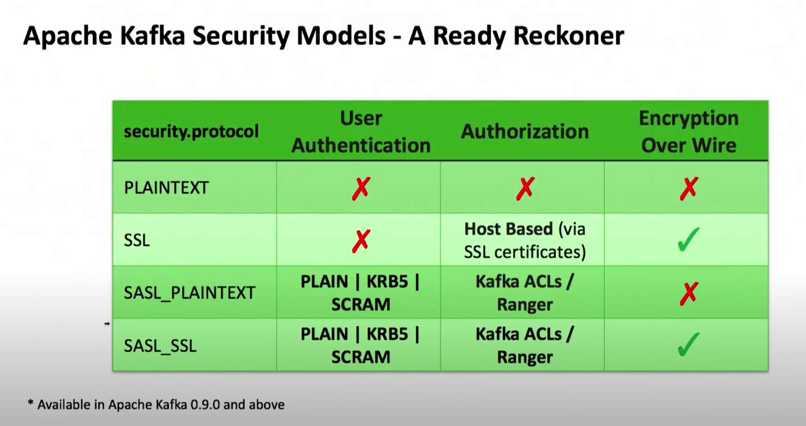
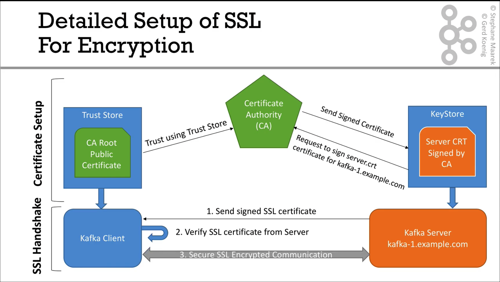

# Visualizing Security in Apache Kafka

[参考](https://www.youtube.com/watch?v=pfYvaEd39oA)

## Agenda 议程

* Apache Kafka Security Models

	* PLAINTEXT

	* SSL

	* SASL PLAINTEXT

	* SASL SSL

* Apache Kafka Security Models - A Ready Reckoner

* How to Troubleshoot security issues

* Most Common Errors

* Apache Kafka Security-Dos and Don'ts

## What Are We Securing?

* End-user Authentication (Is user who he/she claims to be?)

* User Authorization (Does authenticated user have access to this resource?)

* In-flight data i.e. Communication between

	* Kafka Broker <--> Kafka Clients (Consumer/Producers)

	* Kafka Broker <--> Kafka Broker

	* Kafka Broker <--> Zookeeper

## What Are We NOT Securing?

* Data persisted on-disk, e.g. security through data encryption

## Apache Kafka Security Models

### PLAINTEXT

* No Authentication / No Authorization / insecure channel => ZERO security

* Default security method

* To be used only for Proof-of-Concept

* Absolutely NOT recommended for use in Dev/Test/Prod environment

## Apache Kafka Security Models

### SSL

* X.509 Certificate based model - only secures the HTTP channel

* Performs certificate based host authorization

* No User Authentication / Authorization

* How to configure

  * Setup per-node certificate truststore/keystore for brokers & clients

| Broker-side:                     | Client-side:            |
| -------------------------------- | ----------------------- |
| listeners = SSL://127.0.0.1:6667 | security.protocol = SSL |
| inter.broker.protocol = SSL      |                         |

## Apache Kafka Security Models

### SASL_PLAINTEXT (or PLAINTEXTSASL in older version)

* Supports user authentication via

	* Username / Password

	* GSSAPI (Kerberos Ticket)

	* SCRAM (Salted Password)

* Supports User authorization via **Kafka ACLs** or **Apache Ranger**

* Sends secrets & data over the wire in **"Plain"** format

* How tọ configure

	* Pre-configure authentication mechanism

| Broker-side: | Client-side: |
| -----------  | -----------  |
| listeners = SASL_PLAINTEXT://127.0.0.1:6667 | security.protocol = SASL_PLAINTEXT |
| inter.broker.protocol = SASL_PLAINTEXT | sasl.mechanism = PLAIN \| GSSAPI \| SCRAM-SHA-256 \| SCRAM-SHA-512 |
| sasl.enabled.mechanism = PLAIN \| GSSAPI\| SCRAM | |

## Apache Kafka Security Models

### SASL SSL

* Supports user authentication via

* Username / Password

* GSSAPI (Kerberos Ticket)

* SCRAM (Salted Password)

* Supports User authorization via **Kafka ACLs** or **Apache Ranger**

* Sends secrets & data over the wire in **"~~Plain~~" Encrypted** format

* How tọ configure

	* Pre-configure authentication mechanism

	* Setup per-node certificate truststore/keystore for broker(s) & client(s)

| Broker-side: | Client-side: |
| -----------  | -----------  |
| listeners = SASL_SSL://127.0.0.1:6667 | security.protocol = SASL SSL |
| inter.broker.protocol = SASL_SSL | sasl.mechanism =PLAIN \| GSSAPI\| SCRAM-SHA-256 \| SCRAM-SHA-512 |
| sasl.enabled.mechanism=PLAIN \| GSSAPI \| SCRAM |  |



## How to troubleshoot security issues?

* Enable Krb debug for SASL clients (consumer/producer)

```bash
$ export KAFKA_OPTS="-Dsun.security.krb5.debug=true"
```

* Enable SSL debug for clients

```bash
$ export KAFKA_OPTS="-Djavax.net.debug=ssl"
```

* Enable Krb / SSL debug for Kafka Broker (AMBARI-24151)

	* Enable this in console as 'kafka' user & start the Broker from command line:

```bash
$ export KAFKA_KERBEROS_PARAMS="$KAFKA_KERBEROS_PARAMS -Dsun.security.krb5.debug=true -Djavax.net.debug=ssl"

$ ./bin/kafka-server-start.sh -daemon /etc/kafka/conf/server.properties
```

> Disable debug properties once you are done with troubleshooting, otherwise it's going to bloat the log files


## How to troubleshoot security issues?

* Enable Kafka Broker log4j debug

```
Set log4j.logger.kafka=DEBUG, kafkaAppender in /etc/kafka/conf/log4j.properties
```

* Enable Kafka Ranger log4j debug

```
Set log4j.logger.org.apache.ranger=DEBUG, rangerAppender in /etc/kafka/conf/log4j.properties
```

* Enable Kafka Client debug

```
Set log4j.rootLogger=DEBUG, stderr in /etc/kafka/conf/tools-log4j.properties
```

> Disable debug properties once you are done with troubleshooting, otherwise it's going to bloat the log files

## Troubleshoot Using Kafka Console Consumer/Producer

1. Create a Kafka topic

* Should be run only on Kafka Broker node as 'kafka' user (why?)

```bash
$ ./bin/kafka-topics.sh --create --topic testvr46 --zookeeper
bali3.openstacklocal:2181 --partitions 1 --replication-factor 1
```

2. Use Kafka Console Producer to write messages to above Kafka topic

* Can be run from any Kafka client node as any user

* Make sure that authentication token is acquired and user has permission to 'Describe' & 'Publish'

```bash
$ ./bin/kafka-console-producer.sh --broker-list
bali2.openstacklocal:6667 --topic testvr46 --security-protocol PLAINTEXTSASL
```

3. Use Kafka Console Consumer to read messages from the Kafka topic

* Can be run from another or same Kafka client as the same or different user

* Make sure that authentication token is acquired and user has permission to 'Consume'

```bash
$ ./bin/kafka-console-consumer.sh -bootstrap-server
bali2.openstacklocal:6667 --topic testvr46 --security-protocol PLAINTEXTSASL --from-beginning
```

## Most Common Errors

* javax.security.auth.login.LoginException

	* Check JAAS configuration

* Could not login: the client is being asked for a password

	* Again, issue with JAAS configuration - either Ticket not found or Bad / inaccessible user keytab

* PKIX path building failed - unable to find valid certification path to requested target

	* Issue with SSL truststore; most likely truststore not present or readable

* No User Authentication / Authorization


## Apache Kafka Security - Dos and Don'ts

* No Kerberos = No Security

	* All the pain is well worth it !

* Enabling SSL is only half the story

	* Having SSL without Authentication is meaningless

* Using any SASL (i.e. Authentication) without SSL is dangerous

* Use Apache Ranger for large deployments with many users





```bash
## zookeeper server
$ openssl req -new -x509 -keyout ca-key -out ca-cert -days 3650
ca-key ca-cert

$ keytool -keystore kafka.zookeeper.truststore.jks -alias ca-cert -import -file ca-cert
kafka.zookeeper.truststore.jks

$ keytool -keystore kafka.zookeeper.keystore.jks -alias zookeeper -validity 3650 -genkey -keyalg RSA -ext SAN=dns:localhost
kafka.zookeeper.keystore.jks

$ keytool -keystore kafka.zookeeper.keystore.jks -alias zookeeper -certreq -file ca-request-zookeeper
ca-request-zookeeper

$ openssl x509 -req -CA ca-cert -Ckey ca-key -in ca-request-zookeeper -out ca-signed-zookeeper -days 3650 -CAcreateserial
ca-signed-zookeeper ca-cert.srl

$ keytool -keystore kafka.zookeeper.keystore.jks -alias ca-cert -import -file ca-cert

$ keytool -keystore kafka.zookeeper.keystore.jks -alias zookeeper -import -file ca-signed-zookeeper

# zookeeper.properties
secureClientPort=2182
authProvider=org.apache.zookeeper.auth.X509AuthenticationProvider
serverCnxnFactory=org.apache.zookeeper.server.NettyServerCnxnFactory
ssl.trustStore.location=./kafka.zookeeper.truststore.jks
ssl.trustStore.password=
ssl.keyStore.location=./kafka.zookeeper.keystore.jks
ssl.keyStore.password=
ssl.clientAuth=need

## zookeeper client
$ keytool -keystore kafka.zookeeper-client.truststore.jks -alias ca-cert -import -file ca-cert
kafka.zookeeper-client.truststore.jks

$ keytool -keystore kafka.zookeeper-client.keystore.jks -alias zookeeper-client -validity 3650 -genkey -keyalg RSA -ext SAN=dns:localhost
kafka.zookeeper-client.keystore.jks

$ keytool -keystore kafka.zookeeper-client.keystore.jks -alias zookeeper-client -certreq -file ca-request-zookeeper-client
ca-request-zookeeper-client

$ openssl x509 -req -CA ca-cert -CAkey ca-key -in ca-request-zookeeper-client -out ca-signed-zookeeper-client -days 3650 -CAcreateserial
ca-signed-zookeeper-client

$ keytool -keystore kafka.zookeeper-client.keystore.jks -alias ca-cert -import -file ca-cert

$ keytool -keystore kafka.zookeeper-client.keystore.jks -alias zookeeper-client -import -file ca-signed-zookeeper-client

# zookeeper-client.properties
zookeeper.clientCnxnSocket=org.apache.zookeeper.ClientCnxnSocketNetty
zookeeper.ssl.client.enable=true
zookeeper.ssl.protocol=TLSv1.2
zookeeper.ssl.trustStore.location=./kafka.zookeeper-client.truststore.jks
zookeeper.ssl.trustStore.password=
zookeeper.ssl.keyStore.location=./kafka.zookeeper-client.keystore.jks
zookeeper.ssl.keyStore.password=

$ zookeeper-shell.sh localhost:8082 -zk-tls-config-file ./zookeeper-client.properties

## kafka broker0
$ keytool -keystore kafka.broker0.truststore.jks -alias ca-cert -import -file ca-cert
kafka.broker0.truststore.jks

$ keytool -keystore kafka.broker0.keystore.jks -alias broker0 -validity 3650 -genkey -keyalg RSA -ext SAN=dns:localhost
kafka.broker0.keystore.jks

$ keytool -keystore kafka.broker0.keystore.jks -alias broker0 -certreq -file ca-request-broker0
ca-request-broker0

$ openssl x509 -req -CA ca-cert -CAkey ca-key -in ca-request-broker0 -out ca-signed-broker0 -days 3650 -CAcreateserial
ca-signed-broker0

$ keytool -keystore kafka.broker0.keystore.jks -alias ca-cert -import -file ca-cert

$ keytool -keystore kafka.broker0.keystore.jks -alias broker0 -import -file ca-signed-broker0

# server-0.properties
zookeeper.connect=localhost:2182
zookeeper.clientCnxnSocket=org.apache.zookeeper.ClientCnxnSocketNetty
zookeeper.ssl.client.enable=true
zookeeper.ssl.protocol=TLSv1.2
zookeeper.ssl.trustStore.location=./kafka.broker0.truststore.jks
zookeeper.ssl.trustStore.password=
zookeeper.ssl.keyStore.location=./kafka.broker0.keystore.jks
zookeeper.ssl.keyStore.password=
zookeeper.set.acl=true


listeners=SSL://localhost:9092
advertised.listeners=SSL://localhost:9092

ssl.trustStore.location=./kafka.broker0.truststore.jks
ssl.trustStore.password=
ssl.keyStore.location=./kafka.broker0.keystore.jks
ssl.keyStore.password=
ssl.key.password=
ssl.client.auth=required
ssl.protocol=TLSv1.2

security.inter.broker.protocol=SSL


## kafka broker1
$ keytool -keystore kafka.broker1.truststore.jks -alias ca-cert -import -file ca-cert

$ keytool -keystore kafka.broker1.keystore.jks -alias broker1 -validity 3650 -genkey -keyalg RSA -ext SAN=dns:localhost

$ keytool -keystore kafka.broker1.keystore.jks -alias broker1 -certreq -file ca-request-broker1

$ openssl x509 -req -CA ca-cert -CAkey ca-key -in ca-request-broker1 -out ca-signed-broker1 -days 3650 -CAcreateserial

$ keytool -keystore kafka.broker1.keystore.jks -alias ca-cert -import -file ca-cert

$ keytool -keystore kafka.broker1.keystore.jks -alias broker1 -import -file ca-signed-broker1

## ## kafka broker2
$ keytool -keystore kafka.broker2.truststore.jks -alias ca-cert -import -file ca-cert

$ keytool -keystore kafka.broker2.keystore.jks -alias broker2 -validity 3650 -genkey -keyalg RSA -ext SAN=dns:localhost

$ keytool -keystore kafka.broker2.keystore.jks -alias broker2 -certreq -file ca-request-broker2

$ openssl x509 -req -CA ca-cert -CAkey ca-key -in ca-request-broker2 -out ca-signed-broker2 -days 3650 -CAcreateserial

$ keytool -keystore kafka.broker2.keystore.jks -alias ca-cert -import -file ca-cert

$ keytool-keystore kafka.broker2.keystore.jks -alias broker2 -import -file ca-signed-broker2


# producer and consumer
security.protocol=ssl
ssl.trustStore.location=./kafka.producer.truststore.jks
ssl.trustStore.password=
ssl.keyStore.location=./kafka.producer.keystore.jks
ssl.keyStore.password=
ssl.key.password=


```

https://www.youtube.com/watch?v=LaRBSqIPCtQ


```bash
$ kafka-configs.sh --zookeeper localhost:2182 --zk-tls-config-file zookeeper-client.properties --entity-type users --entity-name broker-admin --alter --add-config 'SCRAM-SHA-512=[password=Dem123]'


```


