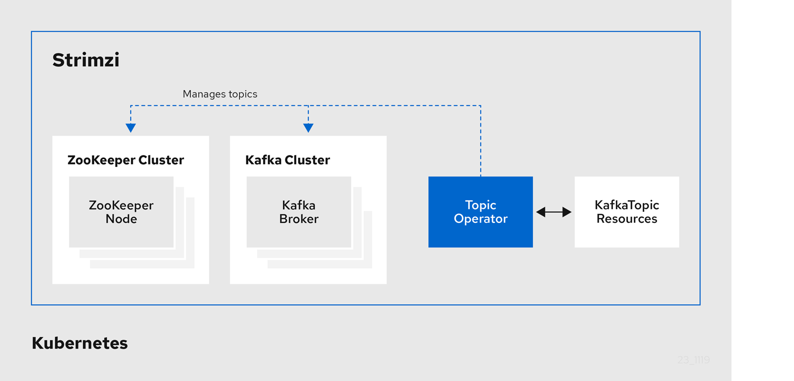

# Deploying and Upgrading (0.18.0)

https://strimzi.io/docs/operators/0.18.0/deploying.html

## 1. Deployment overview

Strimzi simplifies the process of running Apache Kafka in a Kubernetes cluster. Strimzi 简化了在 Kubernetes 集群中运行 Apache Kafka 的过程。

Strimzi is designed to work on all types of Kubernetes cluster regardless of distribution, from public and private clouds to local deployments intended for development.  Strimzi 旨在处理所有类型的 Kubernetes 集群，无论分布如何，从公共和私有云到用于开发的本地部署。

### 1.1. How Strimzi supports Kafka

Strimzi provides container images and Operators for running Kafka on Kubernetes. Strimzi Operators are fundamental to the running of Strimzi. The Operators provided with Strimzi are purpose-built with specialist operational knowledge to effectively manage Kafka.  Strimzi 提供了容器镜像和 Operators，用于在 Kubernetes 上运行 Kafka。 Strimzi 操作符是 Strimzi 运行的基础。 随Strimzi 提供的Operators 是专门构建的，具有专业的操作知识，可以有效地管理Kafka。

Operators simplify the process of:  运算符简化了以下过程：

- Deploying and running Kafka clusters  部署和运行 Kafka 集群

- Deploying and running Kafka components  部署和运行 Kafka 组件

- Configuring access to Kafka  配置对 Kafka 的访问

- Securing access to Kafka  保护对 Kafka 的访问

- Upgrading Kafka

- Managing brokers

- Creating and managing topics

- Creating and managing users

### 1.2. Strimzi Operators

Strimzi supports Kafka using *Operators* to deploy and manage the components and dependencies of Kafka to Kubernetes.  Strimzi 支持 Kafka 使用 Operators 来部署和管理 Kafka 到 Kubernetes 的组件和依赖项。

Operators are a method of packaging, deploying, and managing a Kubernetes application. Strimzi Operators extend Kubernetes functionality, automating common and complex tasks related to a Kafka deployment. By implementing knowledge of Kafka operations in code, Kafka administration tasks are simplified and require less manual intervention.  Operator 是一种打包、部署和管理 Kubernetes 应用程序的方法。 Strimzi Operators 扩展了 Kubernetes 功能，自动执行与 Kafka 部署相关的常见和复杂任务。 通过在代码中实现 Kafka 操作的知识，Kafka 管理任务得到了简化，并且需要更少的人工干预。

#### Operators

Strimzi provides Operators for managing a Kafka cluster running within a Kubernetes cluster.

- **Cluster Operator**  Deploys and manages Apache Kafka clusters, Kafka Connect, Kafka MirrorMaker, Kafka Bridge, Kafka Exporter, and the Entity Operator

- **Entity Operator**  Comprises the Topic Operator and User Operator

- **Topic Operator**  Manages Kafka topics

- **User Operator**  Manages Kafka users

The Cluster Operator can deploy the Topic Operator and User Operator as part of an **Entity Operator** configuration at the same time as a Kafka cluster.

Operators within the Strimzi architecture


#### 1.2.1. Cluster Operator

Strimzi uses the Cluster Operator to deploy and manage clusters for:

- Kafka (including ZooKeeper, Entity Operator, Kafka Exporter, and Cruise Control)

- Kafka Connect

- Kafka MirrorMaker

- Kafka Bridge

Custom resources are used to deploy the clusters.

For example, to deploy a Kafka cluster:

- A `Kafka` resource with the cluster configuration is created within the Kubernetes cluster.

- The Cluster Operator deploys a corresponding Kafka cluster, based on what is declared in the `Kafka` resource.

The Cluster Operator can also deploy (through configuration of the `Kafka` resource):

- A Topic Operator to provide operator-style topic management through `KafkaTopic` custom resources

- A User Operator to provide operator-style user management through `KafkaUser` custom resources

The Topic Operator and User Operator function within the Entity Operator on deployment.

Example architecture for the Cluster Operator


#### 1.2.2. Topic Operator

The Topic Operator provides a way of managing topics in a Kafka cluster through Kubernetes resources.

Example architecture for the Topic Operator



The role of the Topic Operator is to keep a set of `KafkaTopic` Kubernetes resources describing Kafka topics in-sync with corresponding Kafka topics.  Topic Operator 的作用是保持一组描述 Kafka 主题的 KafkaTopic Kubernetes 资源与相应的 Kafka 主题同步。

Specifically, if a `KafkaTopic` is:

- Created, the Topic Operator creates the topic

- Deleted, the Topic Operator deletes the topic

- Changed, the Topic Operator updates the topic

Working in the other direction, if a topic is:

- Created within the Kafka cluster, the Operator creates a `KafkaTopic`

- Deleted from the Kafka cluster, the Operator deletes the `KafkaTopic`

- Changed in the Kafka cluster, the Operator updates the `KafkaTopic`

This allows you to declare a `KafkaTopic` as part of your application’s deployment and the Topic Operator will take care of creating the topic for you. Your application just needs to deal with producing or consuming from the necessary topics.

If the topic is reconfigured or reassigned to different Kafka nodes, the `KafkaTopic` will always be up to date.

#### 1.2.3. User Operator

The User Operator manages Kafka users for a Kafka cluster by watching for `KafkaUser` resources that describe Kafka users, and ensuring that they are configured properly in the Kafka cluster.

For example, if a `KafkaUser` is:

- Created, the User Operator creates the user it describes

- Deleted, the User Operator deletes the user it describes

- Changed, the User Operator updates the user it describes

Unlike the Topic Operator, the User Operator does not sync any changes from the Kafka cluster with the Kubernetes resources. Kafka topics can be created by applications directly in Kafka, but it is not expected that the users will be managed directly in the Kafka cluster in parallel with the User Operator.  与 Topic Operator 不同，User Operator 不会将来自 Kafka 集群的任何更改与 Kubernetes 资源同步。 Kafka 主题可以由应用程序直接在 Kafka 中创建，但不希望用户直接在 Kafka 集群中与 User Operator 并行管理。

The User Operator allows you to declare a `KafkaUser` resource as part of your application’s deployment. You can specify the authentication and authorization mechanism for the user. You can also configure *user quotas* that control usage of Kafka resources to ensure, for example, that a user does not monopolize access to a broker.

When the user is created, the user credentials are created in a `Secret`. Your application needs to use the user and its credentials for authentication and to produce or consume messages.

In addition to managing credentials for authentication, the User Operator also manages authorization rules by including a description of the user’s access rights in the `KafkaUser` declaration.  除了管理用于身份验证的凭据外，User Operator 还通过在 KafkaUser 声明中包含对用户访问权限的描述来管理授权规则。

### 1.3. Strimzi custom resources

A deployment of Kafka components to a Kubernetes cluster using Strimzi is highly configurable through the application of custom resources. Custom resources are created as instances of APIs added by Custom resource definitions (CRDs) to extend Kubernetes resources.  使用 Strimzi 将 Kafka 组件部署到 Kubernetes 集群是通过自定义资源的应用高度可配置的。 自定义资源创建为自定义资源定义 (CRD) 添加的 API 实例，以扩展 Kubernetes 资源。

CRDs act as configuration instructions to describe the custom resources in a Kubernetes cluster, and are provided with Strimzi for each Kafka component used in a deployment, as well as users and topics. CRDs and custom resources are defined as YAML files. Example YAML files are provided with the Strimzi distribution.  CRD 作为配置指令来描述 Kubernetes 集群中的自定义资源，并为部署中使用的每个 Kafka 组件以及用户和主题提供了 Stramzi。 CRD 和自定义资源定义为 YAML 文件。 示例 YAML 文件随 Strimzi 发行版一起提供。

CRDs also allow Strimzi resources to benefit from native Kubernetes features like CLI accessibility and configuration validation.  CRD 还允许 Strimzi 资源受益于本地 Kubernetes 功能，例如 CLI 可访问性和配置验证。

Additional resources

- [Extend the Kubernetes API with CustomResourceDefinitions](https://kubernetes.io/docs/tasks/access-kubernetes-api/custom-resources/custom-resource-definitions/)

#### 1.3.1. Strimzi custom resource example

CRDs require a one-time installation in a cluster to define the schemas used to instantiate and manage Strimzi-specific resources.

After a new custom resource type is added to your cluster by installing a CRD, you can create instances of the resource based on its specification.

Depending on the cluster setup, installation typically requires cluster admin privileges.

> NOTE | Access to manage custom resources is limited to [Strimzi administrators](https://strimzi.io/docs/operators/0.18.0/deploying.html#adding-users-the-strimzi-admin-role-str).

A CRD defines a new `kind` of resource, such as `kind:Kafka`, within a Kubernetes cluster.

The Kubernetes API server allows custom resources to be created based on the `kind` and understands from the CRD how to validate and store the custom resource when it is added to the Kubernetes cluster.

> WARNING | When CRDs are deleted, custom resources of that type are also deleted. Additionally, the resources created by the custom resource, such as pods and statefulsets are also deleted.

Each Strimzi-specific custom resource conforms to the schema defined by the CRD for the resource’s `kind`. The custom resources for Strimzi components have common configuration properties, which are defined under `spec`.

To understand the relationship between a CRD and a custom resource, let’s look at a sample of the CRD for a Kafka topic.

Kafka topic CRD

```yaml
apiVersion: kafka.strimzi.io/v1beta1
kind: CustomResourceDefinition
metadata: (1)
  name: kafkatopics.kafka.strimzi.io
  labels:
    app: strimzi
spec: (2)
  group: kafka.strimzi.io
  versions:
    v1beta1
  scope: Namespaced
  names:
    # ...
    singular: kafkatopic
    plural: kafkatopics
    shortNames:
    - kt (3)
  additionalPrinterColumns: (4)
      # ...
  subresources:
    status: {} (5)
  validation: (6)
    openAPIV3Schema:
      properties:
        spec:
          type: object
          properties:
            partitions:
              type: integer
              minimum: 1
            replicas:
              type: integer
              minimum: 1
              maximum: 32767
      # ...
```

1. The metadata for the topic CRD, its name and a label to identify the CRD.

2. The specification for this CRD, including the group (domain) name, the plural name and the supported schema version, which are used in the URL to access the API of the topic. The other names are used to identify instance resources in the CLI. For example, `kubectl get kafkatopic my-topic` or `kubectl get kafkatopics`.

3. The shortname can be used in CLI commands. For example, `kubectl get kt` can be used as an abbreviation instead of `kubectl get kafkatopic`.

4. The information presented when using a `get` command on the custom resource.

5. The current status of the CRD as described in the [schema reference](https://strimzi.io/docs/operators/0.18.0/using.html#type-Kafka-reference) for the resource.

6. openAPIV3Schema validation provides validation for the creation of topic custom resources. For example, a topic requires at least one partition and one replica.

> NOTE | You can identify the CRD YAML files supplied with the Strimzi installation files, because the file names contain an index number followed by ‘Crd’.

Here is a corresponding example of a `KafkaTopic` custom resource.

Kafka topic custom resource

```yaml
apiVersion: kafka.strimzi.io/v1beta1
kind: KafkaTopic (1)
metadata:
  name: my-topic
  labels:
    strimzi.io/cluster: my-cluster (2)
spec: (3)
  partitions: 1
  replicas: 1
  config:
    retention.ms: 7200000
    segment.bytes: 1073741824
status:
  conditions: (4)
    lastTransitionTime: "2019-08-20T11:37:00.706Z"
    status: "True"
    type: Ready
  observedGeneration: 1
  / ...
```

1. The `kind` and `apiVersion` identify the CRD of which the custom resource is an instance.

2. A label, applicable only to `KafkaTopic` and `KafkaUser` resources, that defines the name of the Kafka cluster (which is same as the name of the `Kafka` resource) to which a topic or user belongs.

3. The spec shows the number of partitions and replicas for the topic as well as the configuration parameters for the topic itself. In this example, the retention period for a message to remain in the topic and the segment file size for the log are specified.

4. Status conditions for the `KafkaTopic` resource. The `type` condition changed to `Ready` at the `lastTransitionTime`.

Custom resources can be applied to a cluster through the platform CLI. When the custom resource is created, it uses the same validation as the built-in resources of the Kubernetes API.

After a `KafkaTopic` custom resource is created, the Topic Operator is notified and corresponding Kafka topics are created in Strimzi.

## 2. What is deployed with Strimzi

Apache Kafka components are provided for deployment to Kubernetes with the Strimzi distribution. The Kafka components are generally run as clusters for availability.

A typical deployment incorporating Kafka components might include:

- **Kafka**  cluster of broker nodes

- **ZooKeeper**  cluster of replicated ZooKeeper instances

- **Kafka Connect**   cluster for external data connections

- **Kafka MirrorMaker**   cluster to mirror the Kafka cluster in a secondary cluster

- **Kafka Exporter**   to extract additional Kafka metrics data for monitoring

- **Kafka Bridge**   to make HTTP-based requests to the Kafka cluster

Not all of these components are mandatory, though you need Kafka and ZooKeeper as a minimum. Some components can be deployed without Kafka, such as MirrorMaker or Kafka Connect.

### 2.1. Order of deployment

The required order of deployment to a Kubernetes cluster is as follows:

1. Deploy the Cluster operator to manage your Kafka cluster

2. Deploy the Kafka cluster with the ZooKeeper cluster, and include the Topic Operator and User Operator in the deployment

3. Optionally deploy:

    - The Topic Operator and User Operator standalone if you did not deploy them with the Kafka cluster

    - Kafka Connect

    - Kafka MirrorMaker

    - Kafka Bridge

    - Components for the monitoring of metrics

### 2.2. Additional deployment configuration options

The deployment procedures in this guide describe a deployment using the example installation YAML files provided with Strimzi. The procedures highlight any important configuration considerations, but they do not describe all the configuration options available.  本指南中的部署过程描述了使用与 Strimzi 一起提供的示例安装 YAML 文件的部署。 这些过程强调了所有重要的配置注意事项，但并未描述所有可用的配置选项。

You can use custom resources to refine your deployment.  您可以使用自定义资源来优化您的部署。

You may wish to review the configuration options available for Kafka components before you deploy Strimzi. For more information on the configuration through custom resources, see [Deployment configuration](https://strimzi.io/docs/operators/0.18.0/using.html#assembly-deployment-configuration-str).  在部署 Strimzi 之前，您可能希望查看可用于 Kafka 组件的配置选项。 有关通过自定义资源进行配置的更多信息，请参阅部署配置。

#### 2.2.1. Securing Kafka

On deployment, the Cluster Operator automatically sets up TLS certificates for data encryption and authentication within your cluster.

Strimzi provides additional configuration options for *encryption*, *authentication* and *authorization*:

- Secure data exchange between the Kafka cluster and clients by [configuration of Kafka resources](https://strimzi.io/docs/operators/0.18.0/using.html#assembly-deployment-configuration-str).

- Configure your deployment to use an authorization server to provide [OAuth 2.0 authentication](https://strimzi.io/docs/operators/0.18.0/using.html#assembly-oauth-authentication_str) and [OAuth 2.0 authorization](https://strimzi.io/docs/operators/0.18.0/using.html#assembly-oauth-authorization_str).

- [Secure Kafka using your own certificates](https://strimzi.io/docs/operators/0.18.0/using.html#security-str).

#### 2.2.2. Monitoring your deployment

Strimzi supports additional deployment options to monitor your deployment.

- Extract metrics and monitor Kafka components by deploying Prometheus and Grafana with your Kafka cluster.

- Extract additional metrics, particularly related to monitoring consumer lag, by deploying Kafka Exporter with your Kafka cluster.

- Track messages end-to-end by [setting up distributed tracing](https://strimzi.io/docs/operators/0.18.0/using.html#assembly-distributed-tracing-str).

## 3. Preparing for your Strimzi deployment

This section shows how you prepare for a Strimzi deployment, describing:

- The prerequisites you need before you can deploy Strimzi

- How to download the Strimzi release artifacts to use in your deployment

- How to push the Strimzi container images into you own registry (if required)

- How to set up *admin* roles for configuration of custom resources used in deployment

- Alternative deployment options to Kubernetes using *Minikube* or *Minishift*

> NOTE | To run the commands in this guide, your cluster user must have the rights to manage role-based access control (RBAC) and CRDs.


### 3.1. Deployment prerequisites

To deploy Strimzi, make sure:

- A Kubernetes 1.11 and later cluster is available

- The `kubectl` command-line tool is installed and configured to connect to the running cluster.

> NOTE | Strimzi supports some features that are specific to OpenShift, where such integration benefits OpenShift users and there is no equivalent implementation using standard Kubernetes.


#### Alternatives if a Kubernetes cluster is not available

If you do not have access to a Kubernetes cluster, as an alternative you can try installing Strimzi with:

- *Minikube*

- *Minishift*

### 3.2. Downloading Strimzi release artifacts

To install Strimzi, download the release artifacts from [GitHub](https://github.com/strimzi/strimzi-kafka-operator/releases).

Strimzi release artifacts include sample YAML files to help you deploy the components of Strimzi to Kubernetes, perform common operations, and configure your Kafka cluster.

You deploy Strimzi to a Kubernetes cluster using the `kubectl` command-line tool.

> NOTE | Additionally, Strimzi container images are available through the [Docker Hub](https://hub.docker.com/u/strimzi). However, we recommend that you use the YAML files provided to deploy Strimzi.

### 3.3. Pushing container images to your own registry

Container images for Strimzi are available in the [Docker Hub](https://hub.docker.com/u/strimzi). The installation YAML files provided by Strimzi will pull the images directly from the [Docker Hub](https://hub.docker.com/u/strimzi).

If you do not have access to the [Docker Hub](https://hub.docker.com/u/strimzi) or want to use your own container repository:

1. Pull **all** container images listed here

2. Push them into your own registry

3. Update the image names in the YAML files used in deployment

> NOTE | Each Kafka version supported for the release has a separate image.

### 3.4. Designating Strimzi administrators

Strimzi provides custom resources for configuration of your deployment. By default, permission to view, create, edit, and delete these resources is limited to Kubernetes cluster administrators. Strimzi provides two cluster roles that you can use to assign these rights to other users:

- `strimzi-view` allows users to view and list Strimzi resources.
- `strimzi-admin` allows users to also create, edit or delete Strimzi resources.

When you install these roles, they will automatically aggregate (add) these rights to the default Kubernetes cluster roles. `strimzi-view` aggregates to the `view` role, and `strimzi-admin` aggregates to the `edit` and `admin` roles. Because of the aggregation, you might not need to assign these roles to users who already have similar rights.

The following procedure shows how to assign a `strimzi-admin` role that allows non-cluster administrators to manage Strimzi resources.

A system administrator can designate Strimzi administrators after the Cluster Operator is deployed.

Prerequisites

- The Strimzi Custom Resource Definitions (CRDs) and role-based access control (RBAC) resources to manage the CRDs have been [deployed with the Cluster Operator](https://strimzi.io/docs/operators/0.18.0/deploying.html#cluster-operator-str).

Procedure

1. Create the `strimzi-view` and `strimzi-admin` cluster roles in Kubernetes.

   ```shell
   kubectl apply -f install/strimzi-admin
   ```

2. If needed, assign the roles that provide access rights to users that require them.

   ```shell
   kubectl create clusterrolebinding strimzi-admin --clusterrole=strimzi-admin --user=user1 --user=user2
   ```

### [3.5. Alternative cluster deployment options](https://strimzi.io/docs/operators/0.18.0/deploying.html#deploy-alternatives_str)

This section suggests alternatives to using a Kubernetes cluster.

If a Kubernetes cluster is unavailable, you can use:

- *Minikube* to create a local cluster
- *Minishift* to create a local OpenShift cluster and use OpenShift-specific features

#### [3.5.1. Installing a local Kubernetes cluster](https://strimzi.io/docs/operators/0.18.0/deploying.html#deploy-kubernetes-str)

The easiest way to get started with Kubernetes is using Minikube. This section provides basic guidance on how to use it. For more information on the tools, refer to the documentation available online.

In order to interact with a Kubernetes cluster the [`kubectl`](https://kubernetes.io/docs/tasks/tools/install-kubectl/) utility needs to be installed.

You can download and install Minikube from the [Kubernetes website](https://kubernetes.io/docs/getting-started-guides/minikube/). Depending on the number of brokers you want to deploy inside the cluster, and if you need Kafka Connect running as well, try running Minikube with at least with 4 GB of RAM instead of the default 2 GB.

Once installed, start Minikube using:

```shell
minikube start --memory 4096
```

#### [3.5.2. Installing a local OpenShift cluster](https://strimzi.io/docs/operators/0.18.0/deploying.html#deploy-openshift-str)

The easiest way to get started with OpenShift is using Minishift or `oc cluster up`. This section provides basic guidance on how to use them. For more information on the tools, refer to the documentation available online.

##### [oc cluster up](https://strimzi.io/docs/operators/0.18.0/deploying.html#oc_cluster_up)

The [`oc`](https://github.com/openshift/origin/releases) utility is one of the main tools for interacting with OpenShift. It provides a simple way of starting a local cluster using the command:

```shell
oc cluster up
```

This command requires Docker to be installed. You can find more inforation on [here](https://github.com/openshift/origin/blob/release-3.11/docs/cluster_up_down.md).

##### [Minishift](https://strimzi.io/docs/operators/0.18.0/deploying.html#minishift)

Minishift is an OpenShift installation within a VM. It can be downloaded and installed from the [Minishift website](https://docs.openshift.org/latest/minishift/index.html). Depending on the number of brokers you want to deploy inside the cluster, and if you need Kafka Connect running as well, try running Minishift with at least 4 GB of RAM instead of the default 2 GB.

Once installed, start Minishift using:

```shell
minishift start --memory 4GB
```

If you want to use `kubectl` with either an `oc cluster up` or `minishift` cluster, you will need to [configure it](https://kubernetes.io/docs/tasks/access-application-cluster/configure-access-multiple-clusters/), as unlike with Minikube this won’t be done automatically.

##### [`oc` and `kubectl` commands](https://strimzi.io/docs/operators/0.18.0/deploying.html#oc_and_kubectl_commands)

The `oc` command functions as an alternative to `kubectl`. In almost all cases the example `kubectl` commands given in this guide can be done using `oc` simply by replacing the command name (options and arguments remain the same).

In other words, instead of using:

```shell
kubectl apply -f your-file
```

when using OpenShift you can use

```shell
oc apply -f your-file
```

| NOTE | As an exception to this general rule, `oc` uses `oc adm` subcommands for *cluster management*, while `kubectl` does not make such a distinction. For example, the `oc` equivalent of `kubectl taint` is `oc adm taint`. |
| ---- | ------------------------------------------------------------ |
|      |                                                              |

## [4. Deploying Strimzi](https://strimzi.io/docs/operators/0.18.0/deploying.html#deploy-tasks_str)

Having [prepared your environment for a deployment of Strimzi](https://strimzi.io/docs/operators/0.18.0/deploying.html#deploy-tasks-prereqs_str), this section shows:

- [How to create the Kafka cluster](https://strimzi.io/docs/operators/0.18.0/deploying.html#deploy-create-cluster_str)
- Optional procedures to deploy other Kafka components according to your requirements:
  - [Kafka Connect](https://strimzi.io/docs/operators/0.18.0/deploying.html#kafka-connect-str)
  - [Kafka MirrorMaker](https://strimzi.io/docs/operators/0.18.0/deploying.html#kafka-mirror-maker-str)
  - [Kafka Bridge](https://strimzi.io/docs/operators/0.18.0/deploying.html#kafka-bridge-str)

The procedures assume a Kubernetes cluster is available and running.

### [4.1. Create the Kafka cluster](https://strimzi.io/docs/operators/0.18.0/deploying.html#deploy-create-cluster_str)

In order to create your Kafka cluster, you deploy the Cluster Operator to manage the Kafka cluster, then deploy the Kafka cluster.

When deploying the Kafka cluster using the `Kafka` resource, you can configure the deployment to deploy the Topic Operator and User Operator at the same time. Alternatively, if you are using a non-Strimzi Kafka cluster, you can deploy the Topic Operator and User Operator as standalone components.

#### Deploying a Kafka cluster with the Topic Operator and User Operator

Perform these deployment steps if you want to use the Topic Operator and User Operator with a Kafka cluster managed by Strimzi.

1. [Deploy the Cluster Operator](https://strimzi.io/docs/operators/0.18.0/deploying.html#cluster-operator-str)
2. Use the Cluster Operator to deploy the:
   1. [Kafka cluster](https://strimzi.io/docs/operators/0.18.0/deploying.html#kafka-cluster-str)
   2. [Topic Operator](https://strimzi.io/docs/operators/0.18.0/deploying.html#deploying-the-topic-operator-using-the-cluster-operator-str)
   3. [User Operator](https://strimzi.io/docs/operators/0.18.0/deploying.html#deploying-the-user-operator-using-the-cluster-operator-str)

#### Deploying a standalone Topic Operator and User Operator

Perform these deployment steps if you want to use the Topic Operator and User Operator with a Kafka cluster that is **not managed** by Strimzi.

1. [Deploy the standalone Topic Operator](https://strimzi.io/docs/operators/0.18.0/deploying.html#deploying-the-topic-operator-standalone-str)
2. [Deploy the standalone User Operator](https://strimzi.io/docs/operators/0.18.0/deploying.html#deploying-the-user-operator-standalone-str)

#### [4.1.1. Deploying the Cluster Operator](https://strimzi.io/docs/operators/0.18.0/deploying.html#cluster-operator-str)

The Cluster Operator is responsible for deploying and managing Apache Kafka clusters within a Kubernetes cluster.

The procedures in this section show:

- How to deploy the Cluster Operator to *watch*:
  - [A single namespace](https://strimzi.io/docs/operators/0.18.0/deploying.html#deploying-cluster-operator-str)
  - [Multiple namespaces](https://strimzi.io/docs/operators/0.18.0/deploying.html#deploying-cluster-operator-to-watch-multiple-namespaces-str)
  - [All namespaces](https://strimzi.io/docs/operators/0.18.0/deploying.html#deploying-cluster-operator-to-watch-whole-cluster-str)
- Alternative deployment options:
  - [How to deploy the Cluster Operator using a Helm chart](https://strimzi.io/docs/operators/0.18.0/deploying.html#deploying-cluster-operator-helm-chart-str)
  - [How to deploy the Cluster Operator from *OperatorHub.io*](https://strimzi.io/docs/operators/0.18.0/deploying.html#deploying-cluster-operator-from-operator-hub-str)

##### [Watch options for a Cluster Operator deployment](https://strimzi.io/docs/operators/0.18.0/deploying.html#con-cluster-operator-watch-options-str)

When the Cluster Operator is running, it starts to *watch* for updates of Kafka resources.

You can choose to deploy the Cluster Operator to watch Kafka resources from:

- A single namespace (the same namespace containing the Cluster Operator)
- Multiple namespaces
- All namespaces

| NOTE | Strimzi provides example YAML files to make the deployment process easier. |
| ---- | ------------------------------------------------------------ |
|      |                                                              |

The Cluster Operator watches for changes to the following resources:

- `Kafka` for the Kafka cluster.
- `KafkaConnect` for the Kafka Connect cluster.
- `KafkaConnectS2I` for the Kafka Connect cluster with Source2Image support.
- `KafkaConnector` for creating and managing connectors in a Kafka Connect cluster.
- `KafkaMirrorMaker` for the Kafka MirrorMaker instance.
- `KafkaBridge` for the Kafka Bridge instance

When one of these resources is created in the Kubernetes cluster, the operator gets the cluster description from the resource and starts creating a new cluster for the resource by creating the necessary Kubernetes resources, such as StatefulSets, Services and ConfigMaps.

Each time a Kafka resource is updated, the operator performs corresponding updates on the Kubernetes resources that make up the cluster for the resource.

Resources are either patched or deleted, and then recreated in order to make the cluster for the resource reflect the desired state of the cluster. This operation might cause a rolling update that might lead to service disruption.

When a resource is deleted, the operator undeploys the cluster and deletes all related Kubernetes resources.

##### [Deploying the Cluster Operator to watch a single namespace](https://strimzi.io/docs/operators/0.18.0/deploying.html#deploying-cluster-operator-str)

This procedure shows how to deploy the Cluster Operator to watch Strimzi resources in a single namespace in your Kubernetes cluster.

Prerequisites

- This procedure requires use of a Kubernetes user account which is able to create `CustomResourceDefinitions`, `ClusterRoles` and `ClusterRoleBindings`. Use of Role Base Access Control (RBAC) in the Kubernetes cluster usually means that permission to create, edit, and delete these resources is limited to Kubernetes cluster administrators, such as `system:admin`.

Procedure

1. Edit the Strimzi installation files to use the namespace the Cluster Operator is going to be installed to.

   For example, in this procedure the Cluster Operator is installed to the namespace `*my-cluster-operator-namespace*`.

   On Linux, use:

   ```none
   sed -i 's/namespace: .*/namespace: my-cluster-operator-namespace/' install/cluster-operator/*RoleBinding*.yaml
   ```

   On MacOS, use:

   ```none
   sed -i '' 's/namespace: .*/namespace: my-cluster-operator-namespace/' install/cluster-operator/*RoleBinding*.yaml
   ```

2. Deploy the Cluster Operator:

   ```shell
   kubectl apply -f install/cluster-operator -n my-cluster-operator-namespace
   ```

3. Verify that the Cluster Operator was successfully deployed:

   ```shell
   kubectl get deployments
   ```

##### [Deploying the Cluster Operator to watch multiple namespaces](https://strimzi.io/docs/operators/0.18.0/deploying.html#deploying-cluster-operator-to-watch-multiple-namespaces-str)

This procedure shows how to deploy the Cluster Operator to watch Strimzi resources across multiple namespaces in your Kubernetes cluster.

Prerequisites

- This procedure requires use of a Kubernetes user account which is able to create `CustomResourceDefinitions`, `ClusterRoles` and `ClusterRoleBindings`. Use of Role Base Access Control (RBAC) in the Kubernetes cluster usually means that permission to create, edit, and delete these resources is limited to Kubernetes cluster administrators, such as `system:admin`.

Procedure

1. Edit the Strimzi installation files to use the namespace the Cluster Operator is going to be installed to.

   For example, in this procedure the Cluster Operator is installed to the namespace `*my-cluster-operator-namespace*`.

   On Linux, use:

   ```none
   sed -i 's/namespace: .*/namespace: my-cluster-operator-namespace/' install/cluster-operator/*RoleBinding*.yaml
   ```

   On MacOS, use:

   ```none
   sed -i '' 's/namespace: .*/namespace: my-cluster-operator-namespace/' install/cluster-operator/*RoleBinding*.yaml
   ```

2. Edit the `install/cluster-operator/050-Deployment-strimzi-cluster-operator.yaml` file to add a list of all the namespaces the Cluster Operator will watch to the `STRIMZI_NAMESPACE` environment variable.

   For example, in this procedure the Cluster Operator will watch the namespaces `watched-namespace-1`, `watched-namespace-2`, `watched-namespace-3`.

   ```yaml
   apiVersion: apps/v1
   kind: Deployment
   spec:
     # ...
     template:
       spec:
         serviceAccountName: strimzi-cluster-operator
         containers:
         - name: strimzi-cluster-operator
           image: strimzi/operator:0.18.0
           imagePullPolicy: IfNotPresent
           env:
           - name: STRIMZI_NAMESPACE
             value: watched-namespace-1,watched-namespace-2,watched-namespace-3
   ```

3. For each namespace listed, install the `RoleBindings`.

   In this example, we replace `*watched-namespace*` in these commands with the namespaces listed in the previous step, repeating them for `watched-namespace-1`, `watched-namespace-2`, `watched-namespace-3`:

   ```shell
   kubectl apply -f install/cluster-operator/020-RoleBinding-strimzi-cluster-operator.yaml -n watched-namespace
   kubectl apply -f install/cluster-operator/031-RoleBinding-strimzi-cluster-operator-entity-operator-delegation.yaml -n watched-namespace
   kubectl apply -f install/cluster-operator/032-RoleBinding-strimzi-cluster-operator-topic-operator-delegation.yaml -n watched-namespace
   ```

4. Deploy the Cluster Operator

   ```shell
   kubectl apply -f install/cluster-operator -n my-cluster-operator-namespace
   ```

5. Verify that the Cluster Operator was successfully deployed:

   ```shell
   kubectl get deployments
   ```

##### [Deploying the Cluster Operator to watch all namespaces](https://strimzi.io/docs/operators/0.18.0/deploying.html#deploying-cluster-operator-to-watch-whole-cluster-str)

This procedure shows how to deploy the Cluster Operator to watch Strimzi resources across all namespaces in your Kubernetes cluster.

When running in this mode, the Cluster Operator automatically manages clusters in any new namespaces that are created.

Prerequisites

- This procedure requires use of a Kubernetes user account which is able to create `CustomResourceDefinitions`, `ClusterRoles` and `ClusterRoleBindings`. Use of Role Base Access Control (RBAC) in the Kubernetes cluster usually means that permission to create, edit, and delete these resources is limited to Kubernetes cluster administrators, such as `system:admin`.

Procedure

1. Edit the `install/cluster-operator/050-Deployment-strimzi-cluster-operator.yaml` file to set the value of the `STRIMZI_NAMESPACE` environment variable to `*`.

   ```yaml
   apiVersion: apps/v1
   kind: Deployment
   spec:
     # ...
     template:
       spec:
         # ...
         serviceAccountName: strimzi-cluster-operator
         containers:
         - name: strimzi-cluster-operator
           image: strimzi/operator:0.18.0
           imagePullPolicy: IfNotPresent
           env:
           - name: STRIMZI_NAMESPACE
             value: "*"
           # ...
   ```

2. Create `ClusterRoleBindings` that grant cluster-wide access for all namespaces to the Cluster Operator.

   ```shell
   kubectl create clusterrolebinding strimzi-cluster-operator-namespaced --clusterrole=strimzi-cluster-operator-namespaced --serviceaccount my-cluster-operator-namespace:strimzi-cluster-operator
   kubectl create clusterrolebinding strimzi-cluster-operator-entity-operator-delegation --clusterrole=strimzi-entity-operator --serviceaccount my-cluster-operator-namespace:strimzi-cluster-operator
   kubectl create clusterrolebinding strimzi-cluster-operator-topic-operator-delegation --clusterrole=strimzi-topic-operator --serviceaccount my-cluster-operator-namespace:strimzi-cluster-operator
   ```

   Replace `*my-cluster-operator-namespace*` with the namespace you want to install the Cluster Operator to.

3. Deploy the Cluster Operator to your Kubernetes cluster.

   ```shell
   kubectl apply -f install/cluster-operator -n my-cluster-operator-namespace
   ```

4. Verify that the Cluster Operator was successfully deployed:

   ```shell
   kubectl get deployments
   ```

##### [Deploying the Cluster Operator using a Helm Chart](https://strimzi.io/docs/operators/0.18.0/deploying.html#deploying-cluster-operator-helm-chart-str)

As an alternative to using the YAML deployment files, this procedure shows how to deploy the the Cluster Operator using a Helm chart provided with Strimzi.

Prerequisites

- The Helm client must be installed on a local machine.
- Helm must be installed to the Kubernetes cluster.

For more information about Helm, see the [Helm website](https://helm.sh/).

Procedure

1. Add the Strimzi Helm Chart repository:

   ```shell
   helm repo add strimzi https://strimzi.io/charts/
   ```

2. Deploy the Cluster Operator using the Helm command line tool:

   ```shell
   helm install strimzi/strimzi-kafka-operator
   ```

3. Verify that the Cluster Operator has been deployed successfully using the Helm command line tool:

   ```shell
   helm ls
   ```

##### [Deploying the Cluster Operator from OperatorHub.io](https://strimzi.io/docs/operators/0.18.0/deploying.html#deploying-cluster-operator-from-operator-hub-str)

[OperatorHub.io](https://operatorhub.io/) is a catalog of Kubernetes Operators sourced from multiple providers. It offers you an alternative way to install stable versions of Strimzi using the Strimzi Kafka Operator.

The [Operator Lifecycle Manager](https://github.com/operator-framework/operator-lifecycle-manager) is used for the installation and management of all Operators published on [OperatorHub.io](https://operatorhub.io/).

To install Strimzi from [OperatorHub.io](https://operatorhub.io/), locate the *Strimzi Kafka Operator* and follow the instructions provided.

#### [4.1.2. Deploying Kafka](https://strimzi.io/docs/operators/0.18.0/deploying.html#kafka-cluster-str)

Apache Kafka is an open-source distributed publish-subscribe messaging system for fault-tolerant real-time data feeds.

The procedures in this section show:

- How to use the Cluster Operator to deploy:
  - [An *ephemeral* or *persistent* Kafka cluster](https://strimzi.io/docs/operators/0.18.0/deploying.html#deploying-kafka-cluster-str)
  - The Topic Operator and User Operator by configuring the `Kafka` custom resource:
    - [Topic Operator](https://strimzi.io/docs/operators/0.18.0/deploying.html#deploying-the-topic-operator-using-the-cluster-operator-str)
    - [User Operator](https://strimzi.io/docs/operators/0.18.0/deploying.html#deploying-the-user-operator-using-the-cluster-operator-str)
- Alternative standalone deployment procedures for the Topic Operator and User Operator:
  - [Deploy the standalone Topic Operator](https://strimzi.io/docs/operators/0.18.0/deploying.html#deploying-the-topic-operator-standalone-str)
  - [Deploy the standalone User Operator](https://strimzi.io/docs/operators/0.18.0/deploying.html#deploying-the-user-operator-standalone-str)

When installing Kafka, Strimzi also installs a ZooKeeper cluster and adds the necessary configuration to connect Kafka with ZooKeeper.

##### [Deploying the Kafka cluster](https://strimzi.io/docs/operators/0.18.0/deploying.html#deploying-kafka-cluster-str)

This procedure shows how to deploy a Kafka cluster to your Kubernetes using the Cluster Operator.

The deployment uses a YAML file to provide the specification to create a `Kafka` resource.

Strimzi provides example YAMLs files for deployment in `examples/kafka/`:

- `kafka-persistent.yaml`

  Deploys a persistent cluster with three ZooKeeper and three Kafka nodes.

- `kafka-jbod.yaml`

  Deploys a persistent cluster with three ZooKeeper and three Kafka nodes (each using multiple persistent volumes).

- `kafka-persistent-single.yaml`

  Deploys a persistent cluster with a single ZooKeeper node and a single Kafka node.

- `kafka-ephemeral.yaml`

  Deploys an ephemeral cluster with three ZooKeeper and three Kafka nodes.

- `kafka-ephemeral-single.yaml`

  Deploys an ephemeral cluster with three ZooKeeper nodes and a single Kafka node.

In this procedure, we use the examples for an *ephemeral* and *persistent* Kafka cluster deployment:

- Ephemeral cluster

  In general, an ephemeral (or temporary) Kafka cluster is suitable for development and testing purposes, not for production. This deployment uses `emptyDir` volumes for storing broker information (for ZooKeeper) and topics or partitions (for Kafka). Using an `emptyDir` volume means that its content is strictly related to the pod life cycle and is deleted when the pod goes down.

- Persistent cluster

  A persistent Kafka cluster uses `PersistentVolumes` to store ZooKeeper and Kafka data. The `PersistentVolume` is acquired using a `PersistentVolumeClaim` to make it independent of the actual type of the `PersistentVolume`. For example, it can use Amazon EBS volumes in Amazon AWS deployments without any changes in the YAML files. The `PersistentVolumeClaim` can use a `StorageClass` to trigger automatic volume provisioning.

The example clusters are named `my-cluster` by default. The cluster name is defined by the name of the resource and cannot be changed after the cluster has been deployed. To change the cluster name before you deploy the cluster, edit the `Kafka.metadata.name` property of the `Kafka` resource in the relevant YAML file.

```yaml
apiVersion: kafka.strimzi.io/v1beta1
kind: Kafka
metadata:
  name: my-cluster
# ...
```

For more information about configuring the `Kafka` resource, see [Kafka cluster configuration](https://strimzi.io/docs/operators/0.18.0/using.html#assembly-deployment-configuration-kafka-str)

Prerequisites

- [The Cluster Operator must be deployed.](https://strimzi.io/docs/operators/0.18.0/deploying.html#deploying-cluster-operator-str)

Procedure

1. Create and deploy an *ephemeral* or *persistent* cluster.

   For development or testing, you might prefer to use an ephemeral cluster. You can use a persistent cluster in any situation.

   - To create and deploy an *ephemeral* cluster:

     ```shell
     kubectl apply -f examples/kafka/kafka-ephemeral.yaml
     ```

   - To create and deploy a *persistent* cluster:

     ```shell
     kubectl apply -f examples/kafka/kafka-persistent.yaml
     ```

2. Verify that the Kafka cluster was successfully deployed:

   ```shell
   kubectl get deployments
   ```

##### [Deploying the Topic Operator using the Cluster Operator](https://strimzi.io/docs/operators/0.18.0/deploying.html#deploying-the-topic-operator-using-the-cluster-operator-str)

This procedure describes how to deploy the Topic Operator using the Cluster Operator.

You configure the `entityOperator` property of the `Kafka` resource to include the `topicOperator`.

If you want to use the Topic Operator with a Kafka cluster that is not managed by Strimzi, you must [deploy the Topic Operator as a standalone component](https://strimzi.io/docs/operators/0.18.0/deploying.html#deploying-the-topic-operator-standalone-str).

For more information about configuring the `entityOperator` and `topicOperator` properties, see [Entity Operator](https://strimzi.io/docs/operators/0.18.0/using.html#assembly-kafka-entity-operator-deployment-configuration-kafka).

Prerequisites

- [The Cluster Operator must be deployed.](https://strimzi.io/docs/operators/0.18.0/deploying.html#deploying-cluster-operator-str)

Procedure

1. Edit the `entityOperator` properties of the `Kafka` resource to include `topicOperator`:

   ```yaml
   apiVersion: kafka.strimzi.io/v1beta1
   kind: Kafka
   metadata:
     name: my-cluster
   spec:
     #...
     entityOperator:
       topicOperator: {}
       userOperator: {}
   ```

2. Configure the Topic Operator `spec` using the properties described in [`EntityTopicOperatorSpec` schema reference](https://strimzi.io/docs/operators/0.18.0/using.html#type-EntityTopicOperatorSpec-reference).

   Use an empty object (`{}`) if you want all properties to use their default values.

3. Create or update the resource:

   Use `kubectl apply`:

   ```shell
   kubectl apply -f <your-file>
   ```

##### [Deploying the User Operator using the Cluster Operator](https://strimzi.io/docs/operators/0.18.0/deploying.html#deploying-the-user-operator-using-the-cluster-operator-str)

This procedure describes how to deploy the User Operator using the Cluster Operator.

You configure the `entityOperator` property of the `Kafka` resource to include the `userOperator`.

If you want to use the User Operator with a Kafka cluster that is not managed by Strimzi, you must [deploy the User Operator as a standalone component](https://strimzi.io/docs/operators/0.18.0/deploying.html#deploying-the-user-operator-standalone-str).

For more information about configuring the `entityOperator` and `userOperator` properties, see [Entity Operator](https://strimzi.io/docs/operators/0.18.0/using.html#assembly-kafka-entity-operator-deployment-configuration-kafka).

Prerequisites

- [The Cluster Operator must be deployed.](https://strimzi.io/docs/operators/0.18.0/deploying.html#deploying-cluster-operator-str)

Procedure

1. Edit the `entityOperator` properties of the `Kafka` resource to include `userOperator`:

   ```yaml
   apiVersion: kafka.strimzi.io/v1beta1
   kind: Kafka
   metadata:
     name: my-cluster
   spec:
     #...
     entityOperator:
       topicOperator: {}
       userOperator: {}
   ```

2. Configure the User Operator `spec` using the properties described in [`EntityUserOperatorSpec` schema reference](https://strimzi.io/docs/operators/0.18.0/using.html#type-EntityUserOperatorSpec-reference).

   Use an empty object (`{}`) if you want all properties to use their default values.

3. Create or update the resource:

   ```shell
   kubectl apply -f <your-file>
   ```

#### [4.1.3. Alternative standalone deployment options for Strimzi Operators](https://strimzi.io/docs/operators/0.18.0/deploying.html#deploy-standalone-operators_str)

When deploying a Kafka cluster using the Cluster Operator, you can also deploy the Topic Operator and User Operator. Alternatively, you can perform a standalone deployment.

A standalone deployment means the Topic Operator and User Operator can operate with a Kafka cluster that is not managed by Strimzi.

##### [Deploying the standalone Topic Operator](https://strimzi.io/docs/operators/0.18.0/deploying.html#deploying-the-topic-operator-standalone-str)

This procedure shows how to deploy the Topic Operator as a standalone component.

A standalone deployment requires configuration of environment variables, and is more complicated than [deploying the Topic Operator using the Cluster Operator](https://strimzi.io/docs/operators/0.18.0/deploying.html#deploying-the-topic-operator-using-the-cluster-operator-str). However, a standalone deployment is more flexible as the Topic Operator can operate with *any* Kafka cluster, not necessarily one deployed by the Cluster Operator.

For more information about the environment variables used to configure the Topic Operator, see [Topic Operator environment](https://strimzi.io/docs/operators/0.18.0/using.html#topic-operator-environment-deploying).

Prerequisites

- You need an existing Kafka cluster for the Topic Operator to connect to.

Procedure

1. Edit the `Deployment.spec.template.spec.containers[0].env` properties in the `install/topic-operator/05-Deployment-strimzi-topic-operator.yaml` file by setting:

   1. `STRIMZI_KAFKA_BOOTSTRAP_SERVERS` to list the bootstrap brokers in your Kafka cluster, given as a comma-separated list of `*hostname*:‍*port*` pairs.
   2. `STRIMZI_ZOOKEEPER_CONNECT` to list the ZooKeeper nodes, given as a comma-separated list of `*hostname*:‍*port*` pairs. This should be the same ZooKeeper cluster that your Kafka cluster is using.
   3. `STRIMZI_NAMESPACE` to the Kubernetes namespace in which you want the operator to watch for `KafkaTopic` resources.
   4. `STRIMZI_RESOURCE_LABELS` to the label selector used to identify the `KafkaTopic` resources managed by the operator.
   5. `STRIMZI_FULL_RECONCILIATION_INTERVAL_MS` to specify the interval between periodic reconciliations, in milliseconds.
   6. `STRIMZI_TOPIC_METADATA_MAX_ATTEMPTS` to specify the number of attempts at getting topic metadata from Kafka. The time between each attempt is defined as an exponential back-off. Consider increasing this value when topic creation could take more time due to the number of partitions or replicas. Default `6`.
   7. `STRIMZI_ZOOKEEPER_SESSION_TIMEOUT_MS` to the ZooKeeper session timeout, in milliseconds. For example, `10000`. Default `20000` (20 seconds).
   8. `STRIMZI_TOPICS_PATH` to the Zookeeper node path where the Topic Operator stores its metadata. Default `/strimzi/topics`.
   9. `STRIMZI_TLS_ENABLED` to enable TLS support for encrypting the communication with Kafka brokers. Default `true`.
   10. `STRIMZI_TRUSTSTORE_LOCATION` to the path to the truststore containing certificates for enabling TLS based communication. Mandatory only if TLS is enabled through `STRIMZI_TLS_ENABLED`.
   11. `STRIMZI_TRUSTSTORE_PASSWORD` to the password for accessing the truststore defined by `STRIMZI_TRUSTSTORE_LOCATION`. Mandatory only if TLS is enabled through `STRIMZI_TLS_ENABLED`.
   12. `STRIMZI_KEYSTORE_LOCATION` to the path to the keystore containing private keys for enabling TLS based communication. Mandatory only if TLS is enabled through `STRIMZI_TLS_ENABLED`.
   13. `STRIMZI_KEYSTORE_PASSWORD` to the password for accessing the keystore defined by `STRIMZI_KEYSTORE_LOCATION`. Mandatory only if TLS is enabled through `STRIMZI_TLS_ENABLED`.
   14. `STRIMZI_LOG_LEVEL` to the level for printing logging messages. The value can be set to: `ERROR`, `WARNING`, `INFO`, `DEBUG`, and `TRACE`. Default `INFO`.
   15. `STRIMZI_JAVA_OPTS` *(optional)* to the Java options used for the JVM running the Topic Operator. An example is `-Xmx=512M -Xms=256M`.
   16. `STRIMZI_JAVA_SYSTEM_PROPERTIES` *(optional)* to list the `-D` options which are set to the Topic Operator. An example is `-Djavax.net.debug=verbose -DpropertyName=value`.

2. Deploy the Topic Operator:

   ```shell
   kubectl apply -f install/topic-operator
   ```

3. Verify that the Topic Operator has been deployed successfully:

   ```shell
   kubectl describe deployment strimzi-topic-operator
   ```

   The Topic Operator is deployed when the `Replicas:` entry shows `1 available`.

   | NOTE | You may experience a delay with the deployment if you have a slow connection to the Kubernetes cluster and the images have not been downloaded before. |
   | ---- | ------------------------------------------------------------ |
   |      |                                                              |

##### [Deploying the standalone User Operator](https://strimzi.io/docs/operators/0.18.0/deploying.html#deploying-the-user-operator-standalone-str)

This procedure shows how to deploy the User Operator as a standalone component.

A standalone deployment requires configuration of environment variables, and is more complicated than [deploying the User Operator using the Cluster Operator](https://strimzi.io/docs/operators/0.18.0/deploying.html#deploying-the-user-operator-using-the-cluster-operator-str). However, a standalone deployment is more flexible as the User Operator can operate with *any* Kafka cluster, not necessarily one deployed by the Cluster Operator.

Prerequisites

- You need an existing Kafka cluster for the User Operator to connect to.

Procedure

1. Edit the following `Deployment.spec.template.spec.containers[0].env` properties in the `install/user-operator/05-Deployment-strimzi-user-operator.yaml` file by setting:

   1. `STRIMZI_KAFKA_BOOTSTRAP_SERVERS` to list the Kafka brokers, given as a comma-separated list of `*hostname*:‍*port*` pairs.
   2. `STRIMZI_ZOOKEEPER_CONNECT` to list the ZooKeeper nodes, given as a comma-separated list of `*hostname*:‍*port*` pairs. This must be the same ZooKeeper cluster that your Kafka cluster is using. Connecting to ZooKeeper nodes with TLS encryption is not supported.
   3. `STRIMZI_NAMESPACE` to the Kubernetes namespace in which you want the operator to watch for `KafkaUser` resources.
   4. `STRIMZI_LABELS` to the label selector used to identify the `KafkaUser` resources managed by the operator.
   5. `STRIMZI_FULL_RECONCILIATION_INTERVAL_MS` to specify the interval between periodic reconciliations, in milliseconds.
   6. `STRIMZI_ZOOKEEPER_SESSION_TIMEOUT_MS` to the ZooKeeper session timeout, in milliseconds. For example, `10000`. Default `20000` (20 seconds).
   7. `STRIMZI_CA_CERT_NAME` to point to a Kubernetes `Secret` that contains the public key of the Certificate Authority for signing new user certificates for TLS client authentication. The `Secret` must contain the public key of the Certificate Authority under the key `ca.crt`.
   8. `STRIMZI_CA_KEY_NAME` to point to a Kubernetes `Secret` that contains the private key of the Certificate Authority for signing new user certificates for TLS client authentication. The `Secret` must contain the private key of the Certificate Authority under the key `ca.key`.
   9. `STRIMZI_CLUSTER_CA_CERT_SECRET_NAME` to point to a Kubernetes `Secret` containing the public key of the Certificate Authority used for signing Kafka brokers certificates for enabling TLS-based communication. The `Secret` must contain the public key of the Certificate Authority under the key `ca.crt`. This environment variable is optional and should be set only if the communication with the Kafka cluster is TLS based.
   10. `STRIMZI_EO_KEY_SECRET_NAME` to point to a Kubernetes `Secret` containing the private key and related certificate for TLS client authentication against the Kafka cluster. The `Secret` must contain the keystore with the private key and certificate under the key `entity-operator.p12`, and the related password under the key `entity-operator.password`. This environment variable is optional and should be set only if TLS client authentication is needed when the communication with the Kafka cluster is TLS based.
   11. `STRIMZI_CA_VALIDITY` the validity period for the Certificate Authority. Default is `365` days.
   12. `STRIMZI_CA_RENEWAL` the renewal period for the Certificate Authority.
   13. `STRIMZI_LOG_LEVEL` to the level for printing logging messages. The value can be set to: `ERROR`, `WARNING`, `INFO`, `DEBUG`, and `TRACE`. Default `INFO`.
   14. `STRIMZI_GC_LOG_ENABLED` to enable garbage collection (GC) logging. Default `true`. Default is `30` days to initiate certificate renewal before the old certificates expire.
   15. `STRIMZI_JAVA_OPTS` *(optional)* to the Java options used for the JVM running User Operator. An example is `-Xmx=512M -Xms=256M`.
   16. `STRIMZI_JAVA_SYSTEM_PROPERTIES` *(optional)* to list the `-D` options which are set to the User Operator. An example is `-Djavax.net.debug=verbose -DpropertyName=value`.

2. Deploy the User Operator:

   ```shell
   kubectl apply -f install/user-operator
   ```

3. Verify that the User Operator has been deployed successfully:

   ```shell
   kubectl describe deployment strimzi-user-operator
   ```

   The User Operator is deployed when the `Replicas:` entry shows `1 available`.

   | NOTE | You may experience a delay with the deployment if you have a slow connection to the Kubernetes cluster and the images have not been downloaded before. |
   | ---- | ------------------------------------------------------------ |
   |      |                                                              |

### [4.2. Deploy Kafka Connect](https://strimzi.io/docs/operators/0.18.0/deploying.html#kafka-connect-str)

[Kafka Connect](https://kafka.apache.org/documentation/#connect) is a tool for streaming data between Apache Kafka and external systems.

Using the concept of *connectors*, Kafka Connect provides a framework for moving large amounts of data into and out of your Kafka cluster while maintaining scalability and reliability.

Kafka Connect is typically used to integrate Kafka with external databases and storage and messaging systems.

The procedures in this section show how to:

- [Deploy a Kafka Connect cluster using a `KafkaConnect` resource](https://strimzi.io/docs/operators/0.18.0/deploying.html#deploying-kafka-connect-str)
- [Create a Kafka Connect image containing the connectors you need to make your connection](https://strimzi.io/docs/operators/0.18.0/deploying.html#using-kafka-connect-with-plug-ins-str)
- [Create and manage connectors using a `KafkaConnector` resource or the Kafka Connect REST API](https://strimzi.io/docs/operators/0.18.0/deploying.html#con-creating-managing-connectors-str)
- [Deploy a `KafkaConnector` resource to Kafka Connect](https://strimzi.io/docs/operators/0.18.0/deploying.html#proc-deploying-kafkaconnector-str)

| NOTE | The term *connector* is used interchangably to mean a connector instance running within a Kafka Connect cluster, or a connector class. In this guide, the term *connector* is used when the meaning is clear from the context. |
| ---- | ------------------------------------------------------------ |
|      |                                                              |

#### [4.2.1. Deploying Kafka Connect to your Kubernetes cluster](https://strimzi.io/docs/operators/0.18.0/deploying.html#deploying-kafka-connect-str)

This procedure shows how to deploy a Kafka Connect cluster to your Kubernetes cluster using the Cluster Operator.

A Kafka Connect cluster is implemented as a `Deployment` with a configurable number of nodes (also called *workers*) that distribute the workload of connectors as *tasks* so that the message flow is highly scalable and reliable.

The deployment uses a YAML file to provide the specification to create a `KafkaConnect` resource.

In this procedure, we use the example file provided with Strimzi:

- `examples/kafka-connect/kafka-connect.yaml`

For more information about configuring the `KafkaConnect` resource, see:

- [Kafka Connect cluster configuration](https://strimzi.io/docs/operators/0.18.0/using.html#assembly-deployment-configuration-kafka-connect-str)
- [Kafka Connect cluster configuration with Source2Image support](https://strimzi.io/docs/operators/0.18.0/using.html#assembly-deployment-configuration-kafka-connect-s2i-str)

Prerequisites

- [The Cluster Operator must be deployed.](https://strimzi.io/docs/operators/0.18.0/deploying.html#deploying-cluster-operator-str)

Procedure

1. Deploy Kafka Connect to your Kubernetes cluster.

   ```shell
   kubectl apply -f examples/kafka-connect/kafka-connect.yaml
   ```

2. Verify that Kafka Connect was successfully deployed:

   ```shell
   kubectl get deployments
   ```

#### [4.2.2. Extending Kafka Connect with connector plug-ins](https://strimzi.io/docs/operators/0.18.0/deploying.html#using-kafka-connect-with-plug-ins-str)

The Strimzi container images for Kafka Connect include two built-in file connectors for moving file-based data into and out of your Kafka cluster.

| File Connector              | Description                                                  |
| :-------------------------- | :----------------------------------------------------------- |
| `FileStreamSourceConnector` | Transfers data to your Kafka cluster from a file (the source). |
| `FileStreamSinkConnector`   | Transfers data from your Kafka cluster to a file (the sink). |

The Cluster Operator can also use images that you have created to deploy a Kafka Connect cluster to your Kubernetes cluster.

The procedures in this section show how to add your own connector classes to connector images by:

- [Creating a container image from the Kafka Connect base image (manually or using continuous integration)](https://strimzi.io/docs/operators/0.18.0/deploying.html#creating-new-image-from-base-str)
- [Creating a container image using OpenShift builds and Source-to-Image (S2I) (available only on OpenShift)](https://strimzi.io/docs/operators/0.18.0/deploying.html#using-openshift-s2i-create-image-str)

##### [Creating a Docker image from the Kafka Connect base image](https://strimzi.io/docs/operators/0.18.0/deploying.html#creating-new-image-from-base-str)

This procedure shows how to create a custom image and add it to the `/opt/kafka/plugins` directory.

You can use the Kafka container image on [Docker Hub](https://hub.docker.com/u/strimzi) as a base image for creating your own custom image with additional connector plug-ins.

At startup, the Strimzi version of Kafka Connect loads any third-party connector plug-ins contained in the `/opt/kafka/plugins` directory.

Prerequisites

- [The Cluster Operator must be deployed.](https://strimzi.io/docs/operators/0.18.0/deploying.html#deploying-cluster-operator-str)

Procedure

1. Create a new `Dockerfile` using `strimzi/kafka:0.18.0-kafka-2.5.0` as the base image:

   ```none
   FROM strimzi/kafka:0.18.0-kafka-2.5.0
   USER root:root
   COPY ./my-plugins/ /opt/kafka/plugins/
   USER 1001
   ```

2. Build the container image.

3. Push your custom image to your container registry.

4. Point to the new container image.

   You can either:

   - Edit the `KafkaConnect.spec.image` property of the `KafkaConnect` custom resource.

     If set, this property overrides the `STRIMZI_KAFKA_CONNECT_IMAGES` variable in the Cluster Operator.

     ```yaml
     apiVersion: kafka.strimzi.io/v1beta1
     kind: KafkaConnect
     metadata:
       name: my-connect-cluster
     spec:
       #...
       image: my-new-container-image
     ```

     or

   - In the `install/cluster-operator/050-Deployment-strimzi-cluster-operator.yaml` file, edit the `STRIMZI_KAFKA_CONNECT_IMAGES` variable to point to the new container image, and then reinstall the Cluster Operator.

Additional resources

- For more information on the `KafkaConnect.spec.image property`, see [Container images](https://strimzi.io/docs/operators/0.18.0/using.html#assembly-configuring-container-images-deployment-configuration-kafka-connect).
- For more information on the `STRIMZI_KAFKA_CONNECT_IMAGES` variable, see [Cluster Operator Configuration](https://strimzi.io/docs/operators/0.18.0/using.html#ref-operators-cluster-operator-configuration-deploying-co).

##### [Creating a container image using OpenShift builds and Source-to-Image](https://strimzi.io/docs/operators/0.18.0/deploying.html#using-openshift-s2i-create-image-str)

This procedure shows how to use OpenShift [builds](https://docs.okd.io/3.9/dev_guide/builds/index.html) and the [Source-to-Image (S2I)](https://docs.okd.io/3.9/creating_images/s2i.html) framework to create a new container image.

An OpenShift build takes a builder image with S2I support, together with source code and binaries provided by the user, and uses them to build a new container image. Once built, container images are stored in OpenShift’s local container image repository and are available for use in deployments.

A Kafka Connect builder image with S2I support is provided on the [Docker Hub](https://hub.docker.com/u/strimzi) as part of the `strimzi/kafka:0.18.0-kafka-2.5.0` image. This S2I image takes your binaries (with plug-ins and connectors) and stores them in the `/tmp/kafka-plugins/s2i` directory. It creates a new Kafka Connect image from this directory, which can then be used with the Kafka Connect deployment. When started using the enhanced image, Kafka Connect loads any third-party plug-ins from the `/tmp/kafka-plugins/s2i` directory.

Procedure

1. On the command line, use the `oc apply` command to create and deploy a Kafka Connect S2I cluster:

   ```shell
   oc apply -f examples/kafka-connect/kafka-connect-s2i.yaml
   ```

2. Create a directory with Kafka Connect plug-ins:

   ```none
   $ tree ./my-plugins/
   ./my-plugins/
   ├── debezium-connector-mongodb
   │   ├── bson-3.4.2.jar
   │   ├── CHANGELOG.md
   │   ├── CONTRIBUTE.md
   │   ├── COPYRIGHT.txt
   │   ├── debezium-connector-mongodb-0.7.1.jar
   │   ├── debezium-core-0.7.1.jar
   │   ├── LICENSE.txt
   │   ├── mongodb-driver-3.4.2.jar
   │   ├── mongodb-driver-core-3.4.2.jar
   │   └── README.md
   ├── debezium-connector-mysql
   │   ├── CHANGELOG.md
   │   ├── CONTRIBUTE.md
   │   ├── COPYRIGHT.txt
   │   ├── debezium-connector-mysql-0.7.1.jar
   │   ├── debezium-core-0.7.1.jar
   │   ├── LICENSE.txt
   │   ├── mysql-binlog-connector-java-0.13.0.jar
   │   ├── mysql-connector-java-5.1.40.jar
   │   ├── README.md
   │   └── wkb-1.0.2.jar
   └── debezium-connector-postgres
       ├── CHANGELOG.md
       ├── CONTRIBUTE.md
       ├── COPYRIGHT.txt
       ├── debezium-connector-postgres-0.7.1.jar
       ├── debezium-core-0.7.1.jar
       ├── LICENSE.txt
       ├── postgresql-42.0.0.jar
       ├── protobuf-java-2.6.1.jar
       └── README.md
   ```

3. Use the `oc start-build` command to start a new build of the image using the prepared directory:

   ```shell
   oc start-build my-connect-cluster-connect --from-dir ./my-plugins/
   ```

   | NOTE | The name of the build is the same as the name of the deployed Kafka Connect cluster. |
   | ---- | ------------------------------------------------------------ |
   |      |                                                              |

4. When the build has finished, the new image is used automatically by the Kafka Connect deployment.

#### [4.2.3. Creating and managing connectors](https://strimzi.io/docs/operators/0.18.0/deploying.html#con-creating-managing-connectors-str)

When you have created a container image for your connector plug-in, you need to create a connector instance in your Kafka Connect cluster. You can then configure, monitor, and manage a running connector instance.

A connector is an instance of a particular *connector class* that knows how to communicate with the relevant external system in terms of messages. Connectors are available for many external systems, or you can create your own.

You can create *source* and *sink* types of connector.

- Source connector

  A source connector is a runtime entity that fetches data from an external system and feeds it to Kafka as messages.

- Sink connector

  A sink connector is a runtime entity that fetches messages from Kafka topics and feeds them to an external system.

Strimzi provides two APIs for creating and managing connectors:

- `KafkaConnector` resources (referred to as `KafkaConnectors`)
- Kafka Connect REST API

Using the APIs, you can:

- Check the status of a connector instance
- Reconfigure a running connector
- Increase or decrease the number of tasks for a connector instance
- Restart failed tasks (not supported by `KafkaConnector` resource)
- Pause a connector instance
- Resume a previously paused connector instance
- Delete a connector instance

##### [`KafkaConnector` resources](https://strimzi.io/docs/operators/0.18.0/deploying.html#kafkaconnector_resources)

`KafkaConnectors` allow you to create and manage connector instances for Kafka Connect in a Kubernetes-native way, so an HTTP client such as cURL is not required. Like other Kafka resources, you declare a connector’s desired state in a `KafkaConnector` YAML file that is deployed to your Kubernetes cluster to create the connector instance.

You manage a running connector instance by updating its corresponding `KafkaConnector`, and then applying the updates. You remove a connector by deleting its corresponding `KafkaConnector`.

To ensure compatibility with earlier versions of Strimzi, `KafkaConnectors` are disabled by default. To enable them for a Kafka Connect cluster, you must use annotations on the `KafkaConnect` resource. For instructions, see [Enabling `KafkaConnector` resources](https://strimzi.io/docs/operators/0.18.0/using.html#proc-enabling-kafkaconnectors-deployment-configuration-kafka-connect).

When `KafkaConnectors` are enabled, the Cluster Operator begins to watch for them. It updates the configurations of running connector instances to match the configurations defined in their `KafkaConnectors`.

Strimzi includes an example `KafkaConnector`, named `examples/connector/source-connector.yaml`. You can use this example to create and manage a `FileStreamSourceConnector`.

##### [Availability of the Kafka Connect REST API](https://strimzi.io/docs/operators/0.18.0/deploying.html#availability_of_the_kafka_connect_rest_api)

The Kafka Connect REST API is available on port 8083 as the `<connect-cluster-name>-connect-api` service.

If `KafkaConnectors` are enabled, manual changes made directly using the Kafka Connect REST API are reverted by the Cluster Operator.

The operations supported by the REST API are described in the [Apache Kafka documentation](https://kafka.apache.org/documentation/#connect_rest).

#### [4.2.4. Deploying a `KafkaConnector` resource to Kafka Connect](https://strimzi.io/docs/operators/0.18.0/deploying.html#proc-deploying-kafkaconnector-str)

This procedure describes how to deploy the example `KafkaConnector` to a Kafka Connect cluster.

The example YAML will create a `FileStreamSourceConnector` to send each line of the license file to Kafka as a message in a topic named `my-topic`.

Prerequisites

- A Kafka Connect deployment in which [`KafkaConnectors` are enabled](https://strimzi.io/docs/operators/0.18.0/using.html#proc-enabling-kafkaconnectors-deployment-configuration-kafka-connect)
- A running Cluster Operator

Procedure

1. Edit the `examples/connector/source-connector.yaml` file:

   ```yaml
   apiVersion: kafka.strimzi.io/v1alpha1
   kind: KafkaConnector
   metadata:
     name: my-source-connector (1)
     labels:
       strimzi.io/cluster: my-connect-cluster (2)
   spec:
     class: org.apache.kafka.connect.file.FileStreamSourceConnector (3)
     tasksMax: 2 (4)
     config: (5)
       file: "/opt/kafka/LICENSE"
       topic: my-topic
       # ...
   ```

   1. Enter a name for the `KafkaConnector` resource. This will be used as the name of the connector within Kafka Connect. You can choose any name that is valid for a Kubernetes resource.
   2. Enter the name of the Kafka Connect cluster in which to create the connector.
   3. The name or alias of the connector class. This should be present in the image being used by the Kafka Connect cluster.
   4. The maximum number of tasks that the connector can create.
   5. Configuration settings for the connector. Available configuration options depend on the connector class.

2. Create the `KafkaConnector` in your Kubernetes cluster:

   ```shell
   kubectl apply -f examples/connector/source-connector.yaml
   ```

3. Check that the resource was created:

   ```shell
   kubectl get kctr --selector strimzi.io/cluster=my-connect-cluster -o name
   ```

### [4.3. Deploy Kafka MirrorMaker](https://strimzi.io/docs/operators/0.18.0/deploying.html#kafka-mirror-maker-str)

The Cluster Operator deploys one or more Kafka MirrorMaker replicas to replicate data between Kafka clusters. This process is called mirroring to avoid confusion with the Kafka partitions replication concept. MirrorMaker consumes messages from the source cluster and republishes those messages to the target cluster.

#### [4.3.1. Deploying Kafka MirrorMaker to your Kubernetes cluster](https://strimzi.io/docs/operators/0.18.0/deploying.html#deploying-kafka-mirror-maker-str)

This procedure shows how to deploy a Kafka MirrorMaker cluster to your Kubernetes cluster using the Cluster Operator.

The deployment uses a YAML file to provide the specification to create a `KafkaMirrorMaker` or `KafkaMirrorMaker2` resource depending on the version of MirrorMaker deployed.

In this procedure, we use the example files provided with Strimzi:

- `examples/kafka-connect/kafka-mirror-maker.yaml`
- `examples/kafka-connect/kafka-mirror-maker2.yaml`

For information about configuring `KafkaMirrorMaker` or `KafkaMirrorMaker2` resources, see [Kafka MirrorMaker configuration](https://strimzi.io/docs/operators/0.18.0/using.html#assembly-deployment-configuration-kafka-mirror-maker-str).

Prerequisites

- [The Cluster Operator must be deployed.](https://strimzi.io/docs/operators/0.18.0/deploying.html#deploying-cluster-operator-str)

Procedure

1. Deploy Kafka MirrorMaker to your Kubernetes cluster:

   For MirrorMaker:

   ```shell
   kubectl apply -f examples/kafka-mirror-maker/kafka-mirror-maker.yaml
   ```

   For MirrorMaker 2.0:

   ```shell
   kubectl apply -f examples/kafka-mirror-maker-2/kafka-mirror-maker-2.yaml
   ```

2. Verify that MirrorMaker was successfully deployed:

   ```shell
   kubectl get deployments
   ```

### [4.4. Deploy Kafka Bridge](https://strimzi.io/docs/operators/0.18.0/deploying.html#kafka-bridge-str)

The Cluster Operator deploys one or more Kafka bridge replicas to send data between Kafka clusters and clients via HTTP API.

#### [4.4.1. Deploying Kafka Bridge to your Kubernetes cluster](https://strimzi.io/docs/operators/0.18.0/deploying.html#deploying-kafka-bridge-str)

This procedure shows how to deploy a Kafka Bridge cluster to your Kubernetes cluster using the Cluster Operator.

The deployment uses a YAML file to provide the specification to create a `KafkaBridge` resource.

In this procedure, we use the example file provided with Strimzi:

- `examples/kafka-bridge/kafka-bridge.yaml`

For information about configuring the `KafkaBridge` resource, see [Kafka Bridge configuration](https://strimzi.io/docs/operators/0.18.0/using.html#assembly-deployment-configuration-kafka-bridge-str).

Prerequisites

- [The Cluster Operator must be deployed.](https://strimzi.io/docs/operators/0.18.0/deploying.html#deploying-cluster-operator-str)

Procedure

1. Deploy Kafka Bridge to your Kubernetes cluster:

   ```shell
   kubectl apply -f examples/kafka-bridge/kafka-bridge.yaml
   ```

2. Verify that Kafka Bridge was successfully deployed:

   ```shell
   kubectl get deployments
   ```

## [5. Verifying the Strimzi deployment](https://strimzi.io/docs/operators/0.18.0/deploying.html#deploy-verify_str)

Having [deployed Strimzi](https://strimzi.io/docs/operators/0.18.0/deploying.html#deploy-tasks_str), the procedure in this section shows how to deploy example producer and consumer clients.

The procedure assumes a Strimzi is available and running in a Kubernetes cluster.

### [5.1. Deploying example clients](https://strimzi.io/docs/operators/0.18.0/deploying.html#deploying-example-clients-str)

This procedure shows how to deploy example producer and consumer clients that use the Kafka cluster you created to send and receive messages.

Prerequisites

- The Kafka cluster is available for the clients.

Procedure

1. Deploy a Kafka producer.

   ```shell
   kubectl run kafka-producer -ti --image=strimzi/kafka:0.18.0-kafka-2.5.0 --rm=true --restart=Never -- bin/kafka-console-producer.sh --broker-list cluster-name-kafka-bootstrap:9092 --topic my-topic
   ```

2. Type a message into the console where the producer is running.

3. Press *Enter* to send the message.

4. Deploy a Kafka consumer.

   ```shell
   kubectl run kafka-consumer -ti --image=strimzi/kafka:0.18.0-kafka-2.5.0 --rm=true --restart=Never -- bin/kafka-console-consumer.sh --bootstrap-server cluster-name-kafka-bootstrap:9092 --topic my-topic --from-beginning
   ```

5. Confirm that you see the incoming messages in the consumer console.

## [6. Introducing Metrics to Kafka](https://strimzi.io/docs/operators/0.18.0/deploying.html#assembly-metrics-str)

This section describes setup options for monitoring your Strimzi deployment.

Depending on your requirements, you can:

- [Set up and deploy Prometheus and Grafana](https://strimzi.io/docs/operators/0.18.0/deploying.html#assembly-metrics-setup-str)
- [Configure the `Kafka` resource to deploy Kafka Exporter with your Kafka cluster](https://strimzi.io/docs/operators/0.18.0/deploying.html#assembly-kafka-exporter-str)

When you have Prometheus and Grafana enabled, Kafka Exporter provides additional monitoring related to consumer lag.

Additionally, you can configure your deployment to track messages end-to-end by [setting up distributed tracing](https://strimzi.io/docs/operators/0.18.0/using.html#assembly-distributed-tracing-str).

Additional resources

- For more information about Prometheus, see the [Prometheus documentation](https://prometheus.io/docs/introduction/overview/).
- For more information about Grafana, see the [Grafana documentation](https://grafana.com/docs/guides/getting_started/).
- [Apache Kafka Monitoring](http://kafka.apache.org/documentation/#monitoring) describes JMX metrics exposed by Apache Kafka.
- [ZooKeeper JMX](https://zookeeper.apache.org/doc/current/zookeeperJMX.html) describes JMX metrics exposed by Apache ZooKeeper.

### [6.1. Add Prometheus and Grafana](https://strimzi.io/docs/operators/0.18.0/deploying.html#assembly-metrics-setup-str)

This section describes how to monitor Strimzi Kafka, ZooKeeper, Kafka Connect, and Kafka MirrorMaker and MirrorMaker 2.0 clusters using Prometheus to provide monitoring data for example Grafana dashboards.

Prometheus and Grafana can be also used to monitor the operators. The example Grafana dashboard for operators provides:

- Information about the operator such as the number of reconciliations or number of Custom Resources they are processing
- JVM metrics from the operators

In order to run the example Grafana dashboards, you must:

1. [Add metrics configuration to your Kafka cluster resource](https://strimzi.io/docs/operators/0.18.0/deploying.html#assembly-metrics-kafka-str)
2. [Deploy Prometheus and Prometheus Alertmanager](https://strimzi.io/docs/operators/0.18.0/deploying.html#assembly-metrics-prometheus-str)
3. [Deploy Grafana](https://strimzi.io/docs/operators/0.18.0/deploying.html#assembly-metrics-grafana-str)

| NOTE | The resources referenced in this section are intended as a starting point for setting up monitoring, but they are provided as examples only. If you require further support on configuring and running Prometheus or Grafana in production, try reaching out to their respective communities. |
| ---- | ------------------------------------------------------------ |
|      |                                                              |

#### [6.1.1. Example Metrics files](https://strimzi.io/docs/operators/0.18.0/deploying.html#ref-metrics-config-files-str)

You can find the example metrics configuration files in the `examples/metrics` directory.

```none
metrics
├── grafana-install
│   ├── grafana.yaml (1)
├── grafana-dashboards (2)
│   ├── strimzi-kafka-connect.json
│   ├── strimzi-kafka.json
│   ├── strimzi-zookeeper.json
│   ├── strimzi-kafka-mirror-maker-2.json
│   ├── strimzi-operators.json
│   └── strimzi-kafka-exporter.json (3)
├── kafka-connect-metrics.yaml (4)
├── kafka-metrics.yaml (5)
├── prometheus-additional-properties
│   └── prometheus-additional.yaml (6)
├── prometheus-alertmanager-config
│   └── alert-manager-config.yaml (7)
└── prometheus-install
    ├── alert-manager.yaml (8)
    ├── prometheus-rules.yaml (9)
    ├── prometheus.yaml (10)
    ├── strimzi-pod-monitor.yaml (11)
    └── strimzi-service-monitor.yaml (12)
```

1. Installation file for the Grafana image
2. Grafana dashboards
3. Grafana dashboard specific to [Kafka Exporter](https://strimzi.io/docs/operators/0.18.0/deploying.html#assembly-kafka-exporter-str)
4. Metrics configuration that defines Prometheus JMX Exporter relabeling rules for Kafka Connect
5. Metrics configuration that defines Prometheus JMX Exporter relabeling rules for Kafka and ZooKeeper
6. Configuration to add roles for service monitoring
7. Hook definitions for sending notifications through Alertmanager
8. Resources for deploying and configuring Alertmanager
9. Alerting rules examples for use with Prometheus Alertmanager (deployed with Prometheus)
10. Installation file for the Prometheus image
11. Prometheus job definitions to scrape metrics data from pods
12. Prometheus job definitions to scrape metrics data from services

#### [6.1.2. Exposing Prometheus metrics](https://strimzi.io/docs/operators/0.18.0/deploying.html#assembly-metrics-kafka-str)

Strimzi uses the [Prometheus JMX Exporter](https://github.com/prometheus/jmx_exporter) to expose JMX metrics from Kafka and ZooKeeper using an HTTP endpoint, which is then scraped by the Prometheus server.

##### [Prometheus metrics configuration](https://strimzi.io/docs/operators/0.18.0/deploying.html#con-metrics-kafka-options-str)

Strimzi provides [example configuration files for Grafana](https://strimzi.io/docs/operators/0.18.0/deploying.html#ref-metrics-config-files-str).

Grafana dashboards are dependent on Prometheus JMX Exporter relabeling rules, which are defined for:

- Kafka and ZooKeeper as a `Kafka` resource configuration in the example `kafka-metrics.yaml` file
- Kafka Connect as `KafkaConnect` and `KafkaConnectS2I` resources in the example `kafka-connect-metrics.yaml` file

A label is a name-value pair. Relabeling is the process of writing a label dynamically. For example, the value of a label may be derived from the name of a Kafka server and client ID.

| NOTE | We show metrics configuration using `kafka-metrics.yaml` in this section, but the process is the same when configuring Kafka Connect using the `kafka-connect-metrics.yaml` file. |
| ---- | ------------------------------------------------------------ |
|      |                                                              |

Additional resources

For more information on the use of relabeling, see [Configuration](https://prometheus.io/docs/prometheus/latest/configuration/configuration) in the Prometheus documentation.

##### [Prometheus metrics deployment options](https://strimzi.io/docs/operators/0.18.0/deploying.html#con-metrics-kafka-deploy-options-str)

To apply the example metrics configuration of relabeling rules to your Kafka cluster, do one of the following:

- [Copy the example configuration to your own `Kafka` resource definition](https://strimzi.io/docs/operators/0.18.0/deploying.html#proc-metrics-kafka-str)
- [Deploy an example Kafka cluster with the metrics configuration](https://strimzi.io/docs/operators/0.18.0/deploying.html#proc-metrics-deploying-kafka-str)

##### [Copying Prometheus metrics configuration to a Kafka resource](https://strimzi.io/docs/operators/0.18.0/deploying.html#proc-metrics-kafka-str)

To use Grafana dashboards for monitoring, you can copy [the example metrics configuration to a `Kafka` resource](https://strimzi.io/docs/operators/0.18.0/deploying.html#ref-metrics-config-files-str).

Procedure

Execute the following steps for each `Kafka` resource in your deployment.

1. Update the `Kafka` resource in an editor.

   ```shell
   kubectl edit kafka my-cluster
   ```

2. Copy the [example configuration in `kafka-metrics.yaml`](https://strimzi.io/docs/operators/0.18.0/deploying.html#ref-metrics-config-files-str) to your own `Kafka` resource definition.

3. Save the file, exit the editor and wait for the updated resource to be reconciled.

##### [Deploying a Kafka cluster with Prometheus metrics configuration](https://strimzi.io/docs/operators/0.18.0/deploying.html#proc-metrics-deploying-kafka-str)

To use Grafana dashboards for monitoring, you can deploy [an example Kafka cluster with metrics configuration](https://strimzi.io/docs/operators/0.18.0/deploying.html#ref-metrics-config-files-str).

Procedure

- Deploy the Kafka cluster with the metrics configuration:

  ```shell
  kubectl apply -f kafka-metrics.yaml
  ```

#### [6.1.3. Setting up Prometheus](https://strimzi.io/docs/operators/0.18.0/deploying.html#assembly-metrics-prometheus-str)

[Prometheus](https://prometheus.io/) provides an open source set of components for systems monitoring and alert notification.

We describe here how you can use the [CoreOS Prometheus Operator](https://github.com/coreos/prometheus-operator) to run and manage a Prometheus server that is suitable for use in production environments, but with the correct configuration you can run any Prometheus server.

| NOTE | The Prometheus server configuration uses service discovery to discover the pods in the cluster from which it gets metrics. For this feature to work correctly, the service account used for running the Prometheus service pod must have access to the API server so it can retrieve the pod list.For more information, see [Discovering services](https://kubernetes.io/docs/concepts/services-networking/service/#discovering-services). |
| ---- | ------------------------------------------------------------ |
|      |                                                              |

##### [Prometheus configuration](https://strimzi.io/docs/operators/0.18.0/deploying.html#con-metrics-prometheus-options-str)

Strimzi provides [example configuration files for the Prometheus server](https://strimzi.io/docs/operators/0.18.0/deploying.html#ref-metrics-config-files-str).

A Prometheus image is provided for deployment:

- `prometheus.yaml`

Additional Prometheus-related configuration is also provided in the following files:

- `prometheus-additional.yaml`
- `prometheus-rules.yaml`
- `strimzi-pod-monitor.yaml`
- `strimzi-service-monitor.yaml`

For Prometheus to obtain monitoring data:

- [Deploy the Prometheus Operator](https://strimzi.io/docs/operators/0.18.0/deploying.html#proc-metrics-deploying-prometheus-operator-str)

Then use the configuration files to:

- [Deploy Prometheus](https://strimzi.io/docs/operators/0.18.0/deploying.html#proc-metrics-deploying-prometheus-operator-str)

Alerting rules

The `prometheus-rules.yaml` file provides [example alerting rule examples for use with Alertmanager](https://strimzi.io/docs/operators/0.18.0/deploying.html#ref-metrics-alertmanager-examples-str).

##### [Prometheus resources](https://strimzi.io/docs/operators/0.18.0/deploying.html#con-metrics-prometheus-resources-str)

When you apply the Prometheus configuration, the following resources are created in your Kubernetes cluster and managed by the Prometheus Operator:

- A `ClusterRole` that grants permissions to Prometheus to read the health endpoints exposed by the Kafka and ZooKeeper pods, cAdvisor and the kubelet for container metrics.
- A `ServiceAccount` for the Prometheus pods to run under.
- A `ClusterRoleBinding` which binds the `ClusterRole` to the `ServiceAccount`.
- A `Deployment` to manage the Prometheus Operator pod.
- A `ServiceMonitor` to manage the configuration of the Prometheus pod.
- A `Prometheus` to manage the configuration of the Prometheus pod.
- A `PrometheusRule` to manage alerting rules for the Prometheus pod.
- A `Secret` to manage additional Prometheus settings.
- A `Service` to allow applications running in the cluster to connect to Prometheus (for example, Grafana using Prometheus as datasource).

##### [Deploying the Prometheus Operator](https://strimzi.io/docs/operators/0.18.0/deploying.html#proc-metrics-deploying-prometheus-operator-str)

To deploy the Prometheus Operator to your Kafka cluster, apply the YAML bundle resources file from the [Prometheus CoreOS repository](https://github.com/coreos/prometheus-operator).

Procedure

1. Download the resource file from the repository and replace the example `namespace` with your own:

   On Linux, use:

   ```shell
   curl -s https://raw.githubusercontent.com/coreos/prometheus-operator/master/bundle.yaml | sed -e 's/namespace: .*/namespace: my-namespace/' > prometheus-operator-deployment.yaml
   ```

   On MacOS, use:

   ```shell
   curl -s https://raw.githubusercontent.com/coreos/prometheus-operator/master/bundle.yaml | sed -e '' 's/namespace: .*/namespace: my-namespace/' > prometheus-operator-deployment.yaml
   ```

   | NOTE | If it is not required, you can manually remove the `spec.template.spec.securityContext` property from the `prometheus-operator-deployment.yaml` file. |
   | ---- | ------------------------------------------------------------ |
   |      |                                                              |

2. Deploy the Prometheus Operator:

   ```shell
   kubectl apply -f prometheus-operator-deployment.yaml
   ```

   | NOTE | The Prometheus Operator installation works with Kubernetes 1.18+. To check which version to use with a different Kubernetes version, refer to the [Kubernetes compatibility matrix](https://github.com/coreos/kube-prometheus#kubernetes-compatibility-matrix). |
   | ---- | ------------------------------------------------------------ |
   |      |                                                              |

##### [Deploying Prometheus](https://strimzi.io/docs/operators/0.18.0/deploying.html#proc-metrics-deploying-prometheus-str)

To deploy Prometheus to your Kafka cluster to obtain monitoring data, apply the [example resource file for the Prometheus docker image and the YAML files for Prometheus-related resources](https://strimzi.io/docs/operators/0.18.0/deploying.html#ref-metrics-config-files-str).

The deployment process creates a `ClusterRoleBinding` and discovers an Alertmanager instance in the namespace specified for the deployment.

| NOTE | By default, the Prometheus Operator only supports jobs that include an `endpoints` role for service discovery. Targets are discovered and scraped for each endpoint port address. For endpoint discovery, the port address may be derived from service (`role: service`) or pod (`role: pod`) discovery. |
| ---- | ------------------------------------------------------------ |
|      |                                                              |

Prerequisites

- Check the [example alerting rules provided](https://strimzi.io/docs/operators/0.18.0/deploying.html#ref-metrics-alertmanager-examples-str)

Procedure

1. Modify the Prometheus installation file (`prometheus.yaml`) according to the namespace Prometheus is going to be installed in:

   On Linux, use:

   ```shell
   sed -i 's/namespace: .*/namespace: my-namespace/' prometheus.yaml
   ```

   On MacOS, use:

   ```shell
   sed -i '' 's/namespace: .*/namespace: my-namespace/' prometheus.yaml
   ```

2. Edit the `ServiceMonitor` resource in `strimzi-service-monitor.yaml` to define Prometheus jobs that will scrape the metrics data from services. `ServiceMonitor` is used to scrape metrics through services and is used for Apache Kafka, ZooKeeper.

3. Edit the `PodMonitor` resource in `strimzi-pod-monitor.yaml` to define Prometheus jobs that will scrape the metrics data from pods. `PodMonitor` is used to scrape data directly from pods and is used for Operators.

4. To use another role:

   1. Create a `Secret` resource:

      ```shell
      kubectl create secret generic additional-scrape-configs --from-file=prometheus-additional.yaml
      ```

   2. Edit the `additionalScrapeConfigs` property in the `prometheus.yaml` file to include the name of the `Secret` and the YAML file (`prometheus-additional.yaml`) that contains the additional configuration.

5. Deploy the Prometheus resources:

   ```shell
   kubectl apply -f strimzi-service-monitor.yaml
   kubectl apply -f strimzi-pod-monitor.yaml
   kubectl apply -f prometheus-rules.yaml
   kubectl apply -f prometheus.yaml
   ```

#### [6.1.4. Setting up Prometheus Alertmanager](https://strimzi.io/docs/operators/0.18.0/deploying.html#assembly-metrics-prometheus-alertmanager-str)

[Prometheus Alertmanager](https://prometheus.io/docs/alerting/alertmanager/) is a plugin for handling alerts and routing them to a notification service. Alertmanager supports an essential aspect of monitoring, which is to be notified of conditions that indicate potential issues based on alerting rules.

##### [Alertmanager configuration](https://strimzi.io/docs/operators/0.18.0/deploying.html#con-metrics-alertmanager-options-str)

Strimzi provides [example configuration files for Prometheus Alertmanager](https://strimzi.io/docs/operators/0.18.0/deploying.html#ref-metrics-config-files-str).

A configuration file defines the resources for deploying Alertmanager:

- `alert-manager.yaml`

An additional configuration file provides the hook definitions for sending notifications from your Kafka cluster.

- `alert-manager-config.yaml`

For Alertmanger to handle Prometheus alerts, use the configuration files to:

- [Deploy Alertmanager](https://strimzi.io/docs/operators/0.18.0/deploying.html#proc-metrics-deploying-prometheus-alertmanager-str)

##### [Alerting rules](https://strimzi.io/docs/operators/0.18.0/deploying.html#con-metrics-prometheus-alerts-str)

Alerting rules provide notifications about specific conditions observed in the metrics. Rules are declared on the Prometheus server, but Prometheus Alertmanager is responsible for alert notifications.

Prometheus alerting rules describe conditions using [PromQL](https://prometheus.io/docs/prometheus/latest/querying/basics/) expressions that are continuously evaluated.

When an alert expression becomes true, the condition is met and the Prometheus server sends alert data to the Alertmanager. Alertmanager then sends out a notification using the communication method configured for its deployment.

Alertmanager can be configured to use email, chat messages or other notification methods.

Additional resources

For more information about setting up alerting rules, see [Configuration](https://prometheus.io/docs/prometheus/latest/configuration/configuration) in the Prometheus documentation.

##### [Alerting rule examples](https://strimzi.io/docs/operators/0.18.0/deploying.html#ref-metrics-alertmanager-examples-str)

Example alerting rules for Kafka and ZooKeeper metrics are provided with Strimzi for use in a [Prometheus deployment](https://strimzi.io/docs/operators/0.18.0/deploying.html#proc-metrics-deploying-prometheus-str).

General points about the alerting rule definitions:

- A `for` property is used with the rules to determine the period of time a condition must persist before an alert is triggered.
- A tick is a basic ZooKeeper time unit, which is measured in milliseconds and configured using the `tickTime` parameter of `Kafka.spec.zookeeper.config`. For example, if ZooKeeper `tickTime=3000`, 3 ticks (3 x 3000) equals 9000 milliseconds.
- The availability of the `ZookeeperRunningOutOfSpace` metric and alert is dependent on the Kubernetes configuration and storage implementation used. Storage implementations for certain platforms may not be able to supply the information on available space required for the metric to provide an alert.

Kafka alerting rules

- `UnderReplicatedPartitions`

  Gives the number of partitions for which the current broker is the lead replica but which have fewer replicas than the `min.insync.replicas` configured for their topic. This metric provides insights about brokers that host the follower replicas. Those followers are not keeping up with the leader. Reasons for this could include being (or having been) offline, and over-throttled interbroker replication. An alert is raised when this value is greater than zero, providing information on the under-replicated partitions for each broker.

- `AbnormalControllerState`

  Indicates whether the current broker is the controller for the cluster. The metric can be 0 or 1. During the life of a cluster, only one broker should be the controller and the cluster always needs to have an active controller. Having two or more brokers saying that they are controllers indicates a problem. If the condition persists, an alert is raised when the sum of all the values for this metric on all brokers is not equal to 1, meaning that there is no active controller (the sum is 0) or more than one controller (the sum is greater than 1).

- `UnderMinIsrPartitionCount`

  Indicates that the minimum number of in-sync replicas (ISRs) for a lead Kafka broker, specified using `min.insync.replicas`, that must acknowledge a write operation has not been reached. The metric defines the number of partitions that the broker leads for which the in-sync replicas count is less than the minimum in-sync. An alert is raised when this value is greater than zero, providing information on the partition count for each broker that did not achieve the minimum number of acknowledgments.

- `OfflineLogDirectoryCount`

  Indicates the number of log directories which are offline (for example, due to a hardware failure) so that the broker cannot store incoming messages anymore. An alert is raised when this value is greater than zero, providing information on the number of offline log directories for each broker.

- `KafkaRunningOutOfSpace`

  Indicates the remaining amount of disk space that can be used for writing data. An alert is raised when this value is lower than 5GiB, providing information on the disk that is running out of space for each persistent volume claim. The threshold value may be changed in `prometheus-rules.yaml`.

ZooKeeper alerting rules

- `AvgRequestLatency`

  Indicates the amount of time it takes for the server to respond to a client request. An alert is raised when this value is greater than 10 (ticks), providing the actual value of the average request latency for each server.

- `OutstandingRequests`

  Indicates the number of queued requests in the server. This value goes up when the server receives more requests than it can process. An alert is raised when this value is greater than 10, providing the actual number of outstanding requests for each server.

- `ZookeeperRunningOutOfSpace`

  Indicates the remaining amount of disk space that can be used for writing data to ZooKeeper. An alert is raised when this value is lower than 5GiB., providing information on the disk that is running out of space for each persistent volume claim.

##### [Deploying Alertmanager](https://strimzi.io/docs/operators/0.18.0/deploying.html#proc-metrics-deploying-prometheus-alertmanager-str)

To deploy Alertmanager, apply the [example configuration files](https://strimzi.io/docs/operators/0.18.0/deploying.html#ref-metrics-config-files-str).

The sample configuration provided with Strimzi configures the Alertmanager to send notifications to a Slack channel.

The following resources are defined on deployment:

- An `Alertmanager` to manage the Alertmanager pod.
- A `Secret` to manage the configuration of the Alertmanager.
- A `Service` to provide an easy to reference hostname for other services to connect to Alertmanager (such as Prometheus).

Prerequisites

- [Metrics are configured for the Kafka cluster resource](https://strimzi.io/docs/operators/0.18.0/deploying.html#assembly-metrics-kafka-str)
- [Prometheus is deployed](https://strimzi.io/docs/operators/0.18.0/deploying.html#assembly-metrics-prometheus-str)

Procedure

1. Create a `Secret` resource from the Alertmanager configuration file (`alert-manager-config.yaml`):

   ```shell
   kubectl create secret generic alertmanager-alertmanager --from-file=alertmanager.yaml=alert-manager-config.yaml
   ```

2. Update the `alert-manager-config.yaml` file to replace the:

   - `slack_api_url` property with the actual value of the Slack API URL related to the application for the Slack workspace
   - `channel` property with the actual Slack channel on which to send notifications

3. Deploy Alertmanager:

   ```shell
   kubectl apply -f alert-manager.yaml
   ```

#### [6.1.5. Setting up Grafana](https://strimzi.io/docs/operators/0.18.0/deploying.html#assembly-metrics-grafana-str)

Grafana provides visualizations of Prometheus metrics.

You can deploy and enable the example Grafana dashboards provided with Strimzi.

##### [Grafana configuration](https://strimzi.io/docs/operators/0.18.0/deploying.html#con-metrics-grafana-options-str)

Strimzi provides [example dashboard configuration files for Grafana](https://strimzi.io/docs/operators/0.18.0/deploying.html#ref-metrics-config-files-str).

A Grafana docker image is provided for deployment:

- `grafana.yaml`

Example dashboards are also provided as JSON files:

- `strimzi-kafka.json`
- `strimzi-kafka-connect.json`
- `strimzi-zookeeper.json`
- `strimzi-kafka-mirror-maker-2.json`
- `strimzi-kafka-exporter.json`
- `strimzi-operators.json`

The example dashboards are a good starting point for monitoring key metrics, but they do not represent all available metrics. You may need to modify the example dashboards or add other metrics, depending on your infrastructure.

For Grafana to present the dashboards, use the configuration files to:

- [Deploy Grafana](https://strimzi.io/docs/operators/0.18.0/deploying.html#proc-metrics-deploying-grafana-str)

##### [Deploying Grafana](https://strimzi.io/docs/operators/0.18.0/deploying.html#proc-metrics-deploying-grafana-str)

To deploy Grafana to provide visualizations of Prometheus metrics, apply the [example configuration file](https://strimzi.io/docs/operators/0.18.0/deploying.html#ref-metrics-config-files-str).

Prerequisites

- [Metrics are configured for the Kafka cluster resource](https://strimzi.io/docs/operators/0.18.0/deploying.html#assembly-metrics-kafka-str)
- [Prometheus and Prometheus Alertmanager are deployed](https://strimzi.io/docs/operators/0.18.0/deploying.html#assembly-metrics-prometheus-str)

Procedure

1. Deploy Grafana:

   ```shell
   kubectl apply -f grafana.yaml
   ```

2. [Enable the Grafana dashboards](https://strimzi.io/docs/operators/0.18.0/deploying.html#proc-metrics-grafana-dashboard-str).

##### [Enabling the example Grafana dashboards](https://strimzi.io/docs/operators/0.18.0/deploying.html#proc-metrics-grafana-dashboard-str)

Set up a Prometheus data source and example dashboards to enable Grafana for monitoring.

| NOTE | No alert notification rules are defined. |
| ---- | ---------------------------------------- |
|      |                                          |

When accessing a dashboard, you can use the `port-forward` command to forward traffic from the Grafana pod to the host.

For example, you can access the Grafana user interface by:

1. Running `kubectl port-forward svc/grafana 3000:3000`
2. Pointing a browser to `http://localhost:3000`

| NOTE | The name of the Grafana pod is different for each user. |
| ---- | ------------------------------------------------------- |
|      |                                                         |

Procedure

1. Access the Grafana user interface using `admin/admin` credentials.

   On the initial view choose to reset the password.

   

2. Click the **Add data source** button.

   

3. Add Prometheus as a data source.

   - Specify a name
   - Add *Prometheus* as the type
   - Specify the connection string to the Prometheus server ([http://prometheus-operated:9090](http://prometheus-operated:9090/)) in the URL field

4. Click **Add** to test the connection to the data source.

   

5. Click **Dashboards**, then **Import** to open the *Import Dashboard* window and import the example dashboards (or paste the JSON).

   

After importing the dashboards, the Grafana dashboard homepage presents Kafka and ZooKeeper dashboards.

When the Prometheus server has been collecting metrics for a Strimzi cluster for some time, the dashboards are populated.


Kafka dashboardKafka dashboard


ZooKeeper dashboardZooKeeper dashboard

#### [6.1.6. Using metrics with Minikube or Minishift](https://strimzi.io/docs/operators/0.18.0/deploying.html#con-metrics-kafka-mini-kube-shift-str)

When adding Prometheus and Grafana servers to an Apache Kafka deployment using Minikube or Minishift, the memory available to the virtual machine should be increased (to 4 GB of RAM, for example, instead of the default 2 GB).

For information on how to increase the default amount of memory, see:

- [Installing a Kubernetes cluster](https://strimzi.io/docs/operators/0.18.0/deploying.html#deploy-kubernetes-str)
- [Installing an OpenShift cluster](https://strimzi.io/docs/operators/0.18.0/deploying.html#deploy-openshift-str)

Additional resources

- [Prometheus - Monitoring Docker Container Metrics using cAdvisor](https://kubernetes.io/docs/tasks/debug-application-cluster/resource-usage-monitoring/) describes how to use cAdvisor (short for container Advisor) metrics with Prometheus to analyze and expose resource usage (CPU, Memory, and Disk) and performance data from running containers within pods on Kubernetes.

### [6.2. Add Kafka Exporter](https://strimzi.io/docs/operators/0.18.0/deploying.html#assembly-kafka-exporter-str)

[Kafka Exporter](https://github.com/danielqsj/kafka_exporter) is an open source project to enhance monitoring of Apache Kafka brokers and clients. Kafka Exporter is provided with Strimzi for deployment with a Kafka cluster to extract additional metrics data from Kafka brokers related to offsets, consumer groups, consumer lag, and topics.

The metrics data is used, for example, to help identify slow consumers.

Lag data is exposed as Prometheus metrics, which can then be presented in Grafana for analysis.

If you are already using Prometheus and Grafana for monitoring of built-in Kafka metrics, you can configure Prometheus to also scrape the Kafka Exporter Prometheus endpoint.

#### [6.2.1. Monitoring Consumer lag](https://strimzi.io/docs/operators/0.18.0/deploying.html#con-metrics-kafka-exporter-lag-str)

Consumer lag indicates the difference in the rate of production and consumption of messages. Specifically, consumer lag for a given consumer group indicates the delay between the last message in the partition and the message being currently picked up by that consumer.

The lag reflects the position of the consumer offset in relation to the end of the partition log.

Consumer lag between the producer and consumer offset


This difference is sometimes referred to as the *delta* between the producer offset and consumer offset: the read and write positions in the Kafka broker topic partitions.

Suppose a topic streams 100 messages a second. A lag of 1000 messages between the producer offset (the topic partition head) and the last offset the consumer has read means a 10-second delay.

##### The importance of monitoring consumer lag

For applications that rely on the processing of (near) real-time data, it is critical to monitor consumer lag to check that it does not become too big. The greater the lag becomes, the further the process moves from the real-time processing objective.

Consumer lag, for example, might be a result of consuming too much old data that has not been purged, or through unplanned shutdowns.

##### Reducing consumer lag

Typical actions to reduce lag include:

- Scaling-up consumer groups by adding new consumers
- Increasing the retention time for a message to remain in a topic
- Adding more disk capacity to increase the message buffer

Actions to reduce consumer lag depend on the underlying infrastructure and the use cases Strimzi is supporting. For instance, a lagging consumer is less likely to benefit from the broker being able to service a fetch request from its disk cache. And in certain cases, it might be acceptable to automatically drop messages until a consumer has caught up.

#### [6.2.2. Example Kafka Exporter alerting rules](https://strimzi.io/docs/operators/0.18.0/deploying.html#con-metrics-kafka-exporter-alerts-str)

If you performed the steps to introduce metrics to your deployment, you will already have your Kafka cluster configured to use the alert notification rules that support Kafka Exporter.

The rules for Kafka Exporter are defined in `prometheus-rules.yaml`, and are deployed with Prometheus. For more information, see [Prometheus](https://strimzi.io/docs/operators/0.18.0/deploying.html#assembly-metrics-prometheus-str).

The sample alert notification rules specific to Kafka Exporter are as follows:

- `UnderReplicatedPartition`

  An alert to warn that a topic is under-replicated and the broker is not replicating to enough partitions. The default configuration is for an alert if there are one or more under-replicated partitions for a topic. The alert might signify that a Kafka instance is down or the Kafka cluster is overloaded. A planned restart of the Kafka broker may be required to restart the replication process.

- `TooLargeConsumerGroupLag`

  An alert to warn that the lag on a consumer group is too large for a specific topic partition. The default configuration is 1000 records. A large lag might indicate that consumers are too slow and are falling behind the producers.

- `NoMessageForTooLong`

  An alert to warn that a topic has not received messages for a period of time. The default configuration for the time period is 10 minutes. The delay might be a result of a configuration issue preventing a producer from publishing messages to the topic.

Adapt the default configuration of these rules according to your specific needs.

Additional resources

- [Add Prometheus and Grafana](https://strimzi.io/docs/operators/0.18.0/deploying.html#assembly-metrics-setup-str)
- [Example Metrics files](https://strimzi.io/docs/operators/0.18.0/deploying.html#ref-metrics-config-files-str)
- [Alerting rules](https://strimzi.io/docs/operators/0.18.0/deploying.html#con-metrics-prometheus-alerts-str)

#### [6.2.3. Exposing Kafka Exporter metrics](https://strimzi.io/docs/operators/0.18.0/deploying.html#ref-metrics-kafka-exporter-str)

Lag information is exposed by Kafka Exporter as Prometheus metrics for presentation in Grafana.

Kafka Exporter exposes metrics data for brokers, topics and consumer groups.

The data extracted is described here.

| Name            | Information                            |
| :-------------- | :------------------------------------- |
| `kafka_brokers` | Number of brokers in the Kafka cluster |

| Name                                               | Information                                                  |
| :------------------------------------------------- | :----------------------------------------------------------- |
| `kafka_topic_partitions`                           | Number of partitions for a topic                             |
| `kafka_topic_partition_current_offset`             | Current topic partition offset for a broker                  |
| `kafka_topic_partition_oldest_offset`              | Oldest topic partition offset for a broker                   |
| `kafka_topic_partition_in_sync_replica`            | Number of in-sync replicas for a topic partition             |
| `kafka_topic_partition_leader`                     | Leader broker ID of a topic partition                        |
| `kafka_topic_partition_leader_is_preferred`        | Shows `1` if a topic partition is using the preferred broker |
| `kafka_topic_partition_replicas`                   | Number of replicas for this topic partition                  |
| `kafka_topic_partition_under_replicated_partition` | Shows `1` if a topic partition is under-replicated           |

| Name                                 | Information                                                  |
| :----------------------------------- | :----------------------------------------------------------- |
| `kafka_consumergroup_current_offset` | Current topic partition offset for a consumer group          |
| `kafka_consumergroup_lag`            | Current approximate lag for a consumer group at a topic partition |

#### [6.2.4. Configuring Kafka Exporter](https://strimzi.io/docs/operators/0.18.0/deploying.html#proc-kafka-exporter-configuring-str)

This procedure shows how to configure Kafka Exporter in the `Kafka` resource through `KafkaExporter` properties.

For more information about configuring the `Kafka` resource, see the [sample Kafka YAML configuration](https://strimzi.io/docs/operators/0.18.0/using.html#ref-sample-kafka-resource-config-deployment-configuration-kafka).

The properties relevant to the Kafka Exporter configuration are shown in this procedure.

You can configure these properties as part of a deployment or redeployment of the Kafka cluster.

Prerequisites

- A Kubernetes cluster
- A running Cluster Operator

Procedure

1. Edit the `KafkaExporter` properties for the `Kafka` resource.

   The properties you can configure are shown in this example configuration:

   ```yaml
   apiVersion: kafka.strimzi.io/v1beta1
   kind: Kafka
   metadata:
     name: my-cluster
   spec:
     # ...
     kafkaExporter:
       image: my-org/my-image:latest (1)
       groupRegex: ".*" (2)
       topicRegex: ".*" (3)
       resources: (4)
         requests:
           cpu: 200m
           memory: 64Mi
         limits:
           cpu: 500m
           memory: 128Mi
       logging: debug (5)
       enableSaramaLogging: true (6)
       template: (7)
         pod:
           metadata:
             labels:
               label1: value1
           imagePullSecrets:
             - name: my-docker-credentials
           securityContext:
             runAsUser: 1000001
             fsGroup: 0
           terminationGracePeriodSeconds: 120
       readinessProbe: (8)
         initialDelaySeconds: 15
         timeoutSeconds: 5
       livenessProbe: (9)
         initialDelaySeconds: 15
         timeoutSeconds: 5
   # ...
   ```

   1. ADVANCED OPTION: Container image configuration, which is [recommended only in special situations](https://strimzi.io/docs/operators/0.18.0/using.html#assembly-configuring-container-images-deployment-configuration-kafka).
   2. A regular expression to specify the consumer groups to include in the metrics.
   3. A regular expression to specify the topics to include in the metrics.
   4. [CPU and memory resources to reserve](https://strimzi.io/docs/operators/0.18.0/using.html#assembly-resource-limits-and-requests-deployment-configuration-kafka).
   5. Logging configuration, to log messages with a given severity (debug, info, warn, error, fatal) or above.
   6. Boolean to enable Sarama logging, a Go client library used by Kafka Exporter.
   7. [Customization of deployment templates and pods](https://strimzi.io/docs/operators/0.18.0/using.html#assembly-customizing-deployments-str).
   8. [Healthcheck readiness probes](https://strimzi.io/docs/operators/0.18.0/using.html#assembly-healthchecks-deployment-configuration-kafka).
   9. [Healthcheck liveness probes](https://strimzi.io/docs/operators/0.18.0/using.html#assembly-healthchecks-deployment-configuration-kafka).

2. Create or update the resource:

   ```shell
   kubectl apply -f kafka.yaml
   ```

What to do next

After configuring and deploying Kafka Exporter, you can [enable Grafana to present the Kafka Exporter dashboards](https://strimzi.io/docs/operators/0.18.0/deploying.html#proc-kafka-exporter-enabling-str).

Additional resources

[./using.html#type-KafkaExporterTemplate-reference](https://strimzi.io/docs/operators/0.18.0/using.html#type-KafkaExporterTemplate-reference).

#### [6.2.5. Enabling the Kafka Exporter Grafana dashboard](https://strimzi.io/docs/operators/0.18.0/deploying.html#proc-kafka-exporter-enabling-str)

If you deployed Kafka Exporter with your Kafka cluster, you can enable Grafana to present the metrics data it exposes.

A Kafka Exporter dashboard is provided in the `examples/metrics` directory as a JSON file:

- `strimzi-kafka-exporter.json`

Prerequisites

- Kafka cluster is deployed with [Kafka Exporter metrics configuration](https://strimzi.io/docs/operators/0.18.0/deploying.html#proc-kafka-exporter-configuring-str)
- [Prometheus and Prometheus Alertmanager are deployed to the Kafka cluster](https://strimzi.io/docs/operators/0.18.0/deploying.html#assembly-metrics-prometheus-str)
- [Grafana is deployed to the Kafka cluster](https://strimzi.io/docs/operators/0.18.0/deploying.html#proc-metrics-deploying-grafana-str)

This procedure assumes you already have access to the Grafana user interface and Prometheus has been added as a data source. If you are accessing the user interface for the first time, see [Grafana](https://strimzi.io/docs/operators/0.18.0/deploying.html#assembly-metrics-grafana-str).

Procedure

1. Access the Grafana user interface.

2. Click **Dashboards**, then **Import** to open the *Import Dashboard* window and import the example Kafka Exporter dashboard (or paste the JSON).

   When metrics data has been collected for some time, the Kafka Exporter charts are populated.

Kafka Exporter Grafana charts

From the metrics, you can create charts to display:

- Message in per second (from topics)
- Message in per minute (from topics)
- Lag by consumer group
- Messages consumed per minute (by consumer groups)

Use the Grafana charts to analyze lag and to check if actions to reduce lag are having an impact on an affected consumer group. If, for example, Kafka brokers are adjusted to reduce lag, the dashboard will show the *Lag by consumer group* chart going down and the *Messages consumed per minute* chart going up.

## [7. Upgrading Strimzi](https://strimzi.io/docs/operators/0.18.0/deploying.html#assembly-upgrade-str)

Strimzi can be upgraded with no cluster downtime. Each version of Strimzi supports one or more versions of Apache Kafka. You can upgrade to a higher Kafka version as long as it is supported by your version of Strimzi. In some cases, you can also downgrade to a lower supported Kafka version.

Newer versions of Strimzi may support newer versions of Kafka, but you need to upgrade Strimzi *before* you can upgrade to a higher supported Kafka version.

| IMPORTANT | If applicable, [Resource upgrades](https://strimzi.io/docs/operators/0.18.0/deploying.html#assembly-upgrade-resources-str) *must* be performed after upgrading Strimzi and Kafka. |
| --------- | ------------------------------------------------------------ |
|           |                                                              |

### [7.1. Strimzi and Kafka upgrades](https://strimzi.io/docs/operators/0.18.0/deploying.html#assembly-upgrade-kafka-str)

Upgrading Strimzi is a two-stage process. To upgrade brokers and clients without downtime, you *must* complete the upgrade procedures in the following order:

1. Update your Cluster Operator to the latest Strimzi version.
   - [Upgrading the Cluster Operator](https://strimzi.io/docs/operators/0.18.0/deploying.html#assembly-upgrade-cluster-operator-str)
2. Upgrade all Kafka brokers and client applications to the latest Kafka version.
   - [Upgrading Kafka](https://strimzi.io/docs/operators/0.18.0/deploying.html#assembly-upgrading-kafka-versions-str)

#### [7.1.1. Kafka versions](https://strimzi.io/docs/operators/0.18.0/deploying.html#ref-kafka-versions-str)

Kafka’s log message format version and inter-broker protocol version specify the log format version appended to messages and the version of protocol used in a cluster. As a result, the upgrade process involves making configuration changes to existing Kafka brokers and code changes to client applications (consumers and producers) to ensure the correct versions are used.

The following table shows the differences between Kafka versions:

| Kafka version | Interbroker protocol version | Log message format version | ZooKeeper version |
| :------------ | :--------------------------- | :------------------------- | :---------------- |
| 2.4.0         | 2.4                          | 2.4                        | 3.5.6             |
| 2.4.1         | 2.4                          | 2.4                        | 3.5.7             |
| 2.5.0         | 2.5                          | 2.5                        | 3.5.7             |

Message format version

When a producer sends a message to a Kafka broker, the message is encoded using a specific format. The format can change between Kafka releases, so messages include a version identifying which version of the format they were encoded with. You can configure a Kafka broker to convert messages from newer format versions to a given older format version before the broker appends the message to the log.

In Kafka, there are two different methods for setting the message format version:

- The `message.format.version` property is set on topics.
- The `log.message.format.version` property is set on Kafka brokers.

The default value of `message.format.version` for a topic is defined by the `log.message.format.version` that is set on the Kafka broker. You can manually set the `message.format.version` of a topic by modifying its topic configuration.

The upgrade tasks in this section assume that the message format version is defined by the `log.message.format.version`.

#### [7.1.2. Upgrading the Cluster Operator](https://strimzi.io/docs/operators/0.18.0/deploying.html#assembly-upgrade-cluster-operator-str)

The steps to upgrade your Cluster Operator deployment to use Strimzi 0.18.0 are outlined in this section.

The availability of Kafka clusters managed by the Cluster Operator is not affected by the upgrade operation.

| NOTE | Refer to the documentation supporting a specific version of Strimzi for information on how to upgrade to that version. |
| ---- | ------------------------------------------------------------ |
|      |                                                              |

##### [Upgrading the Cluster Operator to a later version](https://strimzi.io/docs/operators/0.18.0/deploying.html#proc-upgrading-the-co-str)

This procedure describes how to upgrade a Cluster Operator deployment to a later version.

Prerequisites

- An existing Cluster Operator deployment is available.
- You have [downloaded the installation files for the new version](https://strimzi.io/docs/operators/0.18.0/deploying.html#downloads-str).

Procedure

1. Take note of any configuration changes made to the existing Cluster Operator resources (in the `/install/cluster-operator` directory). Any changes will be **overwritten** by the new version of the Cluster Operator.

2. Update the Cluster Operator.

   1. Modify the installation files for the new version according to the namespace the Cluster Operator is running in.

      On Linux, use:

      ```none
      sed -i 's/namespace: .*/namespace: my-cluster-operator-namespace/' install/cluster-operator/*RoleBinding*.yaml
      ```

      On MacOS, use:

      ```none
      sed -i '' 's/namespace: .*/namespace: my-cluster-operator-namespace/' install/cluster-operator/*RoleBinding*.yaml
      ```

   2. If you modified one or more environment variables in your existing Cluster Operator `Deployment`, edit the `install/cluster-operator/050-Deployment-cluster-operator.yaml` file to use those environment variables.

3. When you have an updated configuration, deploy it along with the rest of the installation resources:

   ```shell
   kubectl apply -f install/cluster-operator
   ```

   Wait for the rolling updates to complete.

4. Get the image for the Kafka pod to ensure the upgrade was successful:

   ```shell
   kubectl get po my-cluster-kafka-0 -o jsonpath='{.spec.containers[0].image}'
   ```

   The image tag shows the new Strimzi version followed by the Kafka version. For example, `*<New Strimzi version>*-kafka-*<Current Kafka version>*`.

5. Update existing resources to handle deprecated custom resource properties.

   - [Strimzi resource upgrades](https://strimzi.io/docs/operators/0.18.0/deploying.html#assembly-upgrade-resources-str)

You now have an updated Cluster Operator, but the version of Kafka running in the cluster it manages is unchanged.

What to do next

Following the Cluster Operator upgrade, you can perform a [Kafka upgrade](https://strimzi.io/docs/operators/0.18.0/deploying.html#assembly-upgrading-kafka-versions-str).

#### [7.1.3. Upgrading Kafka](https://strimzi.io/docs/operators/0.18.0/deploying.html#assembly-upgrading-kafka-versions-str)

After you have upgraded your Cluster Operator, you can upgrade your brokers to a higher supported version of Kafka.

Kafka upgrades are performed using the Cluster Operator. How the Cluster Operator performs an upgrade depends on the differences between versions of:

- Interbroker protocol
- Log message format
- ZooKeeper

When the versions are the same for the current and target Kafka version, as is typically the case for a patch level upgrade, the Cluster Operator can upgrade through a single rolling update of the Kafka brokers.

When one or more of these versions differ, the Cluster Operator requires two or three rolling updates of the Kafka brokers to perform the upgrade.

Additional resources

- [Upgrading the Cluster Operator](https://strimzi.io/docs/operators/0.18.0/deploying.html#assembly-upgrade-cluster-operator-str)

##### [Kafka version and image mappings](https://strimzi.io/docs/operators/0.18.0/deploying.html#con-versions-and-images-str)

When upgrading Kafka, consider your settings for the `STRIMZI_KAFKA_IMAGES` and `Kafka.spec.kafka.version` properties.

- Each `Kafka` resource can be configured with a `Kafka.spec.kafka.version`.
- The Cluster Operator’s `STRIMZI_KAFKA_IMAGES` environment variable provides a mapping between the Kafka version and the image to be used when that version is requested in a given `Kafka` resource.
  - If `Kafka.spec.kafka.image` is not configured, the default image for the given version is used.
  - If `Kafka.spec.kafka.image` is configured, the default image is overridden.

| WARNING | The Cluster Operator cannot validate that an image actually contains a Kafka broker of the expected version. Take care to ensure that the given image corresponds to the given Kafka version. |
| ------- | ------------------------------------------------------------ |
|         |                                                              |

##### [Strategies for upgrading clients](https://strimzi.io/docs/operators/0.18.0/deploying.html#con-strategies-for-upgrading-clients-str)

The best approach to upgrading your client applications (including Kafka Connect connectors) depends on your particular circumstances.

Consuming applications need to receive messages in a message format that they understand. You can ensure that this is the case in one of two ways:

- By upgrading all the consumers for a topic *before* upgrading any of the producers.
- By having the brokers down-convert messages to an older format.

Using broker down-conversion puts extra load on the brokers, so it is not ideal to rely on down-conversion for all topics for a prolonged period of time. For brokers to perform optimally they should not be down converting messages at all.

Broker down-conversion is configured in two ways:

- The topic-level `message.format.version` configures it for a single topic.
- The broker-level `log.message.format.version` is the default for topics that do not have the topic-level `message.format.version` configured.

Messages published to a topic in a new-version format will be visible to consumers, because brokers perform down-conversion when they receive messages from producers, not when they are sent to consumers.

There are a number of strategies you can use to upgrade your clients:

- Consumers first

  Upgrade all the consuming applications.Change the broker-level `log.message.format.version` to the new version.Upgrade all the producing applications.This strategy is straightforward, and avoids any broker down-conversion. However, it assumes that all consumers in your organization can be upgraded in a coordinated way, and it does not work for applications that are both consumers and producers. There is also a risk that, if there is a problem with the upgraded clients, new-format messages might get added to the message log so that you cannot revert to the previous consumer version.

- Per-topic consumers first

  For each topic:Upgrade all the consuming applications.Change the topic-level `message.format.version` to the new version.Upgrade all the producing applications.This strategy avoids any broker down-conversion, and means you can proceed on a topic-by-topic basis. It does not work for applications that are both consumers and producers of the same topic. Again, it has the risk that, if there is a problem with the upgraded clients, new-format messages might get added to the message log.

- Per-topic consumers first, with down conversion

  For each topic:Change the topic-level `message.format.version` to the old version (or rely on the topic defaulting to the broker-level `log.message.format.version`).Upgrade all the consuming and producing applications.Verify that the upgraded applications function correctly.Change the topic-level `message.format.version` to the new version.This strategy requires broker down-conversion, but the load on the brokers is minimized because it is only required for a single topic (or small group of topics) at a time. It also works for applications that are both consumers and producers of the same topic. This approach ensures that the upgraded producers and consumers are working correctly before you commit to using the new message format version.The main drawback of this approach is that it can be complicated to manage in a cluster with many topics and applications.

Other strategies for upgrading client applications are also possible.

| NOTE | It is also possible to apply multiple strategies. For example, for the first few applications and topics the "per-topic consumers first, with down conversion" strategy can be used. When this has proved successful another, more efficient strategy can be considered acceptable to use instead. |
| ---- | ------------------------------------------------------------ |
|      |                                                              |

##### [Upgrading Kafka brokers and client applications](https://strimzi.io/docs/operators/0.18.0/deploying.html#proc-upgrading-brokers-newer-kafka-str)

This procedure describes how to upgrade a Strimzi Kafka cluster to a higher version of Kafka.

Prerequisites

For the `Kafka` resource to be upgraded, check:

- The Cluster Operator, which supports both versions of Kafka, is up and running.

- The `Kafka.spec.kafka.config` does not contain options that are not supported in the version of Kafka that you are upgrading to.

- Whether the `log.message.format.version` for the current Kafka version needs to be updated for the new version.

  [Consult the Kafka versions table](https://strimzi.io/docs/operators/0.18.0/deploying.html#ref-kafka-versions-str).

Procedure

1. Update the Kafka cluster configuration in an editor, as required:

   ```shell
   kubectl edit kafka my-cluster
   ```

   1. If the `log.message.format.version` of the current Kafka version is the same as that of the new Kafka version, proceed to the next step.

      Otherwise, ensure that `Kafka.spec.kafka.config` has the `log.message.format.version` configured to the default for the *current* version.

      For example, if upgrading from Kafka 2.4.1:

      ```yaml
      kind: Kafka
      spec:
        # ...
        kafka:
          version: 2.4.1
          config:
            log.message.format.version: "2.4"
            # ...
      ```

      If the `log.message.format.version` is unset, set it to the current version.

      | NOTE | The value of `log.message.format.version` must be a string to prevent it from being interpreted as a floating point number. |
      | ---- | ------------------------------------------------------------ |
      |      |                                                              |

   2. Change the `Kafka.spec.kafka.version` to specify the new version (leaving the `log.message.format.version` as the current version).

      For example, if upgrading from Kafka 2.4.1 to 2.5.0:

      ```yaml
      apiVersion: v1alpha1
      kind: Kafka
      spec:
        # ...
        kafka:
          version: 2.5.0 (1)
          config:
            log.message.format.version: "2.4" (2)
            # ...
      ```

      1. This is changed to the new version
      2. This remains at the current version

   3. If the image for the Kafka version is different from the image defined in `STRIMZI_KAFKA_IMAGES` for the Cluster Operator, update `Kafka.spec.kafka.image`.

      See [Kafka version and image mappings](https://strimzi.io/docs/operators/0.18.0/deploying.html#con-versions-and-images-str)

2. Save and exit the editor, then wait for rolling updates to complete.

   | NOTE | Additional rolling updates occur if the new version of Kafka has a new ZooKeeper version. |
   | ---- | ------------------------------------------------------------ |
   |      |                                                              |

   Check the update in the logs or by watching the pod state transitions:

   ```shell
   kubectl logs -f <cluster-operator-pod-name> | grep -E "Kafka version upgrade from [0-9.]+ to [0-9.]+, phase ([0-9]+) of \1 completed"
   ```

   ```shell
   kubectl get po -w
   ```

   If the current and new versions of Kafka have different interbroker protocol versions, check the Cluster Operator logs for an `INFO` level message:

   ```shell
   Reconciliation #<num>(watch) Kafka(<namespace>/<name>): Kafka version upgrade from <from-version> to <to-version>, phase 2 of 2 completed
   ```

   Alternatively, if the current and new versions of Kafka have the same interbroker protocol version, check for:

   ```shell
   Reconciliation #<num>(watch) Kafka(<namespace>/<name>): Kafka version upgrade from <from-version> to <to-version>, phase 1 of 1 completed
   ```

   The rolling updates:

   - Ensure each pod is using the broker binaries for the new version of Kafka

   - Configure the brokers to send messages using the interbroker protocol of the new version of Kafka

     | NOTE | Clients are still using the old version, so brokers will convert messages to the old version before sending them to the clients. To minimize this additional load, update the clients as quickly as possible. |
     | ---- | ------------------------------------------------------------ |
     |      |                                                              |

3. Depending on your chosen strategy for upgrading clients, upgrade all client applications to use the new version of the client binaries.

   See [Strategies for upgrading clients](https://strimzi.io/docs/operators/0.18.0/deploying.html#con-strategies-for-upgrading-clients-str)

   | WARNING | You cannot downgrade after completing this step. If you need to revert the update at this point, follow the procedure [Downgrading Kafka brokers and client applications](https://strimzi.io/docs/operators/0.18.0/deploying.html#proc-downgrading-brokers-older-kafka-str). |
   | ------- | ------------------------------------------------------------ |
   |         |                                                              |

   If required, set the version property for Kafka Connect and MirrorMaker as the new version of Kafka:

   1. For Kafka Connect, update `KafkaConnect.spec.version`
   2. For MirrorMaker, update `KafkaMirrorMaker.spec.version`

4. If the `log.message.format.version` identified in step 1 is the same as the new version proceed to the next step.

   Otherwise change the `log.message.format.version` in `Kafka.spec.kafka.config` to the default version for the new version of Kafka now being used.

   For example, if upgrading to 2.5.0:

   ```yaml
   apiVersion: v1alpha1
   kind: Kafka
   spec:
     # ...
     kafka:
       version: 2.5.0
       config:
         log.message.format.version: "2.5"
         # ...
   ```

5. Wait for the Cluster Operator to update the cluster.

   The Kafka cluster and clients are now using the new Kafka version.

Additional resources

- See [Downgrading Kafka brokers and client applications](https://strimzi.io/docs/operators/0.18.0/deploying.html#proc-downgrading-brokers-older-kafka-str) for the procedure to downgrade a Strimzi Kafka cluster from one version to a lower version.

##### [Upgrading consumers and Kafka Streams applications to cooperative rebalancing](https://strimzi.io/docs/operators/0.18.0/deploying.html#proc-upgrading-consumers-streams-cooperative-rebalancing_str)

You can upgrade Kafka consumers and Kafka Streams applications to use the *incremental cooperative rebalance* protocol for partition rebalances instead of the default *eager rebalance* protocol. The new protocol was added in Kafka 2.4.0.

Consumers keep their partition assignments in a cooperative rebalance and only revoke them at the end of the process, if needed to achieve a balanced cluster. This reduces the unavailability of the consumer group or Kafka Streams application.

| NOTE | Upgrading to the incremental cooperative rebalance protocol is optional. The eager rebalance protocol is still supported. |
| ---- | ------------------------------------------------------------ |
|      |                                                              |

Prerequisites

- You have [upgraded Kafka brokers and client applications](https://strimzi.io/docs/operators/0.18.0/deploying.html#proc-upgrading-brokers-newer-kafka-str) to Kafka 2.5.0.

Procedure

**To upgrade a Kafka consumer to use the incremental cooperative rebalance protocol:**

1. Replace the Kafka clients `.jar` file with the new version.
2. In the consumer configuration, append `cooperative-sticky` to the `partition.assignment.strategy`. For example, if the `range` strategy is set, change the configuration to `range, cooperative-sticky`.
3. Restart each consumer in the group in turn, waiting for the consumer to rejoin the group after each restart.
4. Reconfigure each consumer in the group by removing the earlier `partition.assignment.strategy` from the consumer configuration, leaving only the `cooperative-sticky` strategy.
5. Restart each consumer in the group in turn, waiting for the consumer to rejoin the group after each restart.

**To upgrade a Kafka Streams application to use the incremental cooperative rebalance protocol:**

1. Replace the Kafka Streams `.jar` file with the new version.
2. In the Kafka Streams configuration, set the `upgrade.from` configuration parameter to the Kafka version you are upgrading from (for example, 2.3).
3. Restart each of the stream processors (nodes) in turn.
4. Remove the `upgrade.from` configuration parameter from the Kafka Streams configuration.
5. Restart each consumer in the group in turn.

Additional resources

- [Notable changes in 2.4.0](https://kafka.apache.org/documentation/#upgrade_240_notable) in the Apache Kafka documentation.

#### [7.1.4. Downgrading Kafka](https://strimzi.io/docs/operators/0.18.0/deploying.html#assembly-downgrading-kafka-versions-str)

Kafka version downgrades are performed using the Cluster Operator.

Whether and how the Cluster Operator performs a downgrade depends on the differences between versions of:

- Interbroker protocol
- Log message format
- ZooKeeper

##### [Target downgrade version](https://strimzi.io/docs/operators/0.18.0/deploying.html#com-target-downgrade-version-str)

How the Cluster Operator handles a downgrade operation depends on the `log.message.format.version`.

- If the target downgrade version of Kafka has the same `log.message.format.version` as the current version, the Cluster Operator downgrades by performing a single rolling restart of the brokers.

- If the target downgrade version of Kafka has a different `log.message.format.version`, downgrading is only possible if the running cluster has *always* had `log.message.format.version` set to the version used by the downgraded version.

  This is typically only the case if the upgrade procedure was aborted before the `log.message.format.version` was changed. In this case, the downgrade requires:

  - Two rolling restarts of the brokers if the interbroker protocol of the two versions is different
  - A single rolling restart if they are the same

##### [Downgrading Kafka brokers and client applications](https://strimzi.io/docs/operators/0.18.0/deploying.html#proc-downgrading-brokers-older-kafka-str)

This procedure describes how you can downgrade a Strimzi Kafka cluster to a lower (previous) version of Kafka, such as downgrading from 2.5.0 to 2.4.1.

| IMPORTANT | Downgrading is *not possible* if the new version has ever used a `log.message.format.version` that is not supported by the previous version, including when the default value for `log.message.format.version` is used. For example, this resource can be downgraded to Kafka version 2.4.1 because the `log.message.format.version` has not been changed:`apiVersion: v1alpha1 kind: Kafka spec:  # ...  kafka:    version: 2.5.0    config:      log.message.format.version: "2.4"      # ...`The downgrade would not be possible if the `log.message.format.version` was set at `"2.5"` or a value was absent (so that the parameter took the default value for a 2.5.0 broker of 2.5). |
| --------- | ------------------------------------------------------------ |
|           |                                                              |

Prerequisites

For the `Kafka` resource to be downgraded, check:

- The Cluster Operator, which supports both versions of Kafka, is up and running.
- The `Kafka.spec.kafka.config` does not contain options that are not supported in the version of Kafka you are downgrading to.
- The `Kafka.spec.kafka.config` has a `log.message.format.version` that is supported by the version being downgraded to.

Procedure

1. Update the Kafka cluster configuration in an editor, as required:

   Use `kubectl edit`:

   ```shell
   kubectl edit kafka my-cluster
   ```

   1. Change the `Kafka.spec.kafka.version` to specify the previous version.

      For example, if downgrading from Kafka 2.5.0 to 2.4.1:

      ```yaml
      apiVersion: v1alpha1
      kind: Kafka
      spec:
        # ...
        kafka:
          version: 2.4.1 (1)
          config:
            log.message.format.version: "2.4" (2)
            # ...
      ```

      1. This is changed to the previous version
      2. This is unchanged

      | NOTE | You must format the value of `log.message.format.version` as a string to prevent it from being interpreted as a floating point number. |
      | ---- | ------------------------------------------------------------ |
      |      |                                                              |

   2. If the image for the Kafka version is different from the image defined in `STRIMZI_KAFKA_IMAGES` for the Cluster Operator, update `Kafka.spec.kafka.image`.

      See [Kafka version and image mappings](https://strimzi.io/docs/operators/0.18.0/deploying.html#con-versions-and-images-str)

2. Save and exit the editor, then wait for rolling updates to complete.

   Check the update in the logs or by watching the pod state transitions:

   ```shell
   kubectl logs -f <cluster-operator-pod-name> | grep -E "Kafka version downgrade from [0-9.]+ to [0-9.]+, phase ([0-9]+) of \1 completed"
   ```

   ```shell
   kubectl get po -w
   ```

   If the previous and current versions of Kafka have different interbroker protocol versions, check the Cluster Operator logs for an `INFO` level message:

   ```shell
   Reconciliation #<num>(watch) Kafka(<namespace>/<name>): Kafka version downgrade from <from-version> to <to-version>, phase 2 of 2 completed
   ```

   Alternatively, if the previous and current versions of Kafka have the same interbroker protocol version, check for:

   ```shell
   Reconciliation #<num>(watch) Kafka(<namespace>/<name>): Kafka version downgrade from <from-version> to <to-version>, phase 1 of 1 completed
   ```

3. Downgrade all client applications (consumers) to use the previous version of the client binaries.

   The Kafka cluster and clients are now using the previous Kafka version.

### [7.2. Strimzi resource upgrades](https://strimzi.io/docs/operators/0.18.0/deploying.html#assembly-upgrade-resources-str)

The `kafka.strimzi.io/v1alpha1` API version is deprecated. Resources that use the API version `kafka.strimzi.io/v1alpha1` must be updated to use `kafka.strimzi.io/v1beta1`.

This section describes the upgrade steps for the resources.

| IMPORTANT | The upgrade of resources *must* be performed after [upgrading the Cluster Operator](https://strimzi.io/docs/operators/0.18.0/deploying.html#assembly-upgrade-str), so the Cluster Operator can understand the resources. |
| --------- | ------------------------------------------------------------ |
|           |                                                              |

What if the resource upgrade does not take effect?

If the upgrade does not take effect, a warning is given in the logs on reconciliation to indicate that the resource cannot be updated until the `apiVersion` is updated.

To trigger the update, make a cosmetic change to the custom resource, such as adding an annotation.

Example annotation:

```shell
metadata:
  # ...
  annotations:
    upgrade: "Upgraded to kafka.strimzi.io/v1beta1"
```

#### [7.2.1. Upgrading Kafka resources](https://strimzi.io/docs/operators/0.18.0/deploying.html#proc-upgrade-kafka-resources-str)

Prerequisites

- A Cluster Operator supporting the `v1beta1` API version is up and running.

Procedure

Execute the following steps for each `Kafka` resource in your deployment.

1. Update the `Kafka` resource in an editor.

   ```shell
   kubectl edit kafka my-cluster
   ```

2. Replace:

   ```shell
   apiVersion: kafka.strimzi.io/v1alpha1
   ```

   with:

   ```shell
   apiVersion:kafka.strimzi.io/v1beta1
   ```

3. If the `Kafka` resource has:

   ```shell
   Kafka.spec.topicOperator
   ```

   Replace it with:

   ```shell
   Kafka.spec.entityOperator.topicOperator
   ```

   For example, replace:

   ```shell
   spec:
     # ...
     topicOperator: {}
   ```

   with:

   ```shell
   spec:
     # ...
     entityOperator:
       topicOperator: {}
   ```

4. If present, move:

   ```shell
   Kafka.spec.entityOperator.affinity
   ```

   ```shell
   Kafka.spec.entityOperator.tolerations
   ```

   to:

   ```shell
   Kafka.spec.entityOperator.template.pod.affinity
   ```

   ```shell
   Kafka.spec.entityOperator.template.pod.tolerations
   ```

   For example, move:

   ```shell
   spec:
     # ...
     entityOperator:
       affinity {}
       tolerations {}
   ```

   to:

   ```shell
   spec:
     # ...
     entityOperator:
       template:
         pod:
           affinity {}
           tolerations {}
   ```

5. If present, move:

   ```shell
   Kafka.spec.kafka.affinity
   ```

   ```shell
   Kafka.spec.kafka.tolerations
   ```

   to:

   ```shell
   Kafka.spec.kafka.template.pod.affinity
   ```

   ```shell
   Kafka.spec.kafka.template.pod.tolerations
   ```

   For example, move:

   ```shell
   spec:
     # ...
     kafka:
       affinity {}
       tolerations {}
   ```

   to:

   ```shell
   spec:
     # ...
     kafka:
       template:
         pod:
           affinity {}
           tolerations {}
   ```

6. If present, move:

   ```shell
   Kafka.spec.zookeeper.affinity
   ```

   ```shell
   Kafka.spec.zookeeper.tolerations
   ```

   to:

   ```shell
   Kafka.spec.zookeeper.template.pod.affinity
   ```

   ```shell
   Kafka.spec.zookeeper.template.pod.tolerations
   ```

   For example, move:

   ```shell
   spec:
     # ...
     zookeeper:
       affinity {}
       tolerations {}
   ```

   to:

   ```shell
   spec:
     # ...
     zookeeper:
       template:
         pod:
           affinity {}
           tolerations {}
   ```

7. Save the file, exit the editor and wait for the updated resource to be reconciled.

#### [7.2.2. Upgrading Kafka Connect resources](https://strimzi.io/docs/operators/0.18.0/deploying.html#proc-upgrade-kafka-connect-resources-str)

Prerequisites

- A Cluster Operator supporting the `v1beta1` API version is up and running.

Procedure

Execute the following steps for each `KafkaConnect` resource in your deployment.

1. Update the `KafkaConnect` resource in an editor.

   ```shell
   kubectl edit kafkaconnect my-connect
   ```

2. Replace:

   ```shell
   apiVersion: kafka.strimzi.io/v1alpha1
   ```

   with:

   ```shell
   apiVersion:kafka.strimzi.io/v1beta1
   ```

3. If present, move:

   ```shell
   KafkaConnect.spec.affinity
   ```

   ```shell
   KafkaConnect.spec.tolerations
   ```

   to:

   ```shell
   KafkaConnect.spec.template.pod.affinity
   ```

   ```shell
   KafkaConnect.spec.template.pod.tolerations
   ```

   For example, move:

   ```shell
   spec:
     # ...
     affinity {}
     tolerations {}
   ```

   to:

   ```shell
   spec:
     # ...
     template:
       pod:
         affinity {}
         tolerations {}
   ```

4. Save the file, exit the editor and wait for the updated resource to be reconciled.

#### [7.2.3. Upgrading Kafka Connect S2I resources](https://strimzi.io/docs/operators/0.18.0/deploying.html#proc-upgrade-kafka-connect-s2i-resources-str)

Prerequisites

- A Cluster Operator supporting the `v1beta1` API version is up and running.

Procedure

Execute the following steps for each `KafkaConnectS2I` resource in your deployment.

1. Update the `KafkaConnectS2I` resource in an editor.

   ```shell
   kubectl edit kafkaconnects2i my-connect
   ```

2. Replace:

   ```shell
   apiVersion: kafka.strimzi.io/v1alpha1
   ```

   with:

   ```shell
   apiVersion:kafka.strimzi.io/v1beta1
   ```

3. If present, move:

   ```shell
   KafkaConnectS2I.spec.affinity
   ```

   ```shell
   KafkaConnectS2I.spec.tolerations
   ```

   to:

   ```shell
   KafkaConnectS2I.spec.template.pod.affinity
   ```

   ```shell
   KafkaConnectS2I.spec.template.pod.tolerations
   ```

   For example, move:

   ```shell
   spec:
     # ...
     affinity {}
     tolerations {}
   ```

   to:

   ```shell
   spec:
     # ...
     template:
       pod:
         affinity {}
         tolerations {}
   ```

4. Save the file, exit the editor and wait for the updated resource to be reconciled.

#### [7.2.4. Upgrading Kafka MirrorMaker resources](https://strimzi.io/docs/operators/0.18.0/deploying.html#proc-upgrade-kafka-mirror-maker-resources-str)

Prerequisites

- A Cluster Operator supporting the `v1beta1` API version is up and running.

Procedure

Execute the following steps for each `KafkaMirrorMaker` resource in your deployment.

1. Update the `KafkaMirrorMaker` resource in an editor.

   ```shell
   kubectl edit kafkamirrormaker my-connect
   ```

2. Replace:

   ```shell
   apiVersion: kafka.strimzi.io/v1alpha1
   ```

   with:

   ```shell
   apiVersion:kafka.strimzi.io/v1beta1
   ```

3. If present, move:

   ```shell
   KafkaConnectMirrorMaker.spec.affinity
   ```

   ```shell
   KafkaConnectMirrorMaker.spec.tolerations
   ```

   to:

   ```shell
   KafkaConnectMirrorMaker.spec.template.pod.affinity
   ```

   ```shell
   KafkaConnectMirrorMaker.spec.template.pod.tolerations
   ```

   For example, move:

   ```shell
   spec:
     # ...
     affinity {}
     tolerations {}
   ```

   to:

   ```shell
   spec:
     # ...
     template:
       pod:
         affinity {}
         tolerations {}
   ```

4. Save the file, exit the editor and wait for the updated resource to be reconciled.

#### [7.2.5. Upgrading Kafka Topic resources](https://strimzi.io/docs/operators/0.18.0/deploying.html#proc-upgrade-kafka-topic-resources-str)

Prerequisites

- A Topic Operator supporting the `v1beta1` API version is up and running.

Procedure

Execute the following steps for each `KafkaTopic` resource in your deployment.

1. Update the `KafkaTopic` resource in an editor.

   ```shell
   kubectl edit kafkatopic my-topic
   ```

2. Replace:

   ```shell
   apiVersion: kafka.strimzi.io/v1alpha1
   ```

   with:

   ```shell
   apiVersion:kafka.strimzi.io/v1beta1
   ```

3. Save the file, exit the editor and wait for the updated resource to be reconciled.

#### [7.2.6. Upgrading Kafka User resources](https://strimzi.io/docs/operators/0.18.0/deploying.html#proc-upgrade-kafka-user-resources-str)

Prerequisites

- A User Operator supporting the `v1beta1` API version is up and running.

Procedure

Execute the following steps for each `KafkaUser` resource in your deployment.

1. Update the `KafkaUser` resource in an editor.

   ```shell
   kubectl edit kafkauser my-user
   ```

2. Replace:

   ```shell
   apiVersion: kafka.strimzi.io/v1alpha1
   ```

   with:

   ```shell
   apiVersion:kafka.strimzi.io/v1beta1
   ```

3. Save the file, exit the editor and wait for the updated resource to be reconciled.

Table of Contents

- 

  \1. Deployment overview

  - [1.1. How Strimzi supports Kafka](https://strimzi.io/docs/operators/0.18.0/deploying.html#key-features-product_str)
  - [1.2. Strimzi Operators](https://strimzi.io/docs/operators/0.18.0/deploying.html#overview-components_str)
  - [1.3. Strimzi custom resources](https://strimzi.io/docs/operators/0.18.0/deploying.html#assembly-custom-resources-str)

- 

  \2. What is deployed with Strimzi

  - [2.1. Order of deployment](https://strimzi.io/docs/operators/0.18.0/deploying.html#deploy-options-order-str)
  - [2.2. Additional deployment configuration options](https://strimzi.io/docs/operators/0.18.0/deploying.html#deploy-options-scope-str)

- 

  \3. Preparing for your Strimzi deployment

  - [3.1. Deployment prerequisites](https://strimzi.io/docs/operators/0.18.0/deploying.html#deploy-prereqs-str)
  - [3.2. Downloading Strimzi release artifacts](https://strimzi.io/docs/operators/0.18.0/deploying.html#downloads-str)
  - [3.3. Pushing container images to your own registry](https://strimzi.io/docs/operators/0.18.0/deploying.html#container-images-str)
  - [3.4. Designating Strimzi administrators](https://strimzi.io/docs/operators/0.18.0/deploying.html#adding-users-the-strimzi-admin-role-str)
  - [3.5. Alternative cluster deployment options](https://strimzi.io/docs/operators/0.18.0/deploying.html#deploy-alternatives_str)

- 

  \4. Deploying Strimzi

  - [4.1. Create the Kafka cluster](https://strimzi.io/docs/operators/0.18.0/deploying.html#deploy-create-cluster_str)
  - [4.2. Deploy Kafka Connect](https://strimzi.io/docs/operators/0.18.0/deploying.html#kafka-connect-str)
  - [4.3. Deploy Kafka MirrorMaker](https://strimzi.io/docs/operators/0.18.0/deploying.html#kafka-mirror-maker-str)
  - [4.4. Deploy Kafka Bridge](https://strimzi.io/docs/operators/0.18.0/deploying.html#kafka-bridge-str)

- 

  \5. Verifying the Strimzi deployment

  - [5.1. Deploying example clients](https://strimzi.io/docs/operators/0.18.0/deploying.html#deploying-example-clients-str)

- 

  \6. Introducing Metrics to Kafka

  - [6.1. Add Prometheus and Grafana](https://strimzi.io/docs/operators/0.18.0/deploying.html#assembly-metrics-setup-str)
  - [6.2. Add Kafka Exporter](https://strimzi.io/docs/operators/0.18.0/deploying.html#assembly-kafka-exporter-str)

- 

  \7. Upgrading Strimzi

  - [7.1. Strimzi and Kafka upgrades](https://strimzi.io/docs/operators/0.18.0/deploying.html#assembly-upgrade-kafka-str)
  - [7.2. Strimzi resource upgrades](https://strimzi.io/docs/operators/0.18.0/deploying.html#assembly-upgrade-resources-str)