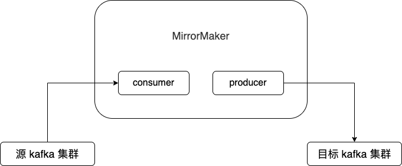
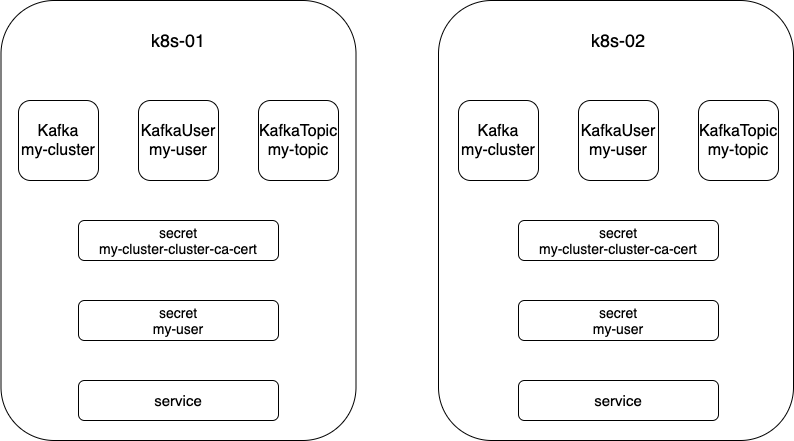
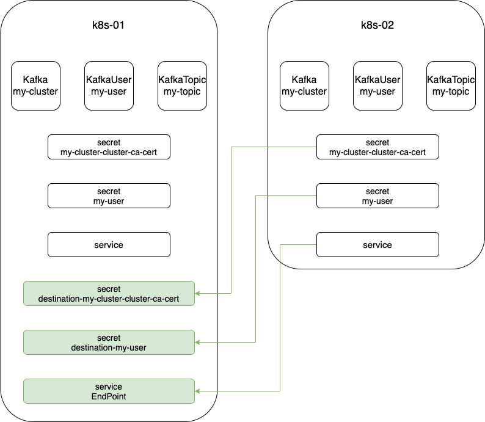
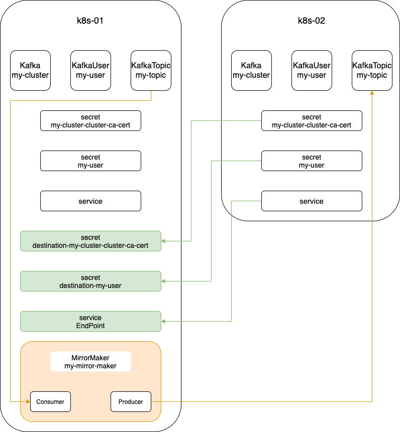

# MirrorMake

## MirrorMake 基础



Kafka 默认提供了一个工具 MirrorMaker，用来帮助用户实现数据在两个 Kafka 集群间的拷贝。就具体实现而言，MirrorMaker 是一个 consumer + producer 的混合体。对于源 kafka 集群而言，它是一个 consumer；而对于目标 kafka 集群而言，它又是一个producer。MirrorMaker 读取源 kafka 集群指定 topic 的数据，然后写入目标 kafka 集群中的`同名 topic` 下。

## MirrorMake 实践

实践思路如下：

1. 假设有两个 k8s 集群：`k8s-01`和 `k8s-02`，在 k8s-01 上部署源 kafka 集群，在 k8s-02上部署目标 kafka 集群。在两个集群上也分别部署 user 和 topic。部署完成后再集群中会生成相关的 Secret 和 Service。如下如所示。



2. 在 k8s-01上部署 MirrorMaker。部署 MirrorMaker 时需要配置 consumer 连接到源 kafka 集群，配置 producer 连接到目标 kafka 集群。连接源 kafka 集群使用 k8s-01 上的 Secret 和 Service。连接目标 kafka 集群需要使用 k8s-02 上的 Secret 和 Service。所以需要根据 k8s-02 上的 Secret 和 Service 信息在 k8s-01 上部署额外的 Secret 和 Service。如下图所示。



3. 在 k8s-01上部署 MirrorMaker。



## MirrorMake 操作

1. 在 k8s-01 上部署源 kafka 集群，user，topic

```yaml
# 创建 Kafka 集群的 yaml 文件
apiVersion: kafka.strimzi.io/v1beta1
kind: Kafka
metadata:
  name: my-cluster
spec:
  kafka:
    version: 2.5.0
    replicas: 3
    jmxOptions: {}
    listeners:
      tls:
        authentication:
          type: tls
    authorization:
      type: simple
    config:
      offsets.topic.replication.factor: 3
      transaction.state.log.replication.factor: 3
      transaction.state.log.min.isr: 2
      log.message.format.version: '2.5'
    storage:
      type: ephemeral
  zookeeper:
    replicas: 3
    storage:
      type: ephemeral
  entityOperator:
    topicOperator: {}
    userOperator: {}

---

# 创建 KafkaUser 集群的 yaml 文件
apiVersion: kafka.strimzi.io/v1beta1
kind: KafkaUser
metadata:
  name: my-user
  labels:
    strimzi.io/cluster: my-cluster
spec:
  authentication:
    type: tls
  authorization:
    type: simple
    acls:
      - resource:
          type: topic
          name: my-topic
          patternType: literal
        operation: Read
        host: '*'
      - resource:
          type: topic
          name: my-topic
          patternType: literal
        operation: Describe
        host: '*'
      - resource:
          type: group
          name: my-group
          patternType: literal
        operation: Read
        host: '*'
      - resource:
          type: topic
          name: my-topic
          patternType: literal
        operation: Write
        host: '*'
      - resource:
          type: topic
          name: my-topic
          patternType: literal
        operation: Create
        host: '*'
      - resource:
          type: topic
          name: my-topic
          patternType: literal
        operation: Describe
        host: '*'

---

# 创建 KafkaTopic 集群的 yaml 文件
apiVersion: kafka.strimzi.io/v1beta1
kind: KafkaTopic
metadata:
  name: my-topic
  labels:
    strimzi.io/cluster: my-cluster
spec:
  partitions: 3
  replicas: 3
  config:
    retention.ms: 604800000
    segment.bytes: 1073741824

```

2. 在 k8s-02 上部署目标 kafka 集群，user，topic

```yaml
apiVersion: kafka.strimzi.io/v1beta1
kind: Kafka
metadata:
  name: my-cluster
spec:
  kafka:
    version: 2.5.0
    replicas: 3
    jmxOptions: {}
    listeners:
      external:
        type: nodeport
        tls: true
        authentication:
          type: tls
    authorization:
      type: simple
    config:
      offsets.topic.replication.factor: 3
      transaction.state.log.replication.factor: 3
      transaction.state.log.min.isr: 2
      log.message.format.version: '2.5'
    storage:
      type: ephemeral
  zookeeper:
    replicas: 3
    storage:
      type: ephemeral
  entityOperator:
    topicOperator: {}
    userOperator: {}

---

# 创建 KafkaUser 集群的 yaml 文件
apiVersion: kafka.strimzi.io/v1beta1
kind: KafkaUser
metadata:
  name: my-user
  labels:
    strimzi.io/cluster: my-cluster
spec:
  authentication:
    type: tls
  authorization:
    type: simple
    acls:
      - resource:
          type: topic
          name: my-topic
          patternType: literal
        operation: Read
        host: '*'
      - resource:
          type: topic
          name: my-topic
          patternType: literal
        operation: Describe
        host: '*'
      - resource:
          type: group
          name: my-group
          patternType: literal
        operation: Read
        host: '*'
      - resource:
          type: topic
          name: my-topic
          patternType: literal
        operation: Write
        host: '*'
      - resource:
          type: topic
          name: my-topic
          patternType: literal
        operation: Create
        host: '*'
      - resource:
          type: topic
          name: my-topic
          patternType: literal
        operation: Describe
        host: '*'

---

# 创建 KafkaTopic 集群的 yaml 文件
apiVersion: kafka.strimzi.io/v1beta1
kind: KafkaTopic
metadata:
  name: my-topic
  labels:
    strimzi.io/cluster: my-cluster
spec:
  partitions: 3
  replicas: 3
  config:
    retention.ms: 604800000
    segment.bytes: 1073741824

```

3. 根据 k8s-02 上的 Secret 和 Service 信息在 k8s-01 上部署 Secret 和 Service

部署 kafka 集群后每次生成的 Secret 和 Service 信息都不一样，所以不能直接复制粘贴下面的示例，需要根据实际信息修改。

```yaml
# destination-my-cluster-cluster-ca-cert.yaml
apiVersion: v1
data:
  ca.crt: LS0tLS1CRU
  ca.p12: MIIEVg==
  ca.password: Z2wxej
kind: Secret
metadata:
  name: destination-my-cluster-cluster-ca-cert
  namespace: kafka

---

# destination-my-user.yaml
apiVersion: v1
data:
  ca.crt: LS0tLS1C
  user.crt: LS0tLS1CRU==
  user.key: LS0tLS1C
  user.p12: MIIJOAIB
  user.password: U2lBN
kind: Secret
metadata:
  name: destination-my-user
  namespace: kafka

---

# destination-service.yaml
apiVersion: v1
kind: Endpoints
metadata:
  name: destination-service
subsets:
  - addresses:
    - ip: 192.168.17.2
    ports:
    - port: 30102
---

apiVersion: v1
kind: Service
metadata:
  name: destination-service
spec:
  ports:
  - port: 30102


```

4. 在 k8s-01 上部署 MirrorMaker

```yaml
apiVersion: kafka.strimzi.io/v1beta1
kind: KafkaMirrorMaker
metadata:
  name: my-mirror-maker
spec:
  replicas: 3
  version: 2.5.0
  consumer:
    bootstrapServers: my-cluster-kafka-bootstrap:9093
    groupId: my-group
    numStreams: 2
    offsetCommitInterval: 120000
    tls:
      trustedCertificates:
      - secretName: my-cluster-cluster-ca-cert
        certificate: ca.crt
    authentication:
      type: tls
      certificateAndKey:
        secretName: my-user
        certificate: user.crt
        key: user.key
    config:
      max.poll.records: 100
      receive.buffer.bytes: 32768
  producer:
    bootstrapServers: destination-service:31818
    abortOnSendFailure: false
    tls:
      trustedCertificates:
      - secretName: destination-my-cluster-cluster-ca-cert
        certificate: ca.crt
    authentication:
      type: tls
      certificateAndKey:
        secretName: destination-my-user
        certificate: user.crt
        key: user.key
    config:
      compression.type: gzip
      batch.size: 8192
      ssl.endpoint.identification.algorithm: ''
  whitelist: my-topic
  resources:
    requests:
      cpu: "1"
      memory: 2Gi
    limits:
      cpu: "2"
      memory: 2Gi

```

5. 验证

在 k8s-01 上往 topic 写入数据，在 k8s-02 上的 topic 消费数据，验证数据是否在两个集群中传输。

[参考](https://github.com/strimzi/strimzi-kafka-operator/issues/3887)


```yaml
apiVersion: v1
data:
  ca.crt: LS0tLS1CRUdJTiBDRVJUSUZJQ0FURS0tLS0tCk1JSURMVENDQWhXZ0F3SUJBZ0lKQUpKZFdFMmhUU3ZKTUEwR0NTcUdTSWIzRFFFQkN3VUFNQzB4RXpBUkJnTlYKQkFvTUNtbHZMbk4wY21sdGVta3hGakFVQmdOVkJBTU1EV05zZFhOMFpYSXRZMkVnZGpBd0hoY05NakF4TWpBeApNRFUxTlRRMVdoY05NakV4TWpBeE1EVTFOVFExV2pBdE1STXdFUVlEVlFRS0RBcHBieTV6ZEhKcGJYcHBNUll3CkZBWURWUVFEREExamJIVnpkR1Z5TFdOaElIWXdNSUlCSWpBTkJna3Foa2lHOXcwQkFRRUZBQU9DQVE4QU1JSUIKQ2dLQ0FRRUF0dDJGRm90SXptdlE0MjQ1NHJjZS9vNVRab3ZGSXFTUFdlSExkRXl3UzZkbUNza0pNamZRNjhFcwpXcGJ5cS93STFOK2tTRmFRNjJyRTgzRU91ZlJZR1pOeWhHYTV2VUFVMUc0S29JL2YxVHFwWDExVlJTOHFpanR6CkN3Z25pdmRyQ2UvakJSUXJmUzJwZjZ4WU11VHplSUpkcnBNNTJweDd1eC90N3dKc0RtbjZIOGNFY0RyRkFDRngKRGQvNEMxQkJ6ZmU1aFlyREt6TW1lY1c2VXR5QW9UckNMSzZsaHUrVEZpVVZGTEtNdmpwMjd0djNKNDI4TFRjLwpxWFNUdTNVYnI4clRFdVROYjh4UjQ0MHhiaWZYaFg3dkFFeldlejB5d1drTUtzODhZbDVmZ0RvYVFLUnh4Y2JaCml4K1kzKys1Y2NlVTdiZ3dUR09jYlFXQjEvU3R0UUlEQVFBQm8xQXdUakFkQmdOVkhRNEVGZ1FVSG5vK0hZeFEKRkRzeHZYaG5pMlZ3OHRhbGNld3dId1lEVlIwakJCZ3dGb0FVSG5vK0hZeFFGRHN4dlhobmkyVnc4dGFsY2V3dwpEQVlEVlIwVEJBVXdBd0VCL3pBTkJna3Foa2lHOXcwQkFRc0ZBQU9DQVFFQUJ5dDJpNmhxa09QZ0haeWZhN1RlCjh6azNVWTc4Vmg1ZEFkY3A3UW0rWlRjeUJ3d2pHS0YrYzRGV21Za3RxZjNjdmZnZnJyb3NiL20wbmdYMFpsV1UKMmhocW81K0dDa0s1ZWpGY1RPMTdOdnRUbVpGQnZXME10YVBXblIzSTRKK0xEc2tVOUNGUktqRVF3ZXl1YkhoSQpXaGlIZk5xUHlrT1VxRURraUJvb0hsVm9xWm82cGNIaC9FOUM4MFE0ZmN3VnFQRjh2QlZDUkQrbUFYRzVROW53CmlKL2Y1b0FTYmo3R0ZiMURGVWxmY29obFpsalhBOURhdmpJdFUvMXY2cFZGVytNTG1MUm53cUxXU3lPQTlzTGYKckxQS0lwZGM1RnhOOFBOdlBScHBncEdVL3ZicVFCUE5aaFN3RVhFd3dObzdaL01MN2kyeXNCT0VVQksxVE84LwoxQT09Ci0tLS0tRU5EIENFUlRJRklDQVRFLS0tLS0K
  ca.p12: MIIEVgIBAzCCBA8GCSqGSIb3DQEHAaCCBAAEggP8MIID+DCCA/QGCSqGSIb3DQEHBqCCA+UwggPhAgEAMIID2gYJKoZIhvcNAQcBMCkGCiqGSIb3DQEMAQYwGwQU4OrcP5ElXe12gfpvNjp/y7XkBdYCAwDDUICCA6CiyvwrR+hcP10Job+L/H4Kz9GriMcSxm7r7GaRZXDlyGsUtJbdaV9u7idKEE62eYR7fGxXcZgtUsKpOdtr1hn0dpyrsgH8mNJhERGifCFo6NkIEfEMLAVAq++GU1NDz0K3ghrOXJ5zvS+/JFienLkLSfNmMOxJaH7b4mY/rC1kn3aGrT4RHJexVYg+cutDLYmwLPshpEkEXHxoztmRaoku0+lNI6A+CbTnpmDHw/gIYf3ZKCrtrsLVBZJbc6H6rOJXc4bIQxhfJWpMIsIkSsb//PgGr+gjSGCzhrg0384bjdwLe93tuIdGlxBXxdvv/46eO2gjfeBe2mRu2qX77yuKt45KESXWZAcMGvRHldSKunobYYXGA6BfoRIfiXwiHnKTwH6XTpln+wHCbSAWasOFrcNMi7yuwls2SOrjPS/aEq0hmWw/9umN7pAgPv3C9C6kKxPf+bJPG1vQ5Fc0OsZcXXSy+mt63UWmV9Q9Cds1B3wkWsHPPI5VwMW62hZd0m7j2Do1gPfEwPamE0LWv8AX8q4WzuJyOZTJ9JVjGOPf2+evg1YHJx1Z124Gpl5GV93Q3GAjxX9Qkd169Wzq5PgxQbJI7ZOgIcB3pdGmiF52PVDD/sPiyhRdUyNF7XveN4ead883NnjgNd8W9F0fcennH8JF8UGmnnwrkgUDA5lt/VCgK/PeLltAxonJF8S4sHL57yIIGaT4iSh0v2YnoVetGUGn9/llMjMIadOGFiQyQivNsEUIwwSrta80IIsF1nFxhxVe9hCrN/toB9HQBlwhdjIhx3CKOeH/pKxUMXBoVfHVKsV00/rxIeR4GHwBMsNvpXVBCdfQ+elakh1EWl1i5E86xvxQdRNMqkHpeMxlRxQjugY3EAYYNQTzGiBp11aNjZZsMft4QE3ldnODQsmXtRoesuTnNBwtIydvzYkl9sCsGbvv0FP40wLG+hUuEuEcTeRiY06sDf1M6zbFHZZZZTwbMwZjI4TNPNYLinvZqL3RxDWo5muvLQanihC/WthdfT66nXyiud5T8zTEDzJOi3ekGrOfr6dsN5ZX3xlDBFVFIusDEgsRvh4DaZSlLJ5Bts91seWVN9DujAccVUT0HAmZEuYIfvQp0BWDSEdiHKo/Wb56r0dfmzRfAkJyrkLVc/7tKjLSFAInBtpErectn9XNGT9Et2lfLefc0+VzBlSVjnrFVX2ipsCPDWL27q91C+CDUdCEf53YShOcM4UdMD4wITAJBgUrDgMCGgUABBRQ2GWv263jsZTvuKd3bVUd7ss6XgQUmwMhX3KuEAbX1eLwvcFGHw180mcCAwGGoA==
  ca.password: Z0NlWm80WUo4NDQy
kind: Secret
metadata:
  name: destination-my-cluster-cluster-ca-cert
  namespace: xxli
type: Opaque

---

apiVersion: v1
data:
  ca.crt: LS0tLS1CRUdJTiBDRVJUSUZJQ0FURS0tLS0tCk1JSURMVENDQWhXZ0F3SUJBZ0lKQUk3ZjRvVmU3SW1FTUEwR0NTcUdTSWIzRFFFQkN3VUFNQzB4RXpBUkJnTlYKQkFvTUNtbHZMbk4wY21sdGVta3hGakFVQmdOVkJBTU1EV05zYVdWdWRITXRZMkVnZGpBd0hoY05NakF4TWpBeApNRFUxTlRRNVdoY05NakV4TWpBeE1EVTFOVFE1V2pBdE1STXdFUVlEVlFRS0RBcHBieTV6ZEhKcGJYcHBNUll3CkZBWURWUVFEREExamJHbGxiblJ6TFdOaElIWXdNSUlCSWpBTkJna3Foa2lHOXcwQkFRRUZBQU9DQVE4QU1JSUIKQ2dLQ0FRRUFwN3lycm9DMWZueCs1NEhPeUt6d3BTSS9rMFFVaWNRb2FvVVBhRWR2dGJZeldnbmhVOVMvMG1zSApkNlYySHVDUVA2dldwUCtrZTFyZDc2czlUSk9VOUNKRnlyQ0dZcmJBSUtNbE1tWUR2cGZqWUdQMktiOGx2R2FXCkZ0RlhnUGJUUlQvM2NjK0JHdTRHRlEzSFkzanNETTV2aTBtdTA3MlFVUlUrcDNCaGQ0UGZoOHpnSGZVclk4S28Kb1I0aFY0ZnVtaGxGamdQSXVXWW9MUlluRDdSUGw3anFldHR5N2FDaWZlVFlJcFcwT1JPWW8yWTI1TVZkV0srYQpwRW43bnJjcVBlMkdMSWRvTCs0aS80TUJnK2RNSU9rbk80N1lwUDd5V2VCb05vSWw5NWg1elVWamt4SWNMWXpCCll1R2EvZjJFdTlmRDBoWitZWDFqMzJYRUI1Ym1Ud0lEQVFBQm8xQXdUakFkQmdOVkhRNEVGZ1FVU0pSa0VHdlIKdWJFeGdPUGxCM3BBckZ6NGtaa3dId1lEVlIwakJCZ3dGb0FVU0pSa0VHdlJ1YkV4Z09QbEIzcEFyRno0a1prdwpEQVlEVlIwVEJBVXdBd0VCL3pBTkJna3Foa2lHOXcwQkFRc0ZBQU9DQVFFQVNaZm9QVW1PY2hGcHVGMmlIODBJCjJrTWFxNjFFN2pjc0RnOHpOa21OTWlNR0RtWkZzeE5Gc0pqdzExM25yR2VHcEV6RjFSY1hIMWdRaExBN0IrNnYKd0o1Ykt4RnpQbk96VHhyWG5HRnNoQlFjY2djY2FvajVRWjRjLzZpQ1FvTzJGRklQWWlpb25abzlLRHZPUmdKUApIeDV3QXEwTDdMZ0RURHE4RmdGNHphclBFeWFsYStOeDNncy9QdmE3WUQ5NFIxTXF2SjZ6cENHbC9FVC9HUHNXCnhlTVBCVE5BclV5ckh2dytpc3NNR0M1RjZTODgrUTBLMEdOYVJkRG1yWG54RzIvYUNpNE9YMzR6UGtWQlU3V0wKUE1uZDlJOE42Vno1NUJxcVQxTG54V05YUEJxSGY3aWUxYmdQZlhrWUpraGcwZzZmcW1lRW5FQWNtSVZqWHhjVgp1Zz09Ci0tLS0tRU5EIENFUlRJRklDQVRFLS0tLS0K
  user.crt: LS0tLS1CRUdJTiBDRVJUSUZJQ0FURS0tLS0tCk1JSUN1ekNDQWFNQ0NRRHp4L1BsV3IxVmlUQU5CZ2txaGtpRzl3MEJBUXNGQURBdE1STXdFUVlEVlFRS0RBcHAKYnk1emRISnBiWHBwTVJZd0ZBWURWUVFEREExamJHbGxiblJ6TFdOaElIWXdNQjRYRFRJd01USXdNVEEyTVRZegpNMW9YRFRJeE1USXdNVEEyTVRZek0xb3dFakVRTUE0R0ExVUVBd3dIYlhrdGRYTmxjakNDQVNJd0RRWUpLb1pJCmh2Y05BUUVCQlFBRGdnRVBBRENDQVFvQ2dnRUJBS3dMZlFYMjVFRlloZk5vTmowL1djZ1VqK3gyaVZTYXJUbW0KUnNka1lwVkx2WDc5djdpMjQvMGdqbER6WEw5aVRZdzFwTHFqck5PRVNaSUJRcFREWG9tb0hDZUUwTmNMcWtxSQpvRWx2MWFJcGNycU9uUmZybHZjR210UnBLM0NhRzk1cXZ4YldPampLanFRcEd4R3phQjU5NkRMNzFTSzd4QzAyCnVCMkJiRkREdHpkb2N0V2FibithYno3TkkvdlhtNlBnRmFyNkVyTGk1OEl3N2ZOeXpiRTBzU213anRUb01IV0IKdVUrd0VidWlTcldQajdNUXg5dXJQV2p4YW1zNEFDRUFLZTNNSTBhNDdoTEZEVHNGUDkwejkxTXVpWHZJOUV0SApxQTltWi8xOFVmNzZCUlliM2g2b1puNGs2MW1wekJhRWlleXp0UDN0MkxhVjJQTGR0djBDQXdFQUFUQU5CZ2txCmhraUc5dzBCQVFzRkFBT0NBUUVBSWQwa1V6V3hXQURLL0t2Z2gvVTc2cTgyTzZDbXY0Z3BzU1VBNHVLTjhoVHcKVGlURHVKb21jUUxQQTdPVmNDaHdWU01ZZlRkNjd3S0xrRUVFUEFaNTB2dDdhdDlOa0k0ZzJCYXc0L0dVanowLwphd3pRZFdWclNoT2VSV1Q0SUNYRC9raUM2YTZSYUF4c294N01xcDdqT2M4SS80V0UzWER4dkR1ZEpJSFBveUErCnlWQ3gzZ1BGSS9BbTUyejdqVjZ1Rm10aThnK0VoVnhOcElWTlYvaXcxYkRXUzhEOGNudlZuRDRBclhuVDRhSEYKMTV6eWQzN0RnSCtQRmJrWGROcTdsTEJQbWtiS200Z2FVSW9iM3JmMCtmMXBkL0xjWSs1cmpEZFJWekdOTCtyaQpiOERHTmdJOFBiODhtcTY4cHdFR0wvTCs2YnhDNUNDYkNweEdubVBwK2c9PQotLS0tLUVORCBDRVJUSUZJQ0FURS0tLS0tCg==
  user.key: LS0tLS1CRUdJTiBQUklWQVRFIEtFWS0tLS0tCk1JSUV2QUlCQURBTkJna3Foa2lHOXcwQkFRRUZBQVNDQktZd2dnU2lBZ0VBQW9JQkFRQ3NDMzBGOXVSQldJWHoKYURZOVAxbklGSS9zZG9sVW1xMDVwa2JIWkdLVlM3MSsvYis0dHVQOUlJNVE4MXkvWWsyTU5hUzZvNnpUaEVtUwpBVUtVdzE2SnFCd25oTkRYQzZwS2lLQkpiOVdpS1hLNmpwMFg2NWIzQnByVWFTdHdtaHZlYXI4VzFqbzR5bzZrCktSc1JzMmdlZmVneSs5VWl1OFF0TnJnZGdXeFF3N2MzYUhMVm1tNS9tbTgrelNQNzE1dWo0QldxK2hLeTR1ZkMKTU8zemNzMnhOTEVwc0k3VTZEQjFnYmxQc0JHN29rcTFqNCt6RU1mYnF6MW84V3ByT0FBaEFDbnR6Q05HdU80Uwp4UTA3QlQvZE0vZFRMb2w3eVBSTFI2Z1BabWY5ZkZIKytnVVdHOTRlcUdaK0pPdFpxY3dXaEluc3M3VDk3ZGkyCmxkankzYmI5QWdNQkFBRUNnZ0VBSy9pcnRaQ0tlaUVUNjBnaFJMb2lTajduSWZxUjB1dk5oa1IzSnBNRGwwREsKWitDVzFiRDR5RU0vM0hTMnFidUlNbU9yZklCRXRiTEQwdXM3aHlYL3paTUh6eG5rL25GZXpybm9yWnhGcjdLRQpQaVloQkhJVUhZSzBvOEZWZHV3TVgyWk0vSnM0T2plYkNWM3dLeS85Vm4yN2tQeElWeDVDWDRQeXZxZkxkVUNGCkN2aWRXOHN2NStwOGdaNk45OG5WM1g0cGYySExvdnVkeVhqcWRvWGVKbkcyem5TTUdTK3hWd1lpNzhoNmRCTzAKRnVvZnJmdUsxblhnK1UvTG9CNW1zOHBndHZ1cFIvY3VsK3RTWHkrbVZyS3pOM2k3ZkRWUmRRNWhaMWFCajhLZQpiYlJ2WStBbTRrTWV2ajd0WVc5OUJzVXc1UGh3dHlVa3VmMzNKMkVQaVFLQmdRRFlBMWlWRVJqZXd0MDVIOWtXCndKSEt2bmtJMWdoK2g4Sy9TUG5NVTdiRnUwbGVhaUx3VnRYblpPZk56NDRUY2lEWjc5Rk5md3NvQlMvY3dwS0EKaUpUTzFBT2g5MlMvNXJUUzROT1NsYjdZWk5Ka096STlsVUFJLy9xZmZaNTIybjM3c3cvbjhSVFhaQXRjNDZ3Mwo0ZnBQOEQ5dCs5LzJrL01jT3dtK3dsS05hd0tCZ1FETDVJZ05JL1dCMzV3NUZaVmtPRzdYcVdZV1lEQWFoNkllCkw3REtKam1YT1dJT3U5VjVXNERPNkZKYzRCZVErSEJwZk8zUDRXRllDUmNZWnNlQUNGT05kVEpDclRDVHhNSWkKUFVFaDltWmllNE9CWkliSUhIRnJCMUp2MUdOa2plSlZyaVRvaUtjZ0g3ckRsVzdWWkR0QzlGSGtMd3FkM2NVZgptRFZ0Ui93L053S0JnRFkxeU1KSU15U2NaS1pVWHNlOTloaWFhb2VVSnplUjNJYml5b1hEc0llNDg3VzFEeVdmCnRUakg4d0NNaVF4S1JRSk1sQXROeWIvMlpVZVNzTzkrMTFGOGxaak5IRVNvb2xLVng2THUzNkV3MURnQlB4K0QKV0RtcCsveVFxdmNLNkRrRmZBVnFWQitsNU5BZjl2VmpTYzFMN3E4c1djMW8zY2NFN2ZJb2xFMFhBb0dBQm5yKwpCQVRua2Jnc3UvZStwcy9RWGhScFJUN0xhSngwLzZhZVpONXdLQ2xQdjQ0aXk5ZW5zV3ZhNms3SkVQZUVneVhRClhUSVpxUFdwQVVLTEJydTlCQnI4ZlBnS09qZ2Z2M3pZN0I1cnhLZU9WM2Q5ZlREQ1BoZWVmQ1Z3LzBvdkxtLzUKaGxhSmtWRFEyOVNORUVVK1NQT0JBdEtuOExxU3dGMVRIV1VUVkdNQ2dZQmUwL3ZjT2t1bWVLM1FraWk5WU9wTwpvYi90SjE2NnVPQ2xhOERiTXJMTW9NVCtnZmFxSXNqZzlxbFVhRWNFUkxyak51ZFhJeUlhbFJjaUJHK1dhRGx5Clg5dzI2QytmMzUxQWU0NWR5dGdrdTNVc2xiblh2OFRNS2JxWDBneGM2TERGWHcwdzNxeWRKbGhoRVh0ZXZuT2UKdHg3RDVES2hmbUZlTE1TUVRXVnBXdz09Ci0tLS0tRU5EIFBSSVZBVEUgS0VZLS0tLS0K
  user.p12: MIIJOAIBAzCCCP4GCSqGSIb3DQEHAaCCCO8EggjrMIII5zCCA38GCSqGSIb3DQEHBqCCA3AwggNsAgEAMIIDZQYJKoZIhvcNAQcBMBwGCiqGSIb3DQEMAQYwDgQISNQ2ujpgvb8CAggAgIIDOEgg//axJ4Jb/5z2FjSoa90YgvffU7shTKFKMpzhkoDzqq6dBgCJChZB7HBW/eQIrhs7OVvp/luEWpAAO6vIrgYjF/LBIcFLzBZm3/f3Eo/IYJ2CASgzZ9oKuGvFruLG3XWnveJvoq8liqt9Xe0EgIlxUrAzBlUL6TDwilVnenCg7KEOXP1vjteLaxuSnaQ1hpMahOlK9kO+f0pVAAW4GbBTstLZDXfI7QgSvduKuQAkfmuAAopNdZYY6jpaE7fiE8ZlBajxMQ6BdRify7oruvTtlhMY3u5hrw5BtH2Uk0QCPKxqGSU3s2VpSWEEt1kBP1SUPWdtmmwuoh71tui0Wv9fyYyybTsJrAqQERYgE2oIzF+LnD9D8fNMFtCBpJ4MsxMDGbqnIbWE0iPk6yX4f/gDJPmQWCCKyNgy8BhuHQP2hvJafPjkpdWE6M4xvX3n/21XSx1/CsApBJffpcRNNYxphkRgemWM8rCnLcsQmYL3BLjvoOcyhgk1rLgcmm9TcOUAiBUUQK2OEyXl2ZxcA1sXnoPwcbm01CwSc2jg+7ebhMvrI8o8gr+pYPDGoxxwITw8pIDQyqqS0tBCBtbaUtgQ8Y4zydyrOKYqIYfB6TRVwfrSwQa9m3V/rENWwGqW90x9/HrPd5luJp2mf4IKqmonbG0Ce+Wk0cdYuTzwbsWZy1Rk9Dg5GywhD4XW7Qq1cBTmFEa3Lhob4jBT0p4rBgI5OTtw156QGKRgzJd7ZXnutWNPqC415bp3lkLhfJ+RJ6rqrYVCEMUP4XbbPO1W/k3EkD6Qneq1zSCddrLc1/LrIrU/JpJ6QwnO8BRG5OzeZUAFivbiTgcQ2jLh/TkDPo2oTWw4+dAohwwKJIPl5yJ6+Oz4LeHEs9f5Us10bCT/HKghD0PgzfuJ8rmoZd6/9BWUa1rwXeoZd/iUPajGZF/5b2tUezvmDzzH+V6tud39PGqg1HD+rlb2E2PQF0sbfg57Pwmi40DMPW6wF5rwiDvkj+fF7I22HTQ3Gk/S2mUR2B3bMPk6hofiA/boAJsEH33xMqvNxcyaOxMcNKYT7wy3uwsnQ82gFB0UsqUMcJnI7NhNw33ccIICMIIFYAYJKoZIhvcNAQcBoIIFUQSCBU0wggVJMIIFRQYLKoZIhvcNAQwKAQKgggTuMIIE6jAcBgoqhkiG9w0BDAEDMA4ECD1zdGG18NQnAgIIAASCBMiOjI2l5EW1C4PF7NPDar/vvd+Ubzla693FIgmibzlF1Ee6UpOHOt4yhZ+8FlDkWxSAGE999Iz1hHJEiKrfZhM9iWG+vNKyR5rd0DlJrXZUccMaPuwGSwp+mfVeT7+CYR7WHmktKcXPUfxd2dFL1wCo05ohdAKOssxUxaym1zAH6ZS3L+wfF2mfaMzkyp/8ZxtqOqPccA8vv9y8gQ0QrO4ikuClSFjRLw/sr2w+egpAcl9EuZjx+iCx06uAY7MDUAvQ0vf6LCYzjas+uGYKOJhPy54WyX+9pbfgQsz2PeMItpJ4xdeLR9CxqELbkcPZAuAUVA9yVdKeqa+tPMpJjUI877YwMWDtjYGrdVaKjIQv5QIIrClgzHW2L2P44Q3Pk87NAPwy/USE/6eWYDo/plHLQkz4TYOxYg0RTzFMFwNF9SoHyBVMAFUYD0P4dw6/71C3o3Mo+foc6ikwz7PHeku4SJXDv6LsO7E4eMIizOzGkP+oZSnnXEvsqsIyEL3ue8+f4QZ3VeEtqwfQkH792kYKmy+3AI2yaTZF28caF6W8ufOgNlw6Xq2QUYNvmzMv/R8GNBBL1ZOFB8cV42gPiMGxWGLw9FKL5TIXcq0bdjSCXx3iwJVCBi5KphoaXv07mdW+TvDi/OwQN4Xt7aUuyuL69YN0AO7yoKfKpUnh+OGpV4FG8WJNGyEr+ltVzSe6EdmIbIIWPLX2k3OtV1v/iylP+8yufP+ltTVqViQcLuBJHoz/67Ch85Q0lMyyGBMJKxNuQJrxOMuMaDkzQeEvNHvN4sKzt607PEysfczqAkPG6urxR+XbNXfYduNHpS+5FRNQ/WTqRertlKy1UHZc55LUaEYCwLHXVsiLhPnpvBo8rXoJNUT5RiVx/0mkh0WfCuQoFz+gaezcDz0qAE9LdRhK+LcgY9Fu5PQZfU8Kn7QsuTpiXQZKqM+0zonXLOJ8de7varpqC2Uogw54pKaIeLiK7DDn/E61AMcrToiBL35R+RCPgHHrBeCWRXRInDOamFPMNW5qu/okT/o9tVUsWdQ9xjdCjC+Oz9N+R41hwj/vQZibqMXAr0f0te6FU3AoZU3vTTMhDrQBfYppu1wBZGQRQRiO2R7Ftok9744DJPsGfQSgCe9unsM9NC61OG6TO1pNI0Xi+ILSxZgSkPJb4aD5x37zoSBbLiomI6qXPplgFrWSXUDe6M1Wt7Wjpsx3qDzYMqIbmKPFVnWNNzopMSMYcnPWxliR+SJgywk2JnalZMYAg5F7QS3dQFrKMQGU5n4ACwggeS3X7H1OGOpeYsWUYUcZPvCGtQCpViYXXQUG2ugxo0FrhgnCSHr0HimpQBwSHDM0e8fhlS1fvtpYNSXyz3GoeFp+tX0QmZ+8KZrlBBY7Dz/1mdfJv5mRKVHiSpqXj3vCBrmXgBcnjftZvbpfyZp1XLI+s95PTlxMzqWqfpfqqUqRoalzWXkgLjjxvZRdfV0zKS9YK2EnEe48x6KQbq30Wl85K4ddiVpqtPh5tIH47SJDRvTS/3E0QRZ6oY+Zw1pXF7cqo+IjfP2mfU00U0wpC3BPHVDzOskfdXl49eC0l+039GWaWpf0P0WkKI1yYO2sxY2fTS47wuSCCXF3S0pr6HzC16sxRDAdBgkqhkiG9w0BCRQxEB4OAG0AeQAtAHUAcwBlAHIwIwYJKoZIhvcNAQkVMRYEFClqSFFSq75DhTB1fX1x1dumTtAJMDEwITAJBgUrDgMCGgUABBQJrI6ElIS8+G2urY9VQ2WEvdDKsQQIm4nsL7fplhwCAggA
  user.password: YmwxejdabU5SWFlW
kind: Secret
metadata:
  name: destination-my-user
  namespace: xxli
type: Opaque


```


