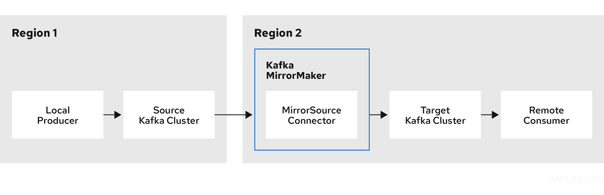

# Introducing MirrorMaker 2.0 to Strimzi

https://strimzi.io/blog/2020/03/30/introducing-mirrormaker2/

https://blog.cloudera.com/a-look-inside-kafka-mirrormaker-2/


March 30, 2020 by Paul Mellor

Apache Kafka MirrorMaker replicates data across two Kafka clusters, within or across data centers. MirrorMaker takes messages from a source Kafka cluster and writes them to a target Kafka cluster, which makes it a very useful tool for those wanting to ensure the availability and consistency of their enterprise data. And who doesn’t? Typical scenarios where you might consider MirrorMaker are for disaster recovery and data aggregation.  Apache Kafka MirrorMaker可跨数据中心内或跨数据中心的两个Kafka集群复制数据。 MirrorMaker从源Kafka群集获取消息，并将消息写入目标Kafka群集，这对于希望确保其企业数据的可用性和一致性的用户而言，它是一个非常有用的工具。 谁不呢？ 您可能考虑将MirrorMaker用于灾难恢复和数据聚合的典型方案。

With the release of Strimzi 0.17, things become a little more interesting with the introduction of support for MirrorMaker 2.0. MirrorMaker 2.0 represents a significant shift in the way you synchronize data between replicated Kafka clusters, promising a more dynamic and automated approach to topic replication between clusters.  随着Strimzi 0.17的发布，随着对MirrorMaker 2.0的支持的引入，事情变得更加有趣。 MirrorMaker 2.0代表了在复制的Kafka集群之间同步数据的方式的重大转变，它有望在集群之间提供一种更加动态和自动化的主题复制方法。

### MirrorMaker 2.0 - the Kafka Connect(ion)

Before we get into some of the implementation detail, there’s something you’ll be keen to know about Mirror Maker 2.0. Is the sequel better than the original? Well, how does **bidirectional replication** sound? And what about **topic configuration synchronization** and **offset tracking**? Pretty good, right?  在深入了解实施细节之前，您将对Mirror Maker 2.0有所了解。 续集比原作更好吗？ 那么，双向复制听起来如何？ 主题配置同步和偏移量跟踪又如何呢？ 还不错吧？

This is MirrorMaker ready to fulfill the potential we always knew it had.  MirrorMaker已准备好发挥我们一直知道的潜力。

The previous version of MirrorMaker relies on configuration of a *source consumer* and *target producer* pair to synchronize Kafka clusters.  MirrorMaker的先前版本依赖于源使用者和目标生产者对的配置来同步Kafka群集。

MirrorMaker 2.0 is instead based on Kafka Connect, which is a bit of a game changer. For a start, there is no longer a need to configure producers and consumers to make your connection.  MirrorMaker 2.0相反地基于Kafka Connect，这有点改变游戏规则。 首先，不再需要配置生产者和使用者来建立连接。

Using MirrorMaker 2.0, you just need to identify your source and target clusters. You then configure and deploy MirrorMaker 2.0 to make the connection between those clusters.  使用MirrorMaker 2.0，您只需要标识您的源集群和目标集群即可。 然后，您可以配置和部署MirrorMaker 2.0以在这些群集之间建立连接。

This image shows a single source cluster, but you can have multiple source clusters, which is something that was not possible with old MirrorMaker.  此图显示了一个源群集，但是您可以有多个源群集，而这是旧的MirrorMaker无法实现的。



MirrorMaker 2.0 *connectors* – remember, we’re based on Kafka Connect now – and related *internal topics* (*offset sync*, *checkpoint* and *heartbeat*) help manage the transfer and synchronization of data between the clusters.  MirrorMaker 2.0连接器–记住，我们现在基于Kafka Connect –以及相关的内部主题（偏移同步，检查点和心跳）有助于管理群集之间的数据传输和同步。

Using Strimzi, you configure a `KafkaMirrorMaker2` resource to define the Kafka Connect deployment, including the connection details of the source and target clusters, and start running a set of MirrorMaker 2.0 connectors to make the connection.  使用Strimzi，您可以配置KafkaMirrorMaker2资源以定义Kafka Connect部署，包括源集群和目标集群的连接详细信息，并开始运行一组MirrorMaker 2.0连接器以进行连接。

Different to the previous version of MirrorMaker, radically different, but different doesn’t mean more complicated here. In fact, once you know the essentials, setting up is rather straightforward.  与先前版本的MirrorMaker不同，这是完全不同的，但这并不意味着更复杂。 实际上，一旦您了解了要点，设置就相当简单了。

### Bidirectional opportunities  双向机会

In the previous version of MirrorMaker, the topic name in the source cluster is automatically created in the downstream cluster. Fine, to a point. But there is no distinction between *Topic-1.Partition-1* in the source cluster and *Topic-1.Partition-1* in the target cluster. Essentially, you are limited to *active/passive* synchronization, because *active/active* replication would cause an infinite loop. MirrorMaker 2.0 solves this by introducing the concept of *remote* topics.  在MirrorMaker的早期版本中，源群集中的主题名称是在下游群集中自动创建的。 很好，到了一定程度。 但是，源群集中的Topic-1.Partition-1与目标群集中的Topic-1.Partition-1之间没有区别。 本质上，您只能使用主动/被动同步，因为主动/主动复制会导致无限循环。 MirrorMaker 2.0通过引入远程主题的概念解决了这一问题。

*Remote* topics are created from the originating cluster by the `MirrorSourceConnector`. They are distinguished by automatic renaming that prepends the name of cluster to the name of the topic. Our *Topic-1.Partition-1* from the source cluster becomes the never-to-be-confused *Cluster-1-Topic-1.Partition-1* in the target cluster. A consumer in the target cluster can consume *Topic-1.Partition-1* and *Cluster-1-Topic-1.Partition-1* and maintain unambiguous consumer offsets.  远程主题是由MirrorSourceConnector从原始群集创建的。 它们的区别在于自动重命名，该重命名将集群名称添加到主题名称之前。 源集群中的Topic-1.Partition-1成为目标集群中永不混淆的Cluster-1-Topic-1.Partition-1。 目标集群中的使用者可以使用Topic-1.Partition-1和Cluster-1-Topic-1.Partition-1并维护明确的使用者偏移量。

As you can see here, *remote* topics can be easily identified, so there’s no possibility of messages being sent back and forth in a loop.  正如您在此处看到的那样，可以轻松识别远程主题，因此不可能循环发送和发送消息。


Why *remote* topic and not just *source* topic? Because each source cluster can also be a target cluster in a bidirectional configuration. This feature also means that it is no longer necessary to aggregate data in a separate cluster.  为什么选择远程主题，而不仅仅是源主题？ 因为每个源群集在双向配置中也可以是目标群集。 此功能还意味着不再需要在单独的群集中聚合数据。

A rose might be a rose by any other name, but when it comes to replicating topics in MirrorMaker 2.0 we can’t afford such ambiguity. Particularly if we want to create a bidirectional configuration.  玫瑰可能是其他名称的玫瑰，但是在MirrorMaker 2.0中复制主题时，我们无法承受这种含糊。 特别是如果我们要创建双向配置。

The approach to topic renaming opens up a world of bidirectional opportunities. You can now have an *active/active* cluster configuration that feeds data to and from each cluster. For this, you need a MirrorMaker 2.0 cluster at each destination, as shown in the previous image.  重命名主题的方法打开了双向机会的世界。 现在，您可以具有一个主动/主动集群配置，该配置将数据往返于每个集群。 为此，您需要在每个目标位置都有一个MirrorMaker 2.0集群，如上图所示。

### Self-regulating topic replication  自调节主题复制

Topic replication is defined using regular expression patterns to *whitelist* or *blacklist* topics:

```
apiVersion: kafka.strimzi.io/v1alpha1
kind: KafkaMirrorMaker2
metadata:
  name: my-mirror-maker2
spec:
  # ...
  mirrors:
  - sourceCluster: "my-cluster-source"
    targetCluster: "my-cluster-target"
    topicsPattern: ".*"
    # ...
```

You use `topicsBlacklistPattern` if you want to use blacklists.

This is pretty similar to MirrorMaker, but previously topic *configuration* was not replicated.  这与MirrorMaker非常相似，但是以前没有复制主题配置。

The target cluster had to be manually maintained to match topic configuration changes in the source cluster. Something easily overlooked, and typically requiring users to build their own automation to achieve at scale.  必须手动维护目标群集以匹配源群集中的主题配置更改。 容易被忽略的东西，通常要求用户构建自己的自动化以实现大规模实现。

With MirrorMaker 2.0, the topic configuration is automatically synchronized between source and target clusters according to the topics defined in the `MirrorMaker2` custom resource. Configuration changes are propagated to remote topics so that new topics and partitions are detected and created. By keeping topic properties synchronized, the need for consumer rebalancing due to topic changes is greatly reduced.  使用MirrorMaker 2.0，主题配置将根据MirrorMaker2自定义资源中定义的主题在源群集和目标群集之间自动同步。 配置更改将传播到远程主题，以便检测和创建新主题和分区。 通过使主题属性保持同步，可以大大减少由于主题更改而导致的消费者重新平衡的需求。

### Offset tracking and mapping  偏移量跟踪和映射

In the previous version of MirrorMaker, the consumer offset of the source topic in the target cluster begins when the replication begins. The `__consumer_offsets` topic is not mirrored. So offsets of the source topic and its replicated equivalent can have two entirely different positions. This was often problematic in a failover situation. How to find the offset in the target cluster? Strategies such as using timestamps can be adopted, but it adds complexity.  在MirrorMaker的早期版本中，复制开始时，目标群集中源主题的使用者偏移量开始。 __consumer_offsets主题未镜像。 因此，源主题的偏移量及其复制的等效项可以具有两个完全不同的位置。 在故障转移情况下，这通常是有问题的。 如何在目标群集中找到偏移量？ 可以采用诸如使用时间戳之类的策略，但这会增加复杂性。

These issues entirely disappear with MirrorMaker 2.0. Instead, we get simplicity and sophistication through the `MirrorCheckpointConnector`.  这些问题在MirrorMaker 2.0中完全消失了。 相反，我们通过MirrorCheckpointConnector获得了简单性和复杂性。

`MirrorCheckpointConnector` tracks and maps offsets for specified consumer groups using an *offset sync* topic and *checkpoint* topic. The *offset sync* topic maps the source and target offsets for replicated topic partitions from record metadata. A *checkpoint* is emitted from each source cluster and replicated in the target cluster through the *checkpoint* topic. The *checkpoint* topic maps the last committed offset in the source and target cluster for replicated topic partitions in each consumer group.  MirrorCheckpointConnector使用偏移量同步主题和检查点主题来跟踪和映射指定使用者组的偏移量。 偏移同步主题映射记录元数据中复制主题分区的源偏移和目标偏移。 从每个源群集发出一个检查点，并通过检查点主题在目标群集中复制一个检查点。 检查点主题为每个使用者组中复制的主题分区映射源群集和目标群集中的最后提交的偏移量。

If you want automatic failover, you can use Kafka’s new `RemoteClusterUtils.java` utility class by adding `connect-mirror-client` as a dependency to your consumers.

```
<dependency>
    <groupId>org.apache.kafka</groupId>
    <artifactId>connect-mirror-client</artifactId>
    <version>2.4.0</version>
</dependency>
```

The class translates the consumer group offset from the source cluster to the corresponding offset for the target cluster.

The consumer groups tracked by `MirrorCheckpointConnector` are dependent on those defined in a *whitelist* or *blacklist*:

```
apiVersion: kafka.strimzi.io/v1alpha1
kind: KafkaMirrorMaker2
metadata:
  name: my-mirror-maker2
spec:
  # ...
  mirrors:
  - sourceCluster: "my-cluster-source"
    targetCluster: "my-cluster-target"
    groupsPattern: "group1|group2|group3"
    # ...
```

You use `groupsBlacklistPattern` if you want to use blacklists.

### Checking the connection

The old way of checking that MirrorMaker was working, on Kubernetes at least, was by using standard Kubernetes *healthcheck* probes to know when MirrorMaker can accept traffic and when it needs a restart. MirrorMaker 2.0 periodically checks on the connection through its dedicated `MirrorHeartbeatConnector`.

`MirrorHeartbeatConnector` periodically checks connectivity between clusters. A *heartbeat* is produced every second by the `MirrorHeartbeatConnector` into a *heartbeat* topic that is created on the local cluster. If you have MirrorMaker 2.0 at both the remote and local locations, the *heartbeat* emitted at the remote location by the `MirrorHeartbeatConnector` is treated like any remote topic and mirrored by the `MirrorSourceConnector` at the local cluster. The *heartbeat* topic makes it easy to check that the remote cluster is available and the clusters are connected. If things go wrong, the *heartbeat* topic offset positions and time stamps can help with recovery and diagnosis.

### Unleashing MirrorMaker 2.0

Okay, so let’s look at how you might approach the configuration of a MirrorMaker 2.0 deployment with the `KafkaMirrorMaker2` resource.

When you define your MirrorMaker 2.0 configuration to set up a connection, you specify the `sourceCluster` and `targetCluster`, and the `bootstrapServers` for connection.

If you’re sticking with defaults, you don’t need to specify much more. Here’s a minimum configuration for MirrorMaker 2.0:

```
apiVersion: kafka.strimzi.io/v1alpha1
kind: KafkaMirrorMaker2
metadata:
  name: my-mirror-maker2
spec:
  version: 2.4.0
  connectCluster: "my-cluster-target"
  clusters:
  - alias: "my-cluster-source"
    bootstrapServers: my-cluster-source-kafka-bootstrap:9092
  - alias: "my-cluster-target"
    bootstrapServers: my-cluster-target-kafka-bootstrap:9092
  mirrors:
  - sourceCluster: "my-cluster-source"
    targetCluster: "my-cluster-target"
    sourceConnector: {}
```

Note that the `spec` includes the Kafka Connect version and cluster alias with the `connectCluster` value, as we’re using a Kafka Connect framework to make our connection.

The `clusters` properties define the Kafka clusters being synchronized, and the `mirrors` properties define the MirrorMaker 2.0 connectors.

You can build a more elaborate configuration. For example, you can add configuration to include replica nodes, which is the number of replica nodes in the Kafka Connect group, and TLS or SASL authentication for the source and target cluster too. Typical and sensible choices.

Here we create 3 replica nodes and use TLS authentication.

```
apiVersion: kafka.strimzi.io/v1alpha1
kind: KafkaMirrorMaker2
metadata:
  name: my-mirror-maker2
spec:
  version: {DefaultKafkaVersion}
  replicas: 3
  connectCluster: "my-cluster-target"
  clusters:
  - alias: "my-cluster-source"
    authentication:
      certificateAndKey:
        certificate: source.crt
        key: source.key
        secretName: my-user-source
      type: tls
    bootstrapServers: my-cluster-source-kafka-bootstrap:9092
    tls:
      trustedCertificates:
      - certificate: ca.crt
        secretName: my-cluster-source-cluster-ca-cert
  - alias: "my-cluster-target"
    authentication:
      certificateAndKey:
        certificate: target.crt
        key: target.key
        secretName: my-user-target
      type: tls
    bootstrapServers: my-cluster-target-kafka-bootstrap:9092
    config:
      config.storage.replication.factor: 1
      offset.storage.replication.factor: 1
      status.storage.replication.factor: 1
    tls:
      trustedCertificates:
      - certificate: ca.crt
      secretName: my-cluster-target-cluster-ca-cert
```

People can be confused by the idea of *replicas* and *replication* through MirrorMaker, that’s why you’ll see replication between clusters often referred to as *mirroring* so that it’s not confused with the `replicas` that represent the nodes replicated in a deployment.

If you don’t want to leave the defaults, you can also include configuration for the *MirrorMaker 2.0 connectors* and related *internal topics*.

The `config` overrides the default configuration options, so here we alter the replication factors for the *internal topics*:

```
apiVersion: kafka.strimzi.io/v1alpha1
kind: KafkaMirrorMaker2
metadata:
  name: my-mirror-maker2
spec:
# ...
  mirrors:
  # ...
  sourceConnector:
    config:
      replication.factor: 1
      offset-syncs.topic.replication.factor: 1
  heartbeatConnector:
    config:
      heartbeats.topic.replication.factor: 1
  checkpointConnector:
    config:
      checkpoints.topic.replication.factor: 1
```

You can see the full `spec` options in the [KafkaMirrorMaker2 schema reference](https://strimzi.io/docs/latest/#type-KafkaMirrorMaker2-reference).

If, at this point, you’re wondering what happens if you’re using the old version of MirrorMaker, it’s still supported. And there are also plans to have a *legacy mode* in MirrorMaker 2.0 that creates topics without the cluster prefix, and doesn’t do the topic configuration mirroring. Basically, turning off the main differences between the original and the new version of MirrorMaker.

### Embrace change

The Apache Kafka community understood that MirrorMaker was due an overhaul [[KIP-382: MirrorMaker 2.0](https://cwiki.apache.org/confluence/display/KAFKA/KIP-382%3A+MirrorMaker+2.0)]. Key issues with using the original MirrorMaker were identified – manual topic configuration, the lack of support for *active/active* replication, and the inability to track offsets – and eradicated with MirrorMaker 2.0. The changes are bold, particularly moving to a Kafka Connect foundation. But the new design works so much better, particularly for backup and disaster recovery.

I hope this post has persuaded you of the benefits of MirrorMaker 2.0. With the release of Strimzi 0.17, you get example files to be able to try it. Tell us what you think.